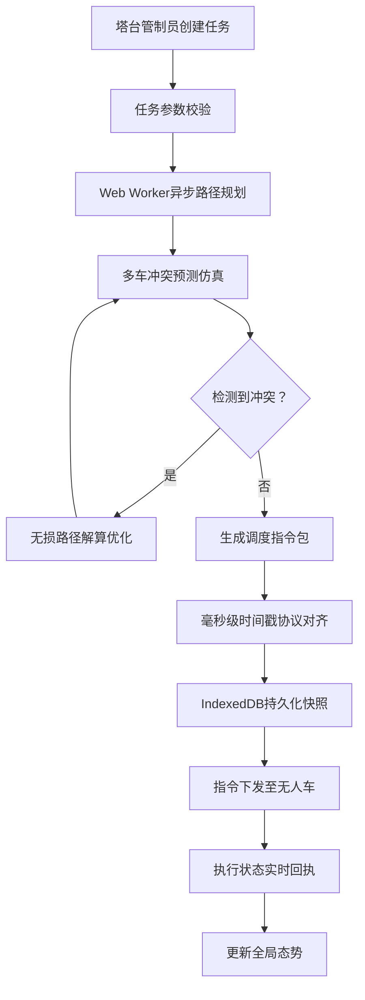
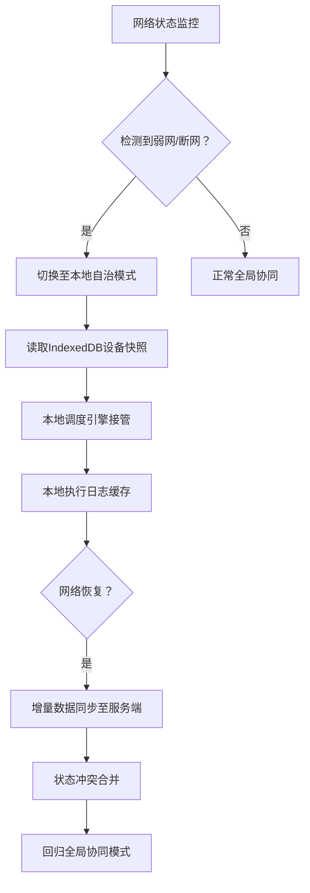

# AeroNexus - 机场停机坪地面支持设备调度中枢 PRD

## 1. 产品概述

AeroNexus 是一款面向机场塔台管制员与地面运维团队的工业级GSE（Ground Support Equipment）智能调度中枢系统。通过多体非线性动力学路径模型与分布式计算架构，实现无人牵引车、廊桥、行李车、加油车等数十类地面设备的毫秒级协同调度，在保障安全的前提下将航班地面周转效率提升40%以上。

### 1.1 核心价值
- **安全保障**：基于实时运动学仿真的冲突预测与规避，零碰撞风险
- **效率提升**：智能路径规划与动态任务分配，缩短航班过站时间
- **不间断运营**：IndexedDB持久化快照总线，弱网/断网环境下自治调度
- **可视化决策**：塔台级实时态势感知，多维度数据孪生呈现

## 2. 核心功能

### 2.1 用户角色

| 角色 | 认证方式 | 核心权限 |
|------|----------|----------|
| 塔台管制员 | 域账号+双因素认证 | 全局态势监控、调度指令下发、冲突仲裁 |
| 地面运维主管 | 工牌扫码登录 | 设备状态管理、任务队列查看、异常处置 |
| 系统管理员 | 专用安全终端 | 系统配置、参数校准、日志审计 |

### 2.2 功能模块

1. **调度中枢主界面**：停机坪全景可视化、设备实时追踪、任务状态监控
2. **路径规划引擎**：多体非线性动力学建模、冲突预测、无损路径解算
3. **指令下发系统**：毫秒级协议对齐、指令优先级队列、执行状态回执
4. **设备管理中心**：万级设备台账、健康状态监控、维护调度
5. **离线协同模块**：弱网检测、本地快照缓存、网络恢复自动同步
6. **数据分析面板**：KPI仪表盘、历史回溯、效率分析报表

### 2.3 页面详情

| 页面名称 | 模块名称 | 功能描述 |
|---------|----------|----------|
| 调度中枢 | 停机坪可视化Canvas | 2D/3D切换的停机坪全景，实时设备位置与轨迹渲染 |
| 调度中枢 | 设备监控面板 | 设备状态、电量、任务、预警信息的多维度展示 |
| 调度中枢 | 指令控制台 | 拖拽式任务分配、批量指令下发、优先级调整 |
| 调度中枢 | 冲突预警条 | 实时冲突告警、风险等级、处置建议一键采纳 |
| 设备管理 | 设备台账 | 分类筛选、详情查看、参数配置 |
| 设备管理 | 健康监控 | 故障预测、维护提醒、异常告警 |
| 数据分析 | 效率仪表盘 | 航班准点率、设备利用率、冲突统计 |
| 数据分析 | 历史回放 | 时间轴回溯、事件定位、根因分析 |
| 系统设置 | 网络状态 | 连接状态监控、离线模式切换、同步进度 |

## 3. 核心流程

### 3.1 调度指令主流程

### 3.2 弱网环境处理流程

## 4. 用户界面设计

### 4.1 设计风格
- **主色调**：深空蓝 `#0A1628` 作为基底，航空橙 `#FF6B35` 作为告警/强调色，科技青 `#00D4FF` 作为主交互色
- **副色调**：成功绿 `#00E676`、警告黄 `#FFD600`、危险红 `#FF5252`
- **设计语言**：航空管制HMI风格，高对比度、低饱和度、专业感强
- **字体**：主标题使用 `JetBrains Mono` 等宽字体，正文使用 `Inter` 确保清晰可读
- **视觉元素**：网格线、扫描线、数据流光、辉光效果，营造科技感与工业感

### 4.2 交互设计
- **响应式**：桌面端优先，支持多屏扩展显示，关键信息区域可独立拖拽
- **实时更新**：设备位置60fps平滑动画，状态更新无感知刷新
- **告警机制**：多层级视觉+听觉告警，可配置的告警静默策略
- **操作反馈**：指令下发的进度动画、执行成功的确认动效、失败的重试机制

### 4.3 页面设计概览

| 页面名称 | 模块名称 | UI元素 |
|---------|----------|--------|
| 调度中枢 | 全景可视化 | 深色底图、网格叠加、设备图标带方向指示、轨迹线带渐变尾迹 |
| 调度中枢 | 侧边设备列表 | 卡片式布局、状态色指示、电量环形进度条 |
| 调度中枢 | 底部指令条 | 时间轴样式、可拖拽排序、执行状态步进动画 |
| 设备管理 | 设备详情 | 左右分栏、左侧参数表单、右侧实时数据曲线 |
| 数据分析 | 仪表盘 | 大数字KPI、趋势折线图、热力分布图 |

### 4.4 响应式设计
- **超大屏(>1920px)**：四栏布局，支持独立窗口分离
- **桌面端(1280-1920px)**：三栏布局，可视化+设备列表+控制面板
- **平板端(768-1280px)**：两栏布局，可折叠侧边栏
- **移动端(<768px)**：单栏布局，核心告警与状态查看

## 5. 非功能需求

### 5.1 性能指标
- 路径规划响应时间 < 50ms（单车）
- 多车冲突预测 < 100ms（50车并发）
- 设备状态更新频率 30Hz
- 界面渲染帧率 稳定60fps
- IndexedDB写入延迟 < 10ms

### 5.2 可靠性
- 系统可用性 99.99%
- 数据持久化可靠性 100%（断电不丢失）
- 弱网环境下可离线工作时长 ≥ 4小时

### 5.3 安全性
- 所有指令操作不可篡改、可审计
- 敏感数据传输全程加密
- 多级权限控制，最小权限原则
