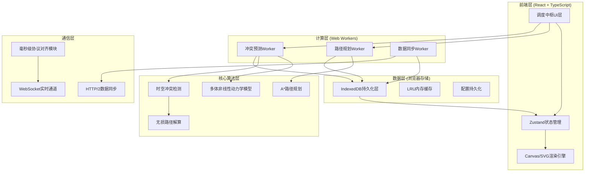

# AeroNexus 技术架构文档

## 1. 架构设计

### 1.1 系统总体架构



## 2. 技术选型

### 2.1 前端核心栈
- **框架**: React 18 + TypeScript 5
- **构建工具**: Vite 5
- **样式方案**: Tailwind CSS 3
- **状态管理**: Zustand 4
- **路由**: React Router 6

### 2.2 可视化与渲染
- **2D渲染**: HTML5 Canvas + requestAnimationFrame
- **图标库**: Lucide React
- **图表库**: Recharts（数据可视化）

### 2.3 浏览器高级API
- **Web Workers**: 多线程计算，路径规划与冲突检测
- **IndexedDB**: 设备状态持久化快照，万级数据存储
- **Broadcast Channel API**: 多标签页通信
- **Performance API**: 高精度时间戳，毫秒级协议对齐

### 2.4 算法与数学库
- **自定义实现**: 多体非线性动力学模型
- **路径规划**: A*算法 + 动态窗口法(DWA)
- **冲突检测**: 时空碰撞检测(ST-CT)算法
- **几何计算**: 自定义向量运算库

### 2.5 工具与规范
- **代码规范**: ESLint + Prettier
- **类型检查**: TypeScript Strict Mode
- **性能监控**: 自定义FPS监控 + Web Vitals

## 3. 目录结构

```
src/
├── components/          # 可复用UI组件
│   ├── control-tower/   # 调度中枢相关组件
│   ├── equipment/       # 设备管理组件
│   ├── analytics/       # 数据分析组件
│   └── common/          # 通用组件
├── hooks/               # 自定义React Hooks
├── workers/             # Web Workers
│   ├── path-planner.worker.ts
│   ├── conflict-detector.worker.ts
│   └── sync-manager.worker.ts
├── store/               # Zustand状态管理
├── utils/               # 工具函数
│   ├── protocol/        # 协议对齐模块
│   ├── dynamics/        # 动力学模型
│   ├── pathfinding/     # 路径规划算法
│   └── storage/         # IndexedDB封装
├── types/               # TypeScript类型定义
├── pages/               # 页面组件
└── assets/              # 静态资源
```

## 4. 核心数据结构

### 4.1 设备状态 (EquipmentState)
```typescript
interface EquipmentState {
  id: string;
  type: 'tug' | 'bridge' | 'baggage' | 'fuel' | 'catering';
  status: 'idle' | 'moving' | 'working' | 'charging' | 'error';
  position: { x: number; y: number; heading: number };
  velocity: { linear: number; angular: number };
  battery: number;
  currentTask: string | null;
  timestamp: number;
  health: {
    temperature: number;
    tirePressure: number;
    brakeStatus: boolean;
  };
}
```

### 4.2 调度指令 (DispatchCommand)
```typescript
interface DispatchCommand {
  id: string;
  priority: 'emergency' | 'high' | 'normal' | 'low';
  type: 'move' | 'work' | 'charge' | 'recall';
  equipmentId: string;
  targetPosition: { x: number; y: number; heading: number };
  path: { x: number; y: number; t: number }[];
  expectedDuration: number;
  scheduledTime: number;
  deadline: number;
  protocolVersion: string;
  signature: string;
}
```

### 4.3 冲突预警 (ConflictAlert)
```typescript
interface ConflictAlert {
  id: string;
  level: 'critical' | 'warning' | 'info';
  type: 'collision' | 'deadlock' | 'zone_violation';
  involvedEquipment: string[];
  predictedTime: number;
  predictedPosition: { x: number; y: number };
  suggestedAction: {
    type: 'reroute' | 'slow_down' | 'stop';
    equipmentId: string;
    newPath?: { x: number; y: number; t: number }[];
  };
  timestamp: number;
}
```

## 5. 核心算法模块

### 5.1 多体非线性动力学模型
```
位置更新: P(t+Δt) = P(t) + V(t)·Δt + 0.5·A(t)·Δt²
速度更新: V(t+Δt) = V(t) + A(t)·Δt
加速度: A(t) = F(t)/m - μ·V(t) - k·V(t)²
转向动力学: θ(t+Δt) = θ(t) + ω(t)·Δt
角速度: ω(t) = V(t)·tan(δ(t))/L
```

### 5.2 时空冲突检测算法
1. 将时间离散化为Δt步长
2. 对每对设备，预测未来T秒内的位置
3. 计算设备间最小距离 d_min(t)
4. 若 d_min(t) < 安全阈值，标记为冲突
5. 基于碰撞时间(TTC)分级告警

### 5.3 无损路径解算
采用A*算法结合速度规划：
- 启发函数: 欧氏距离 + 动态障碍物代价
- 约束条件: 最大曲率、最大加速度、最小转弯半径
- 优化目标: 路径最短 + 时间最优 + 能耗最低

## 6. 毫秒级协议对齐机制

### 6.1 时间同步
1. 使用 `performance.now()` 获取高精度时间戳
2. NTP时间校准，误差控制在±1ms内
3. 指令时间戳精度到微秒级

### 6.2 指令时序
```
T0: 管制员创建任务
T0+1ms: 参数校验通过
T0+2ms: 路径规划请求入队
T0+50ms: 路径规划完成
T0+51ms: 冲突预测完成
T0+52ms: IndexedDB持久化
T0+53ms: WebSocket下发指令
T0+55ms: 设备接收确认
```

## 7. IndexedDB持久化快照总线

### 7.1 数据模型
| Object Store | 主键 | 索引 | 容量 |
|-------------|------|------|------|
| equipment_states | id | type, status, timestamp | 10,000+ |
| dispatch_commands | id | equipmentId, status, scheduledTime | 100,000+ |
| conflict_alerts | id | level, timestamp | 50,000+ |
| system_snapshots | timestamp | - | 每30秒一个 |

### 7.2 读写策略
- **写入**: 批量写入 + 事务保证，失败自动重试
- **读取**: LRU缓存热点数据，IndexedDB兜底
- **同步**: 增量同步，时间戳版本控制，冲突自动合并

## 8. 路由定义

| 路由 | 页面 | 权限要求 |
|-----|------|----------|
| / | 调度中枢主界面 | 塔台管制员/运维主管 |
| /equipment | 设备管理中心 | 运维主管/管理员 |
| /equipment/:id | 设备详情 | 运维主管/管理员 |
| /analytics | 数据分析面板 | 所有角色 |
| /analytics/history | 历史回放 | 所有角色 |
| /settings | 系统设置 | 管理员 |
