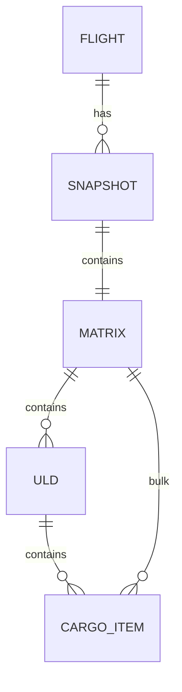

## 1. 架构设计

AirCargoNexus 采用纯前端单页架构，以 Svelte 5 为核心渲染层，通过 Web Worker 将 CPU 密集的分支定界解算隔离出主线程，使用 IndexedDB 持久化万级配载快照。三维场景通过轻量级 WebGL 管线（基于 Three.js 风格但最小化依赖）渲染。所有数据与业务逻辑均在前端闭环，零后端依赖，支持离线运行。

```mermaid
flowchart TD
  "UI 层 (Svelte 5)" --> "状态层 (Svelte Stores)"
  "状态层 (Svelte Stores)" --> "业务层 (配载服务)"
  "业务层 (配载服务)" --> "算法层 (Web Worker B&B)"
  "业务层 (配载服务)" --> "持久层 (IndexedDB)"
  "UI 层 (Svelte 5)" --> "渲染层 (3D / 2D Canvas)"
  "渲染层 (3D / 2D Canvas)" --> "浏览器 GPU"
```

## 2. 技术说明

- 前端框架：Svelte 5 + Runes 响应式（`$state`、`$derived`、`$effect`）
- 构建工具：Vite 5 + TypeScript 5
- 路由：svelte-router-spa（或自定义 hash 路由，保持零后端）
- 3D 渲染：three.js（核心） + @svelthree/svelthree（Svelte 5 适配层）；无依赖时退化为自实现 WebGL 组件
- 2D 图表：轻量级 SVG 折线图（手写组件，避免重型图表库）
- 样式：Tailwind CSS 3 + CSS 变量主题
- 状态管理：Svelte 5 原生 Stores（航班、货物、解算、快照四大 store）
- 持久化：IndexedDB + idb-keyval（轻量级 Promise 封装）
- 算法：自定义异步分支定界启发式，运行于 Web Worker，采用 `Atomics`/`SharedArrayBuffer`（可选）与 `postMessage` 双通道通信
- 初始化：`npm create vite@latest . -- --template svelte-ts`，随后手动升级到 Svelte 5

## 3. 路由定义

| 路由 | 用途 |
|------|------|
| `/` | 重定向至 `/workbench` |
| `/workbench` | 航班装载工作台（含 3D 视窗、货物清单、重心面板） |
| `/solver` | 解算控制台（参数、进度、候选方案） |
| `/snapshots` | 配载快照中心（列表、时间轴、回放） |
| `/cockpit` | 机组配平终端（精简视图、配平滑块、锁定） |

## 4. API 定义（无后端）

所有服务均为前端模块，按 TypeScript 接口约束：

```ts
// 货物
interface CargoItem {
  id: string;
  code: string;
  weight: number;        // kg
  volume: number;        // m3
  dimensions: [number, number, number]; // LxWxH cm
  priority: 1 | 2 | 3;
  dangerous: boolean;
  uldId?: string;        // 若已装入 ULD
}

// ULD 集装器
interface ULD {
  id: string;
  type: 'PMC' | 'PAG' | 'AKE' | 'LD3';
  maxWeight: number;
  compartment: 'FWD_LEFT' | 'FWD_RIGHT' | 'AFT_LEFT' | 'AFT_RIGHT' | 'BULK';
  position: [number, number, number]; // 舱内坐标
  items: CargoItem[];
}

// 装载矩阵
interface LoadingMatrix {
  ulds: ULD[];
  bulkItems: CargoItem[];
  totalWeight: number;
  cog: [number, number, number];   // 重心 x/y/z
  macPercent: number;              // 平均气动弦百分比
  fuelPenalty: number;             // 油耗惩罚系数
  score: number;                   // 综合评分
}

// 配载快照
interface StowageSnapshot {
  id: string;
  flightId: string;
  timestamp: number;
  operatorId: string;
  matrix: LoadingMatrix;
  delta?: Record<string, any>;    // 相对上一版本的差异
}

// 解算参数
interface SolverParams {
  timeBudgetMs: number;
  heuristicWeight: number;         // 0~1 启发式权重
  fuelWeight: number;              // 0~1 油耗权重
  cogTolerance: number;            // MAC 容差 %
  strategy: 'dfs' | 'best-first' | 'beam';
}
```

## 5. 数据模型

### 5.1 数据模型定义



### 5.2 IndexedDB Schema

```ts
// Object Stores:
//   - flights:      { flightId, aircraft, origin, destination, createdAt }
//   - snapshots:    { id, flightId, timestamp, operatorId, matrix, delta } 索引: flightId, timestamp
//   - cargoItems:   { id, code, weight, volume, ... } 索引: code
//   - settings:     key-value（解算参数、主题）
//
// Indexes:
//   snapshots.byFlight  -> [flightId, timestamp]
//   snapshots.byTime    -> timestamp
//   cargoItems.byCode   -> code
```

## 6. 关键算法：异步分支定界启发式

### 6.1 算法流程

```mermaid
flowchart TD
  "初始化上界/下界" --> "生成根节点 (空装载)"
  "生成根节点 (空装载)" --> "选择节点 (best-first)"
  "选择节点 (best-first)" --> "启发式评估 f(n) = g(n) + w*h(n)"
  "启发式评估 f(n) = g(n) + w*h(n)" --> "上界 < 下界?"
  "上界 < 下界?" -- "是" --> "剪枝"
  "上界 < 下界?" -- "否" --> "生成分支 (放置候选)"
  "生成分支 (放置候选)" --> "时间耗尽?"
  "时间耗尽?" -- "是" --> "输出当前最优"
  "时间耗尽?" -- "否" --> "选择节点 (best-first)"
```

### 6.2 Web Worker 通信协议

```ts
// Main -> Worker
type SolverRequest =
  | { type: 'start'; items: CargoItem[]; params: SolverParams; flightId: string }
  | { type: 'pause' }
  | { type: 'resume' }
  | { type: 'cancel' };

// Worker -> Main
type SolverEvent =
  | { type: 'progress'; explored: number; upper: number; lower: number; pruneRate: number }
  | { type: 'candidate'; matrix: LoadingMatrix; rank: number }
  | { type: 'done'; best: LoadingMatrix; stats: SolverStats }
  | { type: 'error'; message: string };
```

Worker 内部使用分块执行（每次 `requestIdleCallback` / `setTimeout(0)` 让出主线程），避免长时间阻塞。

## 7. 目录结构

```
src/
  app.html
  main.ts
  App.svelte
  router.ts
  routes/
    Workbench.svelte
    Solver.svelte
    Snapshots.svelte
    Cockpit.svelte
  components/
    layout/
      AppHeader.svelte
      SidePanel.svelte
      StatusBar.svelte
    cargo/
      CargoList.svelte
      CargoCard.svelte
      CargoForm.svelte
    visualization/
      CargoScene3D.svelte
      EnvelopeChart.svelte
      MacIndicator.svelte
    solver/
      SolverParams.svelte
      SolverProgress.svelte
      CandidateList.svelte
    snapshot/
      SnapshotTimeline.svelte
      SnapshotList.svelte
      SnapshotDiff.svelte
    cockpit/
      CockpitTrim.svelte
      CockpitCog.svelte
  stores/
    flight.ts
    cargo.ts
    solver.ts
    snapshot.ts
  services/
    solver-service.ts
    snapshot-service.ts
    cog-service.ts
    fuel-service.ts
  workers/
    solver.worker.ts
  lib/
    solver/
      branch-and-bound.ts
      heuristics.ts
      types.ts
    db/
      idb.ts
    geometry/
      vec3.ts
      cog.ts
    utils/
      id.ts
      format.ts
  styles/
    theme.css
    tokens.css
```

## 8. 性能与容量目标

- 解算：500 件货物 / 20 个 ULD，时间预算 2s 内给出可用方案
- 快照：IndexedDB 单库存储 ≥ 10,000 条配载快照，分页加载 ≤ 50ms
- 3D：帧率 ≥ 60fps，顶点数 ≤ 50k
- 首屏：≤ 2s LCP，主包 ≤ 300KB（gzip）
