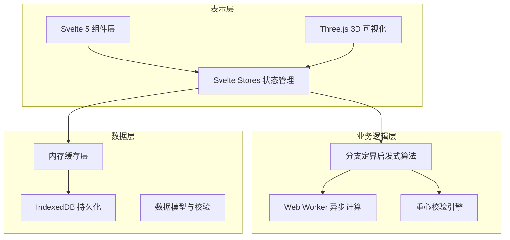

## 1. 架构设计



## 2. 技术描述
- **前端框架**：Svelte 5 + TypeScript + Vite 5
- **3D 可视化**：Three.js 0.160 + @types/three
- **状态管理**：Svelte Stores (内置)
- **样式方案**：Tailwind CSS 3.4
- **异步计算**：Web Workers API (TypeScript 编译)
- **本地存储**：IndexedDB (idb 库封装)
- **数据可视化**：SVG 原生 + 自定义曲线组件
- **图标**：lucide-svelte
- **构建工具**：Vite 5，开启类型检查和代码分割

## 3. 路由定义
| 路由 | 页面组件 | 用途 |
|------|----------|------|
| / | CargoHoldVisualization | 货舱可视化首页 |
| /cargo | CargoManagement | 货物管理页面 |
| /calculate | LoadCalculation | 配载计算页面 |
| /snapshots | SnapshotList | 配载快照列表 |
| /snapshot/:id | SnapshotDetail | 快照详情页 |
| /cockpit | CockpitTerminal | 机组配平终端 |

## 4. 数据模型

### 4.1 核心类型定义
```typescript
// 货物
interface Cargo {
  id: string;
  name: string;
  weight: number;      // kg
  dimensions: {
    length: number;    // cm
    width: number;     // cm
    height: number;    // cm
  };
  priority: number;    // 1-10, 越高越优先
  isDangerous: boolean;
  constraints?: {
    preferredZone?: string;
    forbiddenZones?: string[];
    maxStacking?: number;
  };
}

// 货舱位置
interface CargoPosition {
  id: string;
  zone: string;        // A, B, C, D 区
  coordinates: {
    x: number;         // 纵向位置 (cm)
    y: number;         // 横向位置 (cm)
    z: number;         // 垂直位置 (cm)
  };
  maxWeight: number;
  isOccupied: boolean;
  cargoId?: string;
}

// 装载方案
interface LoadPlan {
  id: string;
  flightNumber: string;
  aircraftType: string;
  timestamp: number;
  cargoPlacements: Array<{
    cargoId: string;
    position: CargoPosition;
    rotation: number;   // 0, 90, 180, 270
  }>;
  centerOfGravity: {
    x: number;          // % MAC
    y: number;          // 横向偏移
    z: number;          // 垂直偏移
  };
  totalWeight: number;
  spaceUtilization: number;
  fuelEfficiency: number;
  status: 'draft' | 'confirmed' | 'executed';
}

// 配载快照
interface LoadSnapshot {
  id: string;
  planId: string;
  timestamp: number;
  version: number;
  payload: LoadPlan;
  metadata: {
    createdBy: string;
    comment?: string;
  };
}

// 飞机参数
interface AircraftSpec {
  type: string;
  maxTakeoffWeight: number;
  maxLandingWeight: number;
  operatingEmptyWeight: number;
  mac: {
    length: number;     // Mean Aerodynamic Chord
    leadingEdge: number;
  };
  cargoZones: CargoZone[];
  cgLimits: {
    forward: number;     // % MAC
    aft: number;         // % MAC
  };
}
```

### 4.2 IndexedDB Schema
| Store Name | 主键 | 索引 |
|------------|------|------|
| cargos | id | name, weight, isDangerous |
| loadPlans | id | flightNumber, aircraftType, status, timestamp |
| snapshots | id | planId, timestamp, version |
| aircraftSpecs | type | - |
| settings | key | - |

## 5. 核心算法设计

### 5.1 分支定界启发式算法流程
```
Algorithm BranchAndBoundLoad(cargos, aircraftSpec):
  Initialize:
    bestSolution = null
    bestScore = Infinity
    openSet = PriorityQueue()
    openSet.add(emptySolution)
  
  While openSet not empty and timeRemaining:
    current = openSet.pop()
    
    If current is complete:
      If current.score < bestScore:
        bestSolution = current
        bestScore = current.score
      Continue
    
    If lowerBound(current) >= bestScore:
      Continue
    
    For each cargo in remaining cargos:
      For each valid position:
        For each valid rotation:
          newSolution = current.place(cargo, position, rotation)
          If newSolution.isValid():
            openSet.add(newSolution)
  
  Return bestSolution
```

### 5.2 评分函数
```typescript
function calculateScore(plan: LoadPlan): number {
  const cgScore = Math.abs(plan.centerOfGravity.x - optimalCg) * 100;
  const weightBalanceScore = Math.abs(plan.centerOfGravity.y) * 50;
  const spaceScore = (1 - plan.spaceUtilization) * 200;
  const priorityScore = calculatePriorityPenalty(plan) * 10;
  return cgScore + weightBalanceScore + spaceScore + priorityScore;
}
```

## 6. 性能优化策略

1. **Web Worker 隔离**：算法计算完全在 Worker 线程执行，主线程仅处理 UI
2. **增量更新**：3D 场景仅在方案变化时更新，使用 InstancedMesh 批量渲染
3. **内存池**：重用算法过程中的临时对象，减少 GC
4. **索引优化**：IndexedDB 关键查询字段建立索引
5. **虚拟滚动**：货物列表和快照列表使用虚拟滚动，支持万级数据
6. **请求帧同步**：算法进度更新与 requestAnimationFrame 同步
