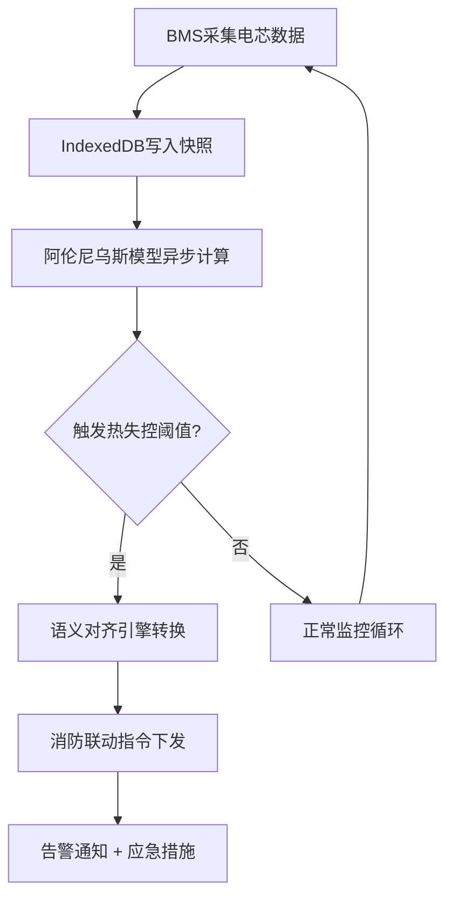
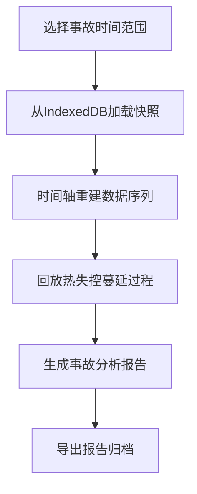

## 1. 产品概述

储能电站电池包热失控蔓延模拟与安全监控系统，基于Vue 3构建的工业级数字孪生平台，实现电芯级热失控预测、BMS与消防系统语义互操作、跨区域储能资产安全运维。

- 解决储能电站热安全预警滞后、系统间数据孤岛、事故追溯困难等核心问题
- 面向储能运营商、消防管理部门、设备制造商，提供从预测到联动的全链路安全解决方案

## 2. 核心功能

### 2.1 用户角色

| 角色 | 注册方式 | 核心权限 |
|------|----------|----------|
| 运维工程师 | 企业SSO登录 | 实时监控、参数配置、历史数据查询 |
| 安全管理员 | 企业SSO登录 | 告警确认、消防联动控制、事故报告导出 |
| 系统管理员 | 本地账号 | 用户管理、系统配置、模型训练 |

### 2.2 功能模块

1. **电池包数字孪生面板**：3D可视化电池包结构、电芯实时温度热力图、热失控蔓延动画模拟
2. **阿伦尼乌斯热模型预测**：异步热生成计算、热连锁反应预测、温升趋势曲线展示
3. **BMS-消防语义对齐引擎**：语义映射配置、数据协议转换、联动规则编排
4. **IndexedDB历史快照**：电芯电压/温度时序存储、离线数据缓存、事故回溯回放
5. **跨区域安全运行总线**：多电站数据聚合、区域安全态势、统一告警中心

### 2.3 页面详情

| 页面名称 | 模块名称 | 功能描述 |
|---------|----------|----------|
| 监控总览 | 电池包3D视图 | 可交互3D电池包模型，点击查看电芯详情，颜色映射温度值 |
| 监控总览 | 实时数据面板 | 电压、温度、SOC等关键参数实时展示，异常标红闪烁 |
| 监控总览 | 告警中心 | 分级告警列表，声光提示，支持确认和处理 |
| 热模型预测 | 阿伦尼乌斯计算 | 配置活化能、指前因子等参数，运行热失控模拟 |
| 热模型预测 | 温升曲线 | 多电芯温升对比曲线，预测时间轴，临界温度警戒线 |
| 语义对齐 | 映射配置 | BMS数据点与消防设备语义标签映射管理 |
| 语义对齐 | 联动规则 | 可视化规则编排，IF-THEN条件触发消防动作 |
| 历史数据 | 快照查询 | 按时间范围查询历史快照，支持导出CSV |
| 历史数据 | 事故回放 | 时间轴拖动回放热失控全过程，关键节点标注 |
| 多电站管理 | 电站列表 | 跨区域储能资产列表，运行状态总览 |
| 多电站管理 | 区域态势 | 地图分布展示，区域安全等级热力图 |

## 3. 核心流程

### 3.1 热失控预测与联动流程

### 3.2 事故回溯流程

## 4. 用户界面设计

### 4.1 设计风格

- **主色调**：工业蓝 (#165DFF) 作为主色，警示橙 (#FF7D00) 用于告警，安全绿 (#00B42A) 表示正常
- **辅助色**：深灰 (#1D2129) 背景，提升数据可视化对比度
- **按钮风格**：直角硬朗工业风，图标+文字组合，hover状态微发光
- **字体**：JetBrains Mono 用于数据展示，Inter 用于界面文本
- **布局风格**：深色仪表盘布局，网格化信息密度，分区明确
- **图标风格**：线性工业图标，粗细2px，统一圆角

### 4.2 页面设计概览

| 页面名称 | 模块名称 | UI元素 |
|---------|----------|--------|
| 监控总览 | 3D电池包 | Three.js渲染，OrbitControls交互，温度颜色映射Shader |
| 监控总览 | 数据卡片 | 玻璃拟态卡片，渐变边框，数据跳动动画 |
| 监控总览 | 告警列表 | 时间线布局，严重程度色条，闪烁动画 |
| 热模型预测 | 参数配置 | 滑块+数字输入联动，实时计算反馈 |
| 热模型预测 | 曲线图 | ECharts面积图，多色系区分电芯，预警虚线标注 |
| 语义对齐 | 映射面板 | 左右分栏拖拽映射，连线动画 |
| 语义对齐 | 规则编排 | 节点式可视化编辑器，条件分支高亮 |
| 历史数据 | 时间轴 | 可缩放时间轴，快照标记点，播放控制 |
| 多电站管理 | 地图 | 高德地图API，站点标记，区域热力层 |

### 4.3 响应性

- 桌面端优先设计，适配1920×1080及以上分辨率
- 平板端：侧边栏折叠，图表自适应缩放
- 移动端：卡片堆叠式布局，核心监控功能优先
- 触控优化：增大可点击区域，支持双指缩放3D模型

### 4.4 3D场景指导

- **环境**：HDRI工业车间环境光，金属质感材质
- **光照**：三点布光，主光冷白，补光暖调，轮廓光突出电池包轮廓
- **相机**：PerspectiveCamera，初始距离3米，俯视角45度
- **交互**：OrbitControls支持旋转、缩放、平移，双击电芯聚焦
- **动画**：热失控时电芯发红发光，热流粒子效果，蔓延路径高亮
- **后处理**：Bloom发光效果，SSR屏幕空间反射，提升真实感
