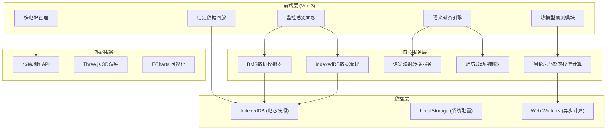
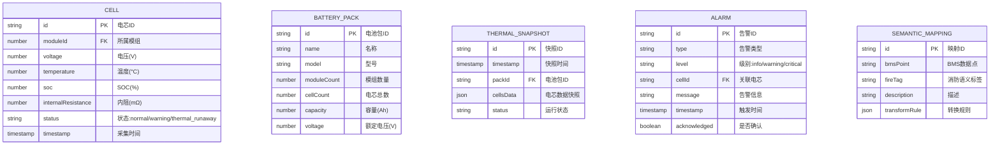

## 1. 架构设计



## 2. 技术描述

- **前端框架**: Vue 3 + TypeScript + Vite 5
- **状态管理**: Pinia
- **路由**: Vue Router 4
- **UI组件库**: Element Plus (深色主题定制)
- **3D渲染**: Three.js + @tweenjs/tween.js
- **图表可视化**: ECharts 5
- **样式方案**: Tailwind CSS 3 + SCSS
- **本地数据库**: IndexedDB (idb库封装)
- **异步计算**: Web Workers
- **代码规范**: ESLint + Prettier + Husky

## 3. 路由定义

| 路由路径 | 页面名称 | 说明 |
|---------|----------|------|
| /dashboard | 监控总览 | 电池包3D视图、实时数据、告警中心 |
| /thermal-model | 热模型预测 | 阿伦尼乌斯计算、温升曲线、参数配置 |
| /semantic-align | 语义对齐 | BMS-消防映射、联动规则编排 |
| /history | 历史数据 | 快照查询、事故回放、数据导出 |
| /multi-station | 多电站管理 | 电站列表、区域态势地图 |
| /settings | 系统设置 | 用户管理、参数配置、日志 |

## 4. 核心数据模型

### 4.1 电芯数据模型



### 4.2 阿伦尼乌斯模型参数

```typescript
interface ArrheniusParams {
  activationEnergy: number;      // 活化能 (J/mol)
  preExponentialFactor: number;  // 指前因子 (1/s)
  gasConstant: number;           // 气体常数 (8.314 J/(mol·K))
  initialTemperature: number;    // 初始温度 (K)
  heatCapacity: number;          // 比热容 (J/(kg·K))
  thermalConductivity: number;   // 热传导系数 (W/(m·K))
  mass: number;                  // 质量 (kg)
}

interface ThermalRunawayPrediction {
  cellId: string;
  timeToRunaway: number;         // 距热失控时间 (s)
  temperatureCurve: number[];    // 温升曲线
  criticalTemperature: number;   // 临界温度 (°C)
  riskLevel: 'low' | 'medium' | 'high' | 'extreme';
}
```

## 5. 项目目录结构

```
src/
├── api/                    # API接口
├── assets/                 # 静态资源
│   ├── icons/
│   ├── images/
│   └── styles/
├── components/             # 公共组件
│   ├── battery-pack-3d/   # 电池包3D组件
│   ├── charts/            # 图表组件
│   ├── common/            # 通用组件
│   └── layout/            # 布局组件
├── composables/           # 组合式函数
│   ├── useIndexedDB.ts    # IndexedDB封装
│   ├── useThermalModel.ts # 热模型计算
│   └── useSemanticAlign.ts # 语义对齐
├── workers/               # Web Workers
│   └── arrhenius.worker.ts # 阿伦尼乌斯计算worker
├── router/                # 路由配置
├── stores/                # Pinia状态管理
│   ├── battery.ts         # 电池状态
│   ├── alarm.ts           # 告警状态
│   └── settings.ts        # 设置状态
├── types/                 # TypeScript类型定义
├── utils/                 # 工具函数
│   ├── arrhenius.ts       # 阿伦尼乌斯公式
│   └── semantic.ts        # 语义转换工具
├── views/                 # 页面视图
├── App.vue
└── main.ts
```

## 6. 关键技术实现

### 6.1 异步阿伦尼乌斯热生成模型

```typescript
// arrhenius.ts
const GAS_CONSTANT = 8.314; // J/(mol·K)

export function calculateReactionRate(
  temperature: number,
  activationEnergy: number,
  preExponentialFactor: number
): number {
  const kelvin = temperature + 273.15;
  return preExponentialFactor * Math.exp(
    -activationEnergy / (GAS_CONSTANT * kelvin)
  );
}

export function calculateHeatGeneration(
  reactionRate: number,
  reactionHeat: number,
  volume: number
): number {
  return reactionRate * reactionHeat * volume;
}

export function calculateTemperatureRise(
  heatGeneration: number,
  mass: number,
  heatCapacity: number,
  timeStep: number
): number {
  return (heatGeneration * timeStep) / (mass * heatCapacity);
}
```

### 6.2 IndexedDB封装

```typescript
// useIndexedDB.ts
import { openDB, IDBPDatabase } from 'idb';

const DB_NAME = 'battery-logic-db';
const DB_VERSION = 1;

interface DBSchema {
  thermalSnapshots: {
    key: string;
    value: ThermalSnapshot;
    indexes: { 'by-timestamp': number };
  };
  cells: {
    key: string;
    value: CellData;
    indexes: { 'by-module': string };
  };
  alarms: {
    key: string;
    value: Alarm;
    indexes: { 'by-time': number };
  };
}

export async function useIndexedDB() {
  const db = await openDB<DBSchema>(DB_NAME, DB_VERSION, {
    upgrade(db) {
      // 数据库初始化逻辑
    }
  });
  return { db };
}
```

### 6.3 语义对齐引擎

```typescript
// semantic-align.ts
export interface SemanticTag {
  id: string;
  domain: 'bms' | 'fire';
  label: string;
  unit?: string;
  dataType: 'number' | 'boolean' | 'string' | 'enum';
  thresholds?: Threshold[];
}

export interface MappingRule {
  source: string;      // BMS数据点
  target: string;      // 消防标签
  transform: (value: any) => any;
  condition?: (value: any) => boolean;
}

export class SemanticAlignmentEngine {
  private mappings: Map<string, MappingRule> = new Map();
  
  registerMapping(rule: MappingRule) {
    this.mappings.set(rule.source, rule);
  }
  
  transform(bmsData: BMSDataPoint): FireControlSignal[] {
    const signals: FireControlSignal[] = [];
    // 语义转换逻辑
    return signals;
  }
}
```
