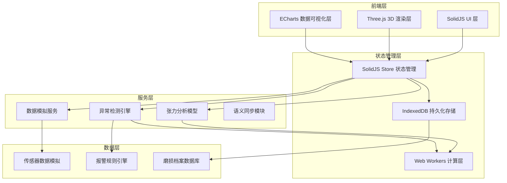

## 1. 架构设计



## 2. 技术选型

| 分类 | 技术栈 | 版本 | 说明 |
|------|--------|------|------|
| 前端框架 | SolidJS | ^1.8.0 | 高性能响应式 UI 框架 |
| 构建工具 | Vite | ^5.0.0 | 快速开发构建工具 |
| 3D 渲染 | Three.js | ^0.160.0 | WebGL 3D 引擎 |
| 数据可视化 | ECharts | ^5.4.0 | 图表可视化库 |
| 状态管理 | SolidJS Store | ^1.8.0 | 内置状态管理 |
| 本地存储 | IndexedDB (idb) | ^8.0.0 | 浏览器本地数据库 |
| 样式方案 | TailwindCSS | ^3.4.0 | 原子化 CSS 框架 |
| 语言 | TypeScript | ^5.3.0 | 类型安全 |

## 3. 目录结构

```
src/
├── components/          # UI 组件
│   ├── dashboard/      # 仪表盘组件
│   ├── belt3d/         # 3D 皮带组件
│   ├── sensors/        # 传感器监控
│   ├── alarms/         # 报警中心
│   ├── analysis/       # 磨损分析
│   └── settings/       # 系统配置
├── stores/             # 状态管理
│   ├── sensorStore.ts
│   ├── alarmStore.ts
│   ├── beltStore.ts
│   └── settingsStore.ts
├── services/           # 业务服务
│   ├── sensorService.ts
│   ├── tensionAnalysis.ts
│   ├── anomalyDetection.ts
│   └── semanticSync.ts
├── workers/            # Web Workers
│   ├── tensionWorker.ts
│   └── analysisWorker.ts
├── db/                 # IndexedDB 数据库
│   ├── index.ts
│   ├── schema.ts
│   └── operations.ts
├── types/              # TypeScript 类型
│   ├── sensor.ts
│   ├── belt.ts
│   ├── alarm.ts
│   └── index.ts
├── utils/              # 工具函数
│   ├── math.ts
│   ├── color.ts
│   └── format.ts
├── App.tsx
├── main.tsx
└── index.css
```

## 4. 路由定义

| 路由 | 页面 | 说明 |
|------|------|------|
| / | 监控大屏 | 3D 皮带映射 + 实时数据概览 |
| /sensors | 传感器监控 | 光纤传感器数据波形展示 |
| /alarms | 报警中心 | 报警列表与统计分析 |
| /analysis | 磨损分析 | 历史趋势与寿命预测 |
| /settings | 系统配置 | 传感器管理与阈值设置 |

## 5. 核心数据模型

### 5.1 传感器数据模型

```typescript
interface SensorData {
  id: string;
  timestamp: number;
  sensorId: string;
  position: number;      // 皮带位置 (米)
  tension: number;       // 张力值 (kN)
  temperature: number;   // 温度 (°C)
  vibration: number;     // 振动幅度
  strain: number;        // 应变值
}

interface FiberSensor {
  id: string;
  name: string;
  channel: number;
  position: number;
  samplingRate: number;
  isActive: boolean;
  lastCalibration: number;
}
```

### 5.2 皮带状态模型

```typescript
interface BeltState {
  id: string;
  length: number;        // 皮带总长度
  speed: number;         // 运行速度 (m/s)
  load: number;          // 负载率 (%)
  tensionProfile: number[];  // 张力分布曲线
  temperatureProfile: number[];  // 温度分布
  wearProfile: number[]; // 磨损分布
  isRunning: boolean;
  healthScore: number;   // 健康评分 0-100
}
```

### 5.3 报警模型

```typescript
interface Alarm {
  id: string;
  timestamp: number;
  type: 'tear' | 'tension' | 'temperature' | 'wear' | 'sensor';
  severity: 'info' | 'warning' | 'critical';
  position: number;
  sensorId: string;
  value: number;
  threshold: number;
  message: string;
  acknowledged: boolean;
  acknowledgedBy?: string;
  resolved: boolean;
  resolvedAt?: number;
}
```

### 5.4 磨损档案模型

```typescript
interface WearRecord {
  id: string;
  date: string;          // YYYY-MM-DD
  beltId: string;
  position: number;
  wearDepth: number;     // 磨损深度 (mm)
  wearRate: number;      // 磨损速率 (mm/1000h)
  tensionAvg: number;
  temperatureAvg: number;
  operatingHours: number;
  loadCycles: number;
}
```

## 6. IndexedDB 存储结构

| Object Store | 主键 | 索引 | 说明 |
|--------------|------|------|------|
| sensor_data | id | timestamp, sensorId, position | 传感器原始数据 |
| belt_states | id | timestamp, healthScore | 皮带状态快照 |
| alarms | id | timestamp, severity, type, resolved | 报警记录 |
| wear_records | id | date, beltId, position | 磨损档案 |
| sensors | id | channel, position | 传感器配置 |
| settings | key | - | 系统配置 |

## 7. 关键技术实现

### 7.1 异步动态张力分析

```typescript
// Web Worker 中执行的张力分析
async function analyzeTension(data: SensorData[]): Promise<TensionAnalysisResult> {
  const profile = interpolateTensionProfile(data);
  const stressPoints = detectStressConcentration(profile);
  const anomalies = detectAnomalies(profile, stressPoints);
  
  return {
    profile,
    stressPoints,
    anomalies,
    healthScore: calculateHealthScore(profile, anomalies)
  };
}
```

### 7.2 语义同步引擎

```typescript
// 运维系统与变频器间的语义同步
class SemanticSynchronizer {
  private subscribers = new Map<string, (data: any) => void>();
  
  subscribe(topic: string, callback: (data: any) => void) {
    this.subscribers.set(topic, callback);
  }
  
  publish(topic: string, data: any) {
    const semanticData = this.enrichWithSemantics(data);
    const callback = this.subscribers.get(topic);
    if (callback) callback(semanticData);
  }
  
  private enrichWithSemantics(data: SensorData): SemanticSensorData {
    return {
      ...data,
      semantics: {
        domain: 'belt_conveyor',
        entity: 'fiber_sensor',
        quantity: this.mapToQuantity(data),
        unit: this.getUnit(data),
        timestamp: new Date(data.timestamp).toISOString()
      }
    };
  }
}
```

### 7.3 3D 皮带渲染

使用 Three.js 创建参数化皮带几何体，通过 ShaderMaterial 实现张力分布的可视化映射，支持实时顶点颜色更新。

### 7.4 性能优化策略

1. **数据采样**：高频传感器数据在前端进行降采样处理
2. **Web Workers**：复杂计算任务离线执行，不阻塞 UI
3. **增量更新**：3D 场景仅更新变化的顶点数据
4. **虚拟列表**：报警和历史数据采用虚拟滚动
5. **内存管理**：IndexedDB 数据分页加载，定期清理过期缓存
