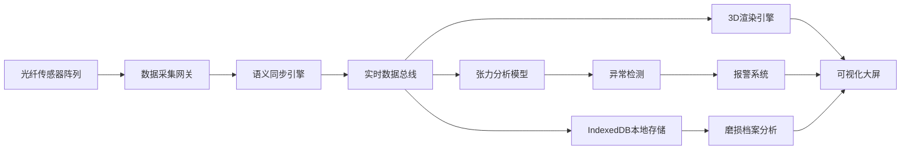

## 1. 产品概述

BeltNexus 是一款基于 SolidJS 的重载皮带机在线撕裂状态监控系统，通过分布式光纤传感器实现运维系统与变频器间的语义同步，利用异步动态张力分析模型实时渲染皮带3D映射状态，配合 IndexedDB 存储长周期的皮带磨损档案，有效降低大规模矿区物流系统的非计划停机风险。

## 2. 核心功能

### 2.1 用户角色

| 角色 | 注册方式 | 核心权限 |
|------|----------|----------|
| 系统管理员 | 工号登录 | 系统配置、用户管理、数据导出 |
| 运维工程师 | 工号登录 | 实时监控、报警处理、维护记录 |
| 数据分析师 | 工号登录 | 历史数据查询、报表生成、磨损分析 |

### 2.2 功能模块

1. **实时监控仪表盘**：皮带3D可视化、传感器数据实时展示、张力分布热力图
2. **撕裂检测系统**：光纤传感器数据采集、异常模式识别、多级报警机制
3. **张力分析模块**：异步动态张力分析、应力集中点标记、预测性维护建议
4. **磨损档案管理**：IndexedDB 本地存储、历史趋势分析、磨损预测模型
5. **系统配置中心**：传感器校准、报警阈值设置、数据同步策略

### 2.3 页面详情

| 页面名称 | 模块名称 | 功能描述 |
|---------|----------|----------|
| 监控大屏 | 3D皮带映射 | 实时渲染皮带运行状态，支持旋转、缩放、剖切查看 |
| 监控大屏 | 数据概览卡片 | 显示关键指标：运行速度、张力均值、温度、报警数量 |
| 监控大屏 | 张力热力图 | 彩色映射显示皮带全长张力分布，异常区域高亮 |
| 传感器监控 | 光纤数据时序图 | 多通道光纤传感器数据实时波形展示 |
| 传感器监控 | 频谱分析 | 振动频谱特征提取，异常模式识别 |
| 报警中心 | 报警列表 | 实时报警推送，分级显示，支持确认和处置 |
| 报警中心 | 报警统计 | 按类型、时间、区域统计报警分布 |
| 磨损分析 | 历史趋势 | 长期磨损数据曲线，支持多维度对比 |
| 磨损分析 | 预测模型 | 基于历史数据的剩余使用寿命预测 |
| 系统配置 | 传感器管理 | 添加、编辑、校准传感器参数 |
| 系统配置 | 阈值设置 | 自定义各级报警阈值和触发条件 |

## 3. 核心流程

## 4. 用户界面设计

### 4.1 设计风格

- **主色调**：工业蓝 (#0A2463) 作为主色，警示橙 (#FF6B35) 用于报警，科技青 (#00F5D4) 用于数据高亮
- **背景**：深空灰渐变 (#0D1117 到 #161B22)，营造工业科技感
- **按钮风格**：扁平设计，细边框，悬停时有发光效果
- **字体**：JetBrains Mono 作为数字显示字体，Noto Sans SC 作为中文界面字体
- **布局风格**：深色仪表盘布局，卡片式模块，网格化排列
- **图标风格**：线性细边图标，统一 24px 网格

### 4.2 页面设计概述

| 页面名称 | 模块名称 | UI 元素 |
|---------|----------|----------|
| 监控大屏 | 3D场景 | 深色背景、环境光、金属质感皮带模型、发光传感器节点 |
| 监控大屏 | 数据卡片 | 半透明玻璃态、模糊背景、发光边框、数字跳动动画 |
| 监控大屏 | 热力图 | 渐变色带、实时数据更新动画、异常点脉冲效果 |
| 报警中心 | 报警列表 | 按严重程度着色、新报警滑动进入、处置状态标记 |
| 磨损分析 | 趋势图表 | 平滑曲线、渐变填充、交互式数据点提示 |

### 4.3 响应式设计

- 采用桌面优先设计，适配 1920×1080 及以上分辨率监控大屏
- 支持 1280×720 普通桌面显示
- 关键监控模块支持全屏模式
- 触摸设备优化缩放和拖拽操作

### 4.4 3D 场景设计

- **环境**：工业厂房环境，弱光照射，突出皮带主体
- **光照**：三光源设置，主光冷白色，辅光蓝色，轮廓光橙色
- **相机**：默认俯视 45° 视角，支持轨道控制，预设多个关键视角
- **交互**：点击传感器节点显示详细数据，鼠标悬停高亮区域
- **动画**：皮带运行平滑动画，异常区域闪烁脉冲，数据更新过渡效果
- **后期处理**：Bloom 发光效果，轻微胶片颗粒，增强科技感
