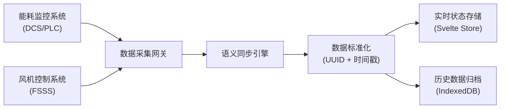
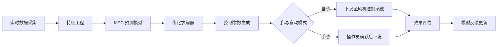

# 锅炉燃烧效率调优系统 PRD

## 1. 产品概述
基于 Svelte 5 构建的大型锅炉燃烧效率智能调优系统，实现烟气氧含量数据在能耗监控与风机控制系统间的语义同步，通过异步模型预测控制 (MPC) 优化燃烧参数，为火电厂提供实时热效率反馈与历史异常复盘能力。

**核心价值**：
- 提升锅炉燃烧效率 3-5%，降低煤耗
- 实现跨系统数据语义同步，消除信息孤岛
- 基于 MPC 的 predictive 控制，减少人工干预
- IndexedDB 本地存储异常波形，支撑离线复盘分析

## 2. 核心功能

### 2.1 用户角色
| 角色 | 注册方式 | 核心权限 |
|------|----------|----------|
| 运行操作员 | 企业 SSO 登录 | 实时监控、参数调整、异常确认 |
| 工艺工程师 | 企业 SSO 登录 | 模型调参、策略配置、复盘分析 |
| 系统管理员 | 本地账号 | 用户管理、系统配置、数据导出 |

### 2.2 功能模块
1. **实时监控仪表盘**：烟气氧含量、热效率、风机状态等核心指标可视化
2. **MPC 优化控制**：燃烧参数预测、优化建议、自动/手动控制切换
3. **异常波形快照**：燃烧异常自动捕获、波形存储、标签标注
4. **跨系统复盘**：多维度历史分析、策略对比、根因分析
5. **语义同步管理**：数据映射配置、同步状态监控、冲突解决

### 2.3 页面详情
| 页面名称 | 模块名称 | 功能描述 |
|----------|----------|----------|
| 实时监控 | 效率仪表盘 | 热效率趋势、氧含量曲线、能耗指标 KPI |
| 实时监控 | 风机控制 | 送/引风机转速、风门开度实时反馈与控制 |
| MPC 控制 | 参数预测 | 未来 30 分钟燃烧参数预测与优化建议 |
| MPC 控制 | 模型状态 | 模型精度、预测误差、控制回路健康度 |
| 异常快照 | 波形浏览 | 历史异常事件列表、波形回放、对比分析 |
| 异常快照 | 标签管理 | 异常类型标注、处理记录、知识库关联 |
| 复盘分析 | 多维查询 | 按时间/负荷/煤种等维度筛选历史数据 |
| 复盘分析 | 策略对比 | 不同控制策略下的效率对比分析 |
| 系统配置 | 语义映射 | 测点映射、数据字典、同步规则配置 |
| 系统配置 | 存储管理 | IndexedDB 存储配额、数据清理策略 |

## 3. 核心流程

### 3.1 数据采集与同步流程

### 3.2 MPC 优化控制流程

### 3.3 异常捕获与复盘流程

## 4. 用户界面设计

### 4.1 设计风格
**工业科技风 (Industrial Tech)**
- **主色调**：深海蓝 #0F172A 作为背景，科技蓝 #3B82F6 作为主色
- **强调色**：警示橙 #F59E0B、异常红 #EF4444、正常绿 #10B981
- **字体**：JetBrains Mono (数据显示) + Noto Sans SC (中文界面)
- **布局**：Dark mode 优先，大屏优化，信息密度高但层次清晰
- **动效**：数据流式动画、脉冲提示、平滑过渡

### 4.2 页面设计概述
| 页面名称 | 模块名称 | UI 元素 |
|----------|----------|----------|
| 实时监控 | 效率仪表盘 | 大号数字 KPI、渐变趋势图、状态指示灯、呼吸动画 |
| 实时监控 | 风机控制 | 旋钮式控制、滑块调节、状态波形、连锁保护指示 |
| MPC 控制 | 参数预测 | 多曲线对比图、置信区间阴影、优化建议卡片 |
| 异常快照 | 波形浏览 | 时间轴导航、波形缩放、多通道叠加、标签标记 |
| 复盘分析 | 策略对比 | 柱状图对比、热力图、散点图、表格导出 |

### 4.3 响应性
- Desktop-first 设计，针对 1920x1080 及以上分辨率优化
- 支持监控大屏 (2K/4K) 自适应缩放
- 平板端保持核心功能，移动端提供数据查看能力

### 4.4 可视化设计要点
- 所有图表支持时间范围选择 (1min/5min/30min/1h/24h)
- 波形图支持鼠标悬停查看精确数值
- KPI 数值变化时采用数字滚动动画
- 异常状态采用边框闪烁 + 颜色渐变提示
