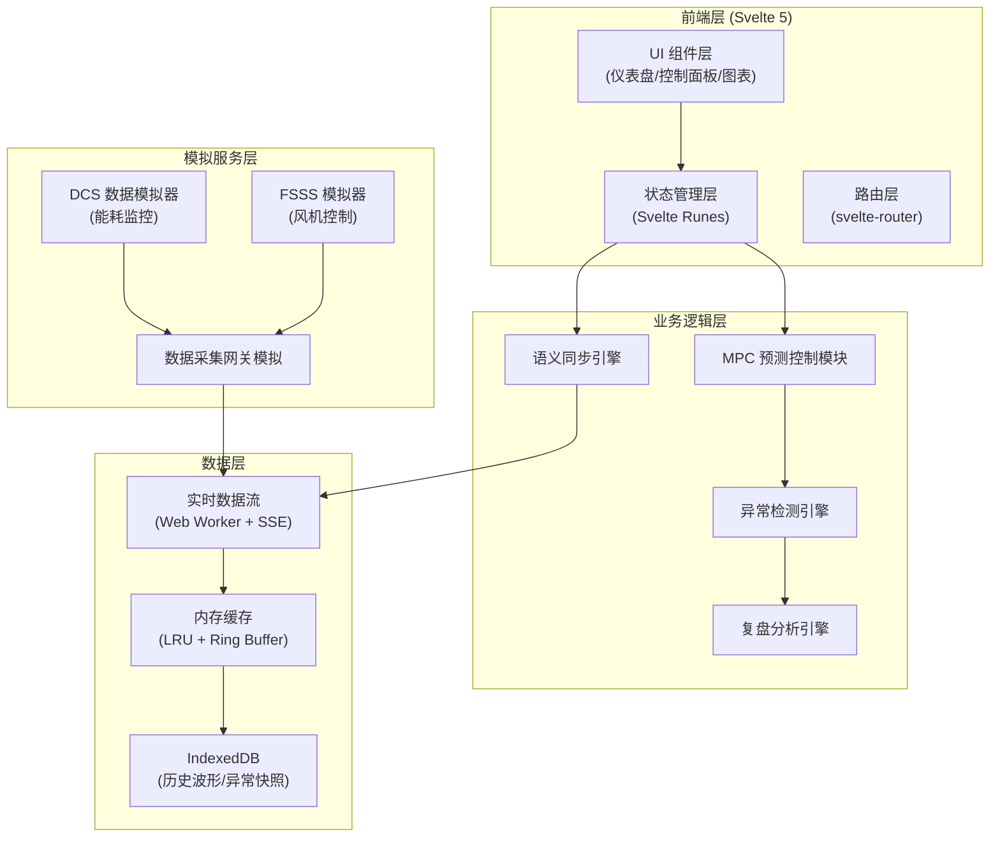

# 锅炉燃烧效率调优系统 - 技术架构文档

## 1. 架构设计



## 2. 技术选型

| 层级 | 技术栈 | 说明 |
|------|--------|------|
| 前端框架 | Svelte 5 (Runes) | 响应式编译，性能优异 |
| 路由 | svelte-router-spa | 轻量级 SPA 路由 |
| 图表可视化 | d3.js v7 + custom canvas | 高性能波形渲染 |
| 状态管理 | Svelte Runes ($state/$derived) | 原生响应式 |
| 本地数据库 | IndexedDB (idb 封装) | 大容量历史存储 |
| 数值计算 | ml.js + custom MPC | 模型预测控制 |
| 样式 | Tailwind CSS v4 | 原子化 CSS |
| 构建工具 | Vite v5 | 快速开发构建 |
| 语言 | TypeScript v5 | 类型安全 |

## 3. 目录结构

```
BoilerPulse/
├── src/
│   ├── lib/
│   │   ├── components/          # UI 组件
│   │   │   ├── dashboard/      # 仪表盘组件
│   │   │   ├── charts/         # 图表组件
│   │   │   ├── controls/       # 控制组件
│   │   │   └── common/         # 通用组件
│   │   ├── stores/             # 状态管理
│   │   │   ├── boiler.ts       # 锅炉状态
│   │   │   ├── mpc.ts          # MPC 状态
│   │   │   └── sync.ts         # 同步状态
│   │   ├── services/           # 业务逻辑
│   │   │   ├── mpc/            # MPC 控制模块
│   │   │   ├── sync/           # 语义同步引擎
│   │   │   ├── detector/       # 异常检测
│   │   │   └── analytics/      # 复盘分析
│   │   ├── db/                 # IndexedDB 封装
│   │   │   ├── schema.ts       # 数据库 schema
│   │   │   ├── snapshot.ts     # 波形快照存储
│   │   │   └── history.ts      # 历史数据存储
│   │   ├── types/              # TypeScript 类型
│   │   ├── utils/              # 工具函数
│   │   └── mock/               # 模拟数据
│   ├── routes/                 # 路由页面
│   ├── App.svelte
│   └── main.ts
├── public/
├── package.json
├── svelte.config.js
├── tsconfig.json
└── vite.config.ts
```

## 4. 核心数据模型

### 4.1 实时数据模型

```typescript
// 烟气氧含量数据
interface OxygenData {
  timestamp: number;           // 时间戳
  value: number;               // 氧含量 (%)
  deviceId: string;            // 设备 ID
  quality: 'good' | 'bad';     // 数据质量
  source: 'DCS' | 'FSSS';      // 来源系统
}

// 热效率数据
interface EfficiencyData {
  timestamp: number;
  value: number;               // 热效率 (%)
  coalConsumption: number;     // 煤耗 (t/h)
  steamOutput: number;         // 蒸汽产量 (t/h)
}

// 风机控制参数
interface FanControl {
  timestamp: number;
  forcedDraftSpeed: number;    // 送风机转速 (%)
  inducedDraftSpeed: number;   // 引风机转速 (%)
  damperOpening: number;       // 风门开度 (%)
  oxygenSetpoint: number;      // 氧含量设定值
}

// MPC 预测结果
interface MPCPrediction {
  timestamp: number;
  horizon: number;             // 预测时域 (分钟)
  predictedOxygen: number[];   // 预测氧含量序列
  predictedEfficiency: number[]; // 预测效率序列
  optimizedParams: FanControl; // 优化后参数
  confidence: number;          // 置信度
}
```

### 4.2 IndexedDB Schema

```typescript
// 异常波形快照
interface WaveformSnapshot {
  id: string;                  // UUID
  startTime: number;           // 快照起始时间
  endTime: number;             // 快照结束时间
  triggerType: string;         // 触发类型
  channels: {
    name: string;
    unit: string;
    data: number[];
    timestamps: number[];
  }[];
  tags: string[];              // 标签
  notes: string;               // 备注
  createdAt: number;
}

// 语义同步映射
interface SemanticMapping {
  id: string;
  sourceTag: string;           // 源系统标签
  targetTag: string;           // 目标系统标签
  transform: string;           // 转换规则
  unit: string;
  description: string;
}
```

## 5. 核心算法

### 5.1 MPC 模型预测控制

```
目标函数: min J = Σ(y_ref - y_pred)² + λ·ΣΔu²
约束条件:
  - u_min ≤ u ≤ u_max
  - Δu_min ≤ Δu ≤ Δu_max
  - y_min ≤ y_pred ≤ y_max

预测模型: ARX 自回归外生模型
y(k) = Σa_i·y(k-i) + Σb_j·u(k-j) + e(k)

优化求解: 二次规划 (QP)
```

### 5.2 异常检测算法

- **阈值检测**: 基于工艺限值的硬阈值
- **统计检测**: 3σ 原则 + EWMA 控制图
- **变化检测**: CUSUM 累积和算法
- **波形匹配**: DTW 动态时间规整

## 6. 语义同步机制

### 6.1 时间同步
- 所有数据使用 UTC 时间戳，精度到毫秒
- 采用 NTP 时钟同步模拟
- 支持数据插值对齐

### 6.2 数据标准化
```typescript
interface StandardizedData {
  uuid: string;
  semanticTag: string;         // 语义标签 (如: boiler.oxygen.level)
  value: number;
  unit: string;
  timestamp: number;
  provenance: {
    source: string;
    originalId: string;
    receivedAt: number;
  };
}
```

## 7. 性能优化策略

1. **数据采样**: 高频数据 (100Hz) 在 Web Worker 中降采样至 1Hz
2. **虚拟滚动**: 历史数据列表采用虚拟滚动
3. **Canvas 渲染**: 波形图使用原生 Canvas 而非 SVG
4. **内存管理**: LRU 缓存 + Ring Buffer 循环缓冲区
5. **Web Worker**: 密集计算 (MPC 求解、FFT 分析) 移至 Worker 线程
