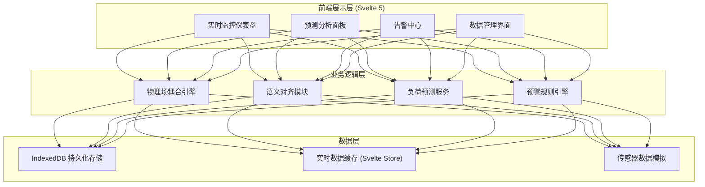

# CableLink - 技术架构文档

## 1. 架构设计



## 2. 技术描述

### 2.1 核心技术栈

- **前端框架**：Svelte 5 (Runes 模式) + TypeScript
- **构建工具**：Vite 5
- **样式方案**：Tailwind CSS 3 + 自定义 CSS 变量
- **状态管理**：Svelte 5 Runes (原生响应式)
- **数据可视化**：D3.js 7 + Canvas 2D
- **本地存储**：IndexedDB (idb 库封装)
- **图表库**：自定义 WebGL 渲染器 (高性能热力图)

### 2.2 关键技术选型理由

1. **Svelte 5**：编译时框架，无运行时开销，适合高性能数据可视化场景
2. **Runes 响应式**：细粒度响应式更新，优化大规模数据流的渲染性能
3. **IndexedDB**：支持 GB 级本地数据存储，满足长周期历史数据需求
4. **Canvas/WebGL**：实现每秒 60fps 的温度热力图实时渲染

## 3. 路由定义

| 路由 | 页面 | 功能 |
|-------|------|------|
| `/` | 监控总览 | 实时数据看板、温度热力图 |
| `/prediction` | 预测分析 | 温升预测、载流量优化 |
| `/history` | 历史数据 | 数据查询、曲线对比、回放 |
| `/alerts` | 告警中心 | 告警列表、规则配置 |
| `/settings` | 系统设置 | 参数配置、模型校准 |

## 4. 数据模型

### 4.1 核心数据结构

```typescript
// 温度测点数据
interface TemperaturePoint {
  timestamp: number;
  sensorId: string;
  position: { distance: number; depth: number };
  temperature: number;
  current: number;
  voltage: number;
}

// 海缆物理参数
interface CableParameters {
  id: string;
  length: number;
  maxCurrent: number;
  maxTemperature: number;
  thermalResistance: number;
  ambientTemperature: number;
}

// 预警记录
interface AlertRecord {
  id: string;
  timestamp: number;
  type: 'overheat' | 'overcurrent' | 'abnormal';
  severity: 'info' | 'warning' | 'danger';
  sensorId: string;
  value: number;
  threshold: number;
  status: 'active' | 'acknowledged' | 'resolved';
}

// 预测结果
interface PredictionResult {
  timestamp: number;
  horizon: number; // 预测时长(小时)
  temperatureForecast: Array<{ time: number; temp: number; confidence: number }>;
  safeCurrent: number;
  riskLevel: 'low' | 'medium' | 'high';
}
```

### 4.2 IndexedDB 存储结构

- **objectStore: `sensor_data`**：主键 `timestamp+sensorId`，索引 `timestamp`, `sensorId`
- **objectStore: `alerts`**：主键 `id`，索引 `timestamp`, `status`, `severity`
- **objectStore: `predictions`**：主键 `timestamp+horizon`，索引 `timestamp`
- **objectStore: `config`**：主键 `key`，存储系统配置参数

## 5. 目录结构

```
src/
├── components/           # 可复用组件
│   ├── dashboard/       # 仪表盘组件
│   ├── charts/          # 图表组件
│   ├── alerts/          # 告警组件
│   └── common/          # 通用组件
├── engine/              # 物理场耦合引擎
│   ├── thermal.ts       # 热力学计算
│   ├── coupling.ts      # 多物理场耦合
│   └── prediction.ts    # 预测模型
├── stores/              # Svelte 5 状态管理
│   ├── realtime.ts      # 实时数据流
│   ├── alerts.ts        # 告警状态
│   └── config.ts        # 系统配置
├── db/                  # IndexedDB 封装
│   ├── index.ts         # 数据库连接
│   ├── sensor.ts        # 传感器数据操作
│   └── alerts.ts        # 告警数据操作
├── alignment/           # 语义对齐模块
│   ├── normalize.ts     # 数据标准化
│   └── mapping.ts       # 语义映射
├── utils/               # 工具函数
├── types/               # TypeScript 类型定义
├── routes/              # 页面路由
├── App.svelte
└── main.ts
```

## 6. 核心模块设计

### 6.1 多重物理场耦合引擎

- **热力学模型**：基于傅里叶热传导方程的有限差分求解
- **电磁场模型**：焦耳热计算、集肤效应模拟
- **环境因素**：海水温度、海流速度、土壤热阻耦合
- **异步计算**：Web Worker 后台计算，避免阻塞 UI

### 6.2 语义对齐模块

- **数据标准化**：不同厂商传感器数据格式统一
- **时间同步**：多源数据时间戳对齐、插值补全
- **空间校准**：传感器位置映射到海缆坐标系统
- **元数据管理**：传感器属性、校准参数统一管理

### 6.3 性能优化策略

- 增量数据更新，避免全量重绘
- Web Worker 隔离计算密集型任务
- Canvas 分层渲染，热点区域按需更新
- IndexedDB 分页查询，控制内存占用
- 虚拟滚动处理长列表
