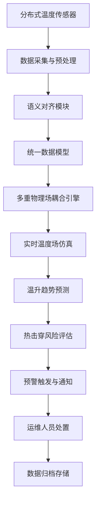

# CableLink - 海底电缆温升负载负荷预测系统 PRD

## 1. 产品概述

CableLink 是一款基于 Svelte 5 的海底电缆温度监控与负荷预测系统，专为海上风电运维与调度管理设计。通过异步多重物理场耦合引擎实时模拟载流量波动，实现分布式温度数据的语义对齐，预防热击穿风险，支撑跨海能源链路的高可用监控。

- **核心问题**：海底电缆长期运行中温度分布不均、载流量预测不准导致的热击穿风险
- **目标用户**：海上风电运维工程师、电网调度人员、能源管理专家
- **市场价值**：提升海缆运行安全性，降低运维成本，提高能源传输效率

## 2. 核心功能

### 2.1 用户角色

| 角色 | 注册方式 | 核心权限 |
|------|----------|----------|
| 运维工程师 | 企业账号登录 | 实时监控、告警处理、数据查询 |
| 调度人员 | 企业账号登录 | 负荷预测、调度决策、报表导出 |
| 系统管理员 | 企业账号登录 | 用户管理、参数配置、系统维护 |

### 2.2 功能模块

1. **实时监控仪表盘**：多维度温度热力图、载流量曲线、预警状态展示
2. **物理场耦合模拟**：异步多重物理场耦合引擎，实时温度场仿真
3. **负荷预测分析**：基于历史数据的温升趋势预测、载流量优化建议
4. **数据语义对齐**：分布式温度传感器数据标准化、跨系统语义映射
5. **长周期数据存储**：IndexedDB 本地持久化、历史曲线查询与回放
6. **热击穿预警系统**：多级阈值告警、风险评估、应急处置建议

### 2.3 页面详情

| 页面名称 | 模块名称 | 功能描述 |
|-----------|-------------|---------------------|
| 监控总览 | 实时数据面板 | 关键指标卡片、预警统计、系统状态概览 |
| 监控总览 | 温度热力图 | 海缆三维温度分布可视化、热点标注 |
| 监控总览 | 载流量曲线 | 实时/历史电流对比、负荷波动分析 |
| 预测分析 | 温升预测 | 基于物理模型的温度趋势预测、置信区间 |
| 预测分析 | 载流量优化 | 安全载流量计算、调度建议生成 |
| 数据管理 | 历史查询 | 多维度数据筛选、曲线对比、数据导出 |
| 告警中心 | 告警列表 | 分级告警展示、处理状态跟踪 |
| 告警中心 | 预警规则 | 阈值配置、告警策略管理 |
| 系统设置 | 参数配置 | 物理模型参数、传感器映射配置 |

## 3. 核心流程

## 4. 用户界面设计

### 4.1 设计风格

- **设计方向**：工业科技风 - 深海蓝为主色调，结合数据可视化的科技感
- **主色调**：深海蓝 (#0A2463)、科技青 (#3E92CC)
- **辅助色**：警告橙 (#FF9F1C)、危险红 (#E63946)、安全绿 (#2EC4B6)
- **中性色**：深空灰 (#1A1A2E)、银灰 (#F1FAEE)
- **字体**：IBM Plex Mono（等宽字体，适合数据展示） + Inter（正文字体）
- **布局**：暗色主题仪表盘布局，左侧导航 + 主内容区 + 右侧信息面板
- **视觉元素**：网格背景、微光效果、数据粒子动画、科技感边框

### 4.2 页面设计概览

| 页面名称 | 模块名称 | UI 元素 |
|-----------|-------------|-------------|
| 监控总览 | 实时数据面板 | 发光数据卡片、脉冲动画指标、渐变圆环图 |
| 监控总览 | 温度热力图 | Canvas 热力渲染、悬浮tooltip、时间轴滑块 |
| 监控总览 | 载流量曲线 | 多系列折线图、面积填充、交互缩放 |
| 预测分析 | 温升预测 | 置信区间阴影带、预测虚线、阈值参考线 |
| 告警中心 | 告警列表 | 分级颜色编码、状态徽章、处理时间线 |

### 4.3 响应性

- Desktop-first 设计，主监控屏适配 1920×1080 及以上分辨率
- 侧边栏可折叠，适配不同屏幕尺寸
- 图表区域支持自适应，关键数据在移动端保持可读性
- 触控交互优化，支持滑动查看历史数据

### 4.4 数据可视化

- 使用 D3.js 实现复杂热力图和物理场可视化
- WebGL 加速大规模温度数据渲染
- 实时数据流采用增量更新策略，优化性能
