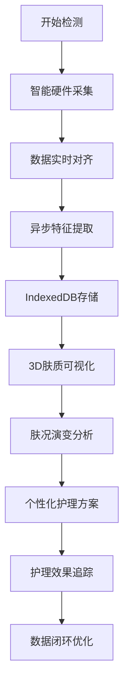

# DermaLogic 肤质追踪系统 - 产品需求文档

## 1. 产品概述

DermaLogic 是一款基于 Svelte 5 的智能肤质追踪平台，通过三维肤质纹理可视化与活性成分数据分析，实现智能硬件、诊断系统与护理终端间的实时数据对齐。利用异步特征提取算法解析肤况演变，结合 IndexedDB 存储长周期肤质影像切片，构建个性化精准护理的数据闭环。

- 核心价值：为用户提供科学、直观的肤质演化追踪，实现护肤效果可视化，打造数据驱动的个性化护理方案。

## 2. 核心功能

### 2.1 用户角色

| 角色 | 注册方式 | 核心权限 |
|------|----------|----------|
| 普通用户 | 邮箱/手机号注册 | 肤质数据采集、查看肤况报告、个性化护理方案 |
| 专业用户 | 机构认证 | 多用户管理、专业分析、数据导出 |

### 2.2 功能模块

1. **首页仪表盘：肤质概览、最新检测入口、肤况趋势图表
2. **三维肤质视图：3D肤质纹理可视化、活性成分热力图、时间轴对比
3. **数据采集页：硬件连接、影像上传、特征提取进度
4. **肤况分析报告：肤质指标分析、演变趋势、问题区域标注
5. **护理方案页：个性化方案、成分推荐、效果追踪
6. **设备管理页：硬件设备列表、同步状态、设备详情

### 2.3 页面详情

| 页面名称 | 模块名称 | 功能描述 |
|-----------|----------|----------|
| 首页仪表盘 | 肤质卡片 | 显示最新肤质评分、主要指标、最近检测时间 |
| 首页仪表盘 | 趋势图表 | 7天/30天肤况变化趋势折线图 |
| 首页仪表盘 | 快捷操作 | 快速检测入口、护理提醒 |
| 三维肤质视图 | 3D渲染区 | 交互式3D肤质模型、可旋转缩放 |
| 三维肤质视图 | 时间轴 | 历史影像时间轴、多时间点对比 |
| 三维肤质视图 | 成分热力图 | 活性成分分布、浓度可视化 |
| 数据采集页 | 设备连接 | 蓝牙/WiFi硬件连接状态 |
| 数据采集页 | 上传区域 | 拖拽上传、相机拍摄 |
| 数据采集页 | 特征提取 | 异步处理进度、实时反馈 |
| 肤况分析报告 | 指标分析 | 含水量、油脂、弹性、粗糙度等 |
| 肤况分析报告 | 问题标注 | 问题区域高亮、AI分析建议 |
| 护理方案页 | 方案推荐 | 基于肤况的个性化方案 |
| 护理方案页 | 成分匹配 | 活性成分与肤质问题匹配度 |
| 设备管理页 | 设备列表 | 已连接设备、状态指示 |
| 设备管理页 | 同步管理 | 数据同步、固件更新 |

## 3. 核心流程

用户通过智能硬件采集肤质影像 → 系统异步提取肤况特征 → IndexedDB存储影像切片 → 3D肤质模型实时渲染 → 肤况分析报告生成 → 个性化护理方案推荐 → 护理效果追踪闭环

## 4. 用户界面设计

### 4.1 设计风格

- **主色调**：科技感深蓝 (#0EA5E9) 代表专业与科技感
- **辅助色**：清新薄荷绿 (#10B981) 代表健康与自然
- **中性色**：深灰 (#1F2937) 至浅灰 (#F9FAFB)
- **按钮风格**：圆角 12px，微立体阴影，悬停放大效果
- **字体**：标题使用优雅无衬线字体，正文使用易读性字体
- **布局风格**：卡片式布局，玻璃拟态效果，层次分明
- **图标风格**：线性图标，统一 24px 标准尺寸

### 4.2 页面设计概览

| 页面名称 | 模块名称 | UI 元素 |
|----------|----------|----------|
| 首页仪表盘 | 肤质卡片 | 渐变背景、圆形进度环、数据卡片 |
| 首页仪表盘 | 趋势图表 | 平滑曲线、渐变色填充、交互提示 |
| 三维肤质视图 | 3D渲染区 | 全屏画布、控制按钮、悬浮工具栏 |
| 三维肤质视图 | 时间轴 | 缩略图预览、滑动选择器 |
| 数据采集页 | 上传区域 | 虚线边框、拖拽高亮、进度动画 |
| 肤况分析报告 | 指标雷达图 | 六维雷达、渐变填充 |
| 护理方案页 | 方案卡片 | 成分标签、匹配度进度条 |

### 4.3 响应式设计

- 桌面端优先设计，适配平板和移动端
- 3D 视图在移动端简化为 2.5D 展示
- 触控优化：增大点击区域，优化滑动手势支持

### 4.4 3D 场景设计

- 环境：柔和环境光，突出肤质纹理细节
- 光照：三点光源 setup，主光 45 度斜射
- 相机：轨道控制器，默认 ，支持旋转缩放
- 交互：点击区域显示详细数据，悬停高亮
- 动画：平滑过渡动画，纹理变化动态效果
