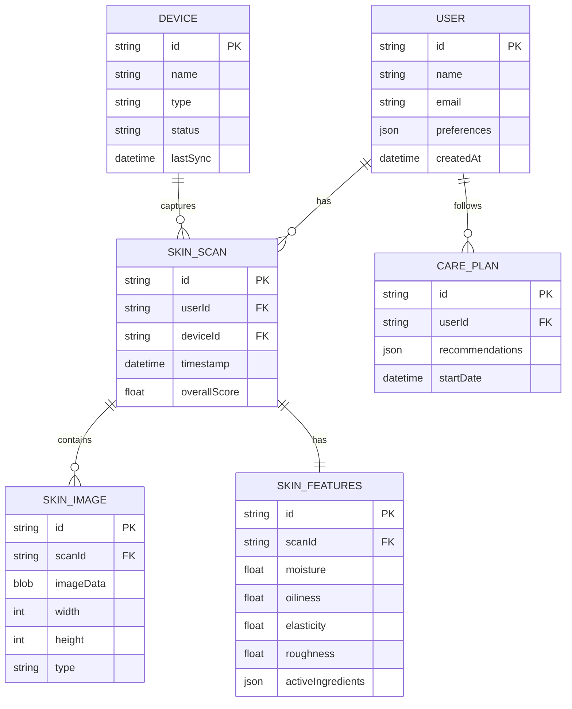

# DermaLogic 肤质追踪系统 - 技术架构文档

## 1. 架构设计

```mermaid
graph TD
    subgraph "前端层 (Svelte 5"
        A["UI 组件层
        B["状态管理 (Svelte Stores"]
        C["3D 渲染引擎 (Three.js)"]
        D["路由管理"]
    end
    
    subgraph "业务逻辑层"
        E["特征提取服务
        F["数据同步服务
        G["护理推荐引擎
    end
    
    subgraph "数据层"
        H["IndexedDB (肤质影像存储)
        I["本地存储 (用户偏好
    end
    
    subgraph "硬件对接层"
        J["蓝牙/WebBluetooth API
        K["WebSocket 实时通信
    end
    
    A --> B
    B --> E
    E --> H
    A --> C
    B --> F
    F --> K
    E --> G
    J --> F
    K --> F
```

## 2. 技术栈说明

- **前端框架**：Svelte 5 + TypeScript
- **构建工具**：Vite 5
- **状态管理**：Svelte Stores (原生
- **3D 渲染**：Three.js
- **本地数据库**：IndexedDB (idb)
- **样式方案**：TailwindCSS 3
- **实时通信**：WebSocket
- **硬件对接**：Web Bluetooth API
- **图表库**：Chart.js
- **图标库**：Lucide Icons

## 3. 路由定义

| 路由 | 页面 | 功能 |
|------|------|------|
| `/` | 首页仪表盘 | 肤质概览、快捷入口
| `/skin-3d` | 三维肤质视图 | 3D肤质模型、时间轴对比
| `/capture` | 数据采集 | 影像上传、特征提取
| `/analysis` | 肤况分析 | 报告展示
| `/care` | 护理方案 | 个性化推荐
| `/devices` | 设备管理 | 硬件管理

## 4. 数据模型

### 4.1 数据模型定义



### 4.2 IndexedDB 存储结构

- **数据库名**: `dermalogic-db`
- **对象存储**:
  - `skinScans`: 肤质检测记录
  - `skinImages`: 肤质影像切片 (Blob存储
  - `carePlans`: 护理方案
  - `devices`: 设备信息

## 5. 核心模块设计

### 5.1 异步特征提取算法

```typescript
// 特征提取服务接口
interface FeatureExtractor {
  extractFeatures(imageData: ImageData): Promise<SkinFeatures>
  extractTrendAnalysis(scans: SkinScan[]): Promise<TrendReport>
}
```

**算法流程:
1. 图像预处理 → 纹理分析 → 特征提取 → 指标计算 → 结果存储

### 5.2 数据实时对齐服务

```typescript
// 数据同步服务
interface DataSyncService {
  connect(deviceId: string): Promise<void>
  syncData(): Promise<void>
  onData(callback: (data: SkinScan) => void
}
```

### 5.3 3D 肤质渲染引擎

```typescript
// 3D 肤质渲染器
class SkinRenderer {
  init(container: HTMLElement): void
  updateTexture(imageData: ImageData): void
  setHighlight(features: SkinFeatures): void
}
```

## 6. 性能优化策略

- **Web Workers**: 特征提取在 Web Worker 中执行，避免阻塞 UI
- **IndexedDB 分页查询优化
- **3D 纹理压缩**: LOD 层级细节
- **请求节流**: 实时数据同步节流
- **虚拟列表虚拟化
- **图片懒加载**

## 7. 项目结构

```
src/
├── components/     # UI 组件
├── stores/        # Svelte 状态管理
├── services/     # 业务服务
├── utils/        # 工具函数
├── types/       # TypeScript 类型定义
├── pages/       # 页面组件
└── lib/         # 第三方库封装
```
