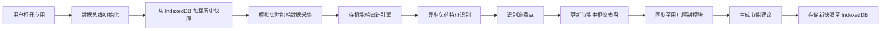
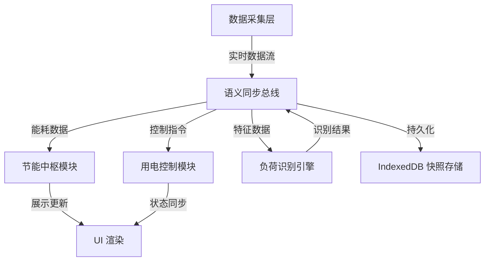

## 1. 产品概述

智能家庭能效管理系统（EcoLiving），基于 Svelte 5 构建，通过实时追踪待机能耗足迹演化，实现电力损耗数据在节能中枢与智能用电控制模块间的实时语义同步。利用异步负荷特征识别引擎自动识别隐性浪费点，结合 IndexedDB 持久化存储家庭用能特征历史快照，为跨系统能效管理提供量化数据总线。

- 核心价值：帮助用户可视化家庭用电情况，自动识别能源浪费，提供节能建议
- 目标用户：关注家庭能耗、希望降低电费支出的家庭用户
- 技术亮点：Svelte 5 响应式、异步负荷识别引擎、IndexedDB 离线存储、实时数据同步总线

## 2. 核心功能

### 2.1 用户角色

| 角色 | 注册方式 | 核心权限 |
|------|----------|----------|
| 家庭用户 | 本地初始化配置 | 查看能耗数据、配置用电设备、接收节能建议、导出能耗报告 |

### 2.2 功能模块

1. **节能中枢仪表盘**：实时能耗概览、待机功率监测、能耗趋势演化图
2. **智能用电控制模块**：设备列表管理、用电状态监控、远程控制模拟
3. **负荷特征识别引擎**：异步异常检测、隐性浪费点识别、浪费等级评估
4. **用能历史快照**：IndexedDB 数据存储、历史趋势对比、快照管理
5. **数据同步总线**：模块间语义同步、实时数据推送、跨组件状态同步

### 2.3 页面详情

| 页面名称 | 模块名称 | 功能描述 |
|----------|----------|----------|
| 节能中枢仪表盘 | 能耗概览卡片 | 显示当前总功率、今日用电量、预计电费、节能评分 |
| 节能中枢仪表盘 | 待机功率追踪 | 实时追踪待机能耗演化曲线，标注异常波动点 |
| 节能中枢仪表盘 | 能耗分布饼图 | 按设备分类展示用电占比，支持交互查看详情 |
| 智能用电控制 | 设备列表 | 展示所有智能设备，包含运行状态、当前功率、待机时长 |
| 智能用电控制 | 设备详情 | 单设备能耗曲线、待机模式分析、优化建议 |
| 负荷特征识别 | 浪费点列表 | 异步识别引擎输出的异常浪费点，按严重程度排序 |
| 负荷特征识别 | 特征分析 | 负荷特征波形图、异常模式匹配、识别置信度 |
| 历史快照管理 | 快照时间轴 | 按时间维度展示历史用能快照，支持对比分析 |
| 历史快照管理 | 数据导出 | 导出能耗报告为 JSON/CSV 格式 |

## 3. 核心流程

### 主业务流程

### 数据同步流程

## 4. 用户界面设计

### 4.1 设计风格

**科技未来感 · 深色主题**

- **主色调**：深青色 `#00D4AA`（代表能源与科技）
- **辅助色**：电光蓝 `#3B82F6`、警示橙 `#F59E0B`、危险红 `#EF4444`
- **背景色**：深空灰 `#0F172A`、卡片灰 `#1E293B`、边框灰 `#334155`
- **字体**：
  - 标题：`Space Grotesk` - 现代几何无衬线，体现科技感
  - 正文：`Inter` - 清晰易读的通用字体
  - 数据数字：`JetBrains Mono` - 等宽字体，确保数据对齐

**设计元素**：
- 玻璃拟态卡片（Glassmorphism）配合微妙的发光边框
- 数据可视化采用渐变线条和发光效果
- 微交互动画：悬停提升、数据脉冲、平滑过渡
- 背景：深色渐变 + 微妙网格纹理 + 低透明度光晕装饰

### 4.2 页面设计概览

| 页面名称 | 模块名称 | UI 元素 |
|----------|----------|----------|
| 节能中枢仪表盘 | 顶部导航栏 | Logo、模块切换标签、当前时间、设置按钮 |
| 节能中枢仪表盘 | 能耗概览卡片组 | 4 张玻璃拟态卡片，数据数字动画递增 |
| 节能中枢仪表盘 | 待机能耗趋势图 | SVG 面积图，渐变填充，异常点红色标记 |
| 节能中枢仪表盘 | 能耗分布环形图 | 交互式环形图，悬停显示详情 |
| 智能用电控制 | 设备网格 | 响应式卡片网格，显示设备状态、功率、开关控制 |
| 智能用电控制 | 设备详情面板 | 右侧滑入面板，展示设备详细能耗分析 |
| 负荷特征识别 | 浪费点列表 | 时间线布局，浪费等级色标标识 |
| 负荷特征识别 | 特征波形图 | Canvas 绘制的实时负荷特征曲线 |
| 历史快照管理 | 快照时间轴 | 垂直时间轴，可点击查看任意历史快照 |
| 历史快照管理 | 对比分析视图 | 双栏布局，支持两个时间段能耗对比 |

### 4.3 响应式设计

- **桌面端优先**（1280px+）：四栏布局，充分利用大屏空间展示多维度数据
- **平板端**（768px-1279px）：两栏布局，侧边导航可折叠
- **移动端**（< 768px）：单列流式布局，底部标签栏导航，图表自适应缩放

### 4.4 交互动效

- **页面加载**：卡片按顺序淡入上浮，延迟 50ms 错落有致
- **数据更新**：数字变化使用平滑过渡动画，图表使用线条绘制动画
- **悬停效果**：卡片提升 4px，边框发光增强，阴影加深
- **切换动画**：模块切换使用左右滑入动画，配合内容淡入
- **异常告警**：浪费点识别后使用脉冲动画吸引注意力
