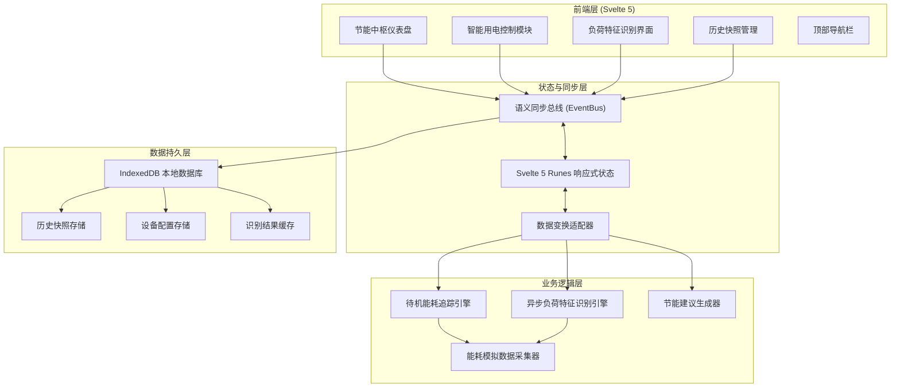
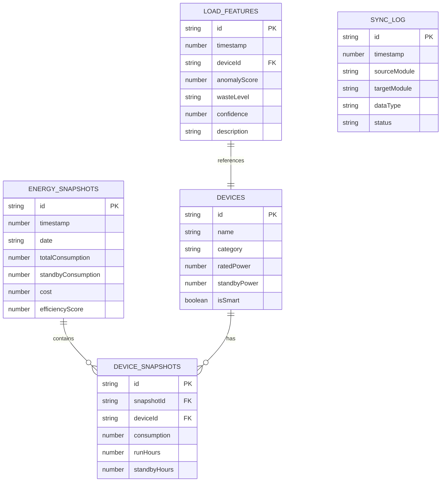
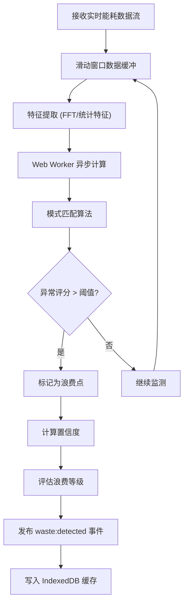

## 1. 架构设计



## 2. 技术描述

- **前端框架**：Svelte 5.0 + TypeScript（使用 Runes 新特性实现细粒度响应式）
- **构建工具**：Vite 5.x
- **样式方案**：Tailwind CSS 3.x + CSS Variables（主题系统）
- **图标库**：Lucide Icons
- **数据可视化**：自定义 SVG + Canvas（轻量级，避免引入重型图表库）
- **本地存储**：IndexedDB（idb 库封装）
- **状态管理**：Svelte 5 Runes + 自定义 EventBus（语义同步总线）
- **包管理器**：pnpm

### 关键技术选型理由

1. **Svelte 5 Runes**：利用 `$state`、`$derived`、`$effect` 实现细粒度响应式，精确追踪能耗数据变化
2. **语义同步总线**：基于发布/订阅模式的 EventBus，实现模块间解耦的数据同步
3. **异步负荷识别引擎**：使用 Web Workers 执行特征匹配算法，避免阻塞主线程
4. **IndexedDB**：存储大容量历史快照数据，支持离线查询和时间序列分析

## 3. 路由定义

| 路由路径 | 页面组件 | 功能描述 |
|----------|----------|----------|
| `/` | `Dashboard.svelte` | 节能中枢仪表盘 - 能耗概览、实时监控 |
| `/control` | `DeviceControl.svelte` | 智能用电控制 - 设备管理、远程控制 |
| `/detection` | `WasteDetection.svelte` | 负荷特征识别 - 浪费点识别、特征分析 |
| `/history` | `HistorySnapshots.svelte` | 历史快照管理 - 时间轴、对比分析 |

## 4. 核心数据结构

### 4.1 能耗数据模型

```typescript
interface EnergyReading {
  timestamp: number;
  totalPower: number;
  standbyPower: number;
  devices: DeviceReading[];
}

interface DeviceReading {
  deviceId: string;
  name: string;
  power: number;
  isOn: boolean;
  isStandby: boolean;
  standbyDuration: number;
}

interface LoadFeature {
  timestamp: number;
  deviceId: string;
  waveform: number[];
  patternMatch: number;
  anomalyScore: number;
  isWaste: boolean;
  wasteLevel: 'low' | 'medium' | 'high' | 'critical';
  confidence: number;
  description: string;
}

interface EnergySnapshot {
  id: string;
  timestamp: number;
  date: string;
  totalConsumption: number;
  standbyConsumption: number;
  cost: number;
  efficiencyScore: number;
  deviceBreakdown: DeviceSnapshot[];
  detectedWastePoints: string[];
  weather?: {
    temperature: number;
    humidity: number;
  };
}

interface DeviceSnapshot {
  deviceId: string;
  name: string;
  consumption: number;
  runHours: number;
  standbyHours: number;
  category: string;
}
```

### 4.2 IndexedDB 存储模型



## 5. 模块架构设计

### 5.1 目录结构

```
src/
├── app.svelte                 # 根组件
├── main.ts                    # 入口文件
├── lib/
│   ├── types/                 # TypeScript 类型定义
│   │   └── energy.ts
│   ├── stores/                # 状态管理 (Svelte 5 Runes)
│   │   ├── energyStore.ts
│   │   └── deviceStore.ts
│   ├── bus/                   # 语义同步总线
│   │   └── eventBus.ts
│   ├── engine/                # 核心引擎
│   │   ├── standbyTracker.ts
│   │   ├── loadRecognizer.ts
│   │   └── suggestionEngine.ts
│   ├── db/                    # IndexedDB 封装
│   │   ├── indexedDB.ts
│   │   └── snapshotStore.ts
│   ├── utils/                 # 工具函数
│   │   ├── formatters.ts
│   │   ├── math.ts
│   │   └── mockData.ts
│   └── components/            # 可复用组件
│       ├── charts/            # 图表组件
│       ├── cards/             # 卡片组件
│       └── ui/                # UI 基元组件
├── pages/                     # 页面组件
│   ├── Dashboard.svelte
│   ├── DeviceControl.svelte
│   ├── WasteDetection.svelte
│   └── HistorySnapshots.svelte
└── styles/                    # 全局样式
    └── app.css
```

### 5.2 语义同步总线接口

```typescript
interface SyncEvent<T = any> {
  type: string;
  source: 'dashboard' | 'control' | 'detection' | 'history' | 'engine';
  target?: string;
  payload: T;
  timestamp: number;
  priority: 'low' | 'normal' | 'high';
}

interface EventBus {
  publish<T>(event: SyncEvent<T>): void;
  subscribe<T>(type: string, handler: (event: SyncEvent<T>) => void): () => void;
  unsubscribe(type: string, handler: Function): void;
  broadcast<T>(payload: T, source: string): void;
}

// 事件类型定义
type SyncEventType = 
  | 'energy:reading'           // 新能耗读数
  | 'device:state-change'      // 设备状态变化
  | 'waste:detected'           // 发现浪费点
  | 'snapshot:created'         // 新快照创建
  | 'ui:navigate'              // 页面导航
  | 'sync:request'             // 数据同步请求
  | 'suggestion:generated';    // 节能建议生成
```

### 5.3 异步负荷识别引擎工作流程



## 6. 核心算法说明

### 6.1 待机能耗追踪算法
- 基于滑动窗口的实时基线计算
- 动态阈值检测（考虑环境温度、时间等因素）
- 待机时长累积与能耗积分计算

### 6.2 负荷特征识别算法
- 统计特征：均值、方差、峰度、偏度
- 频域特征：FFT 变换提取主要频率成分
- 时序特征：上升沿/下降沿斜率、稳态波动
- 模式匹配：与已知浪费模式库进行余弦相似度匹配

### 6.3 节能评分算法
- 待机占比权重（40%）
- 设备效率评分（30%）
- 浪费点数量与等级（20%）
- 历史改善趋势（10%）

## 7. 性能优化策略

1. **虚拟滚动**：历史快照列表使用虚拟滚动，支持万级数据量
2. **Web Workers**：负荷特征识别在 Worker 线程执行
3. **请求分片**：IndexedDB 查询按时间片分页加载
4. **节流防抖**：高频数据更新使用节流（100ms）
5. **组件懒加载**：非首屏组件使用 Svelte 动态导入
6. **内存优化**：历史数据自动归档，仅保留近期高频访问数据

## 8. 初始化与数据生成

应用首次启动时：
1. 初始化 IndexedDB 数据库和对象仓库
2. 生成模拟设备配置（8-12 个典型家庭设备）
3. 生成过去 30 天的历史能耗快照
4. 启动模拟数据采集器（每 2 秒生成新读数）
5. 启动负荷识别引擎（每 10 秒分析一次）
6. 每小时自动创建一个能耗快照
