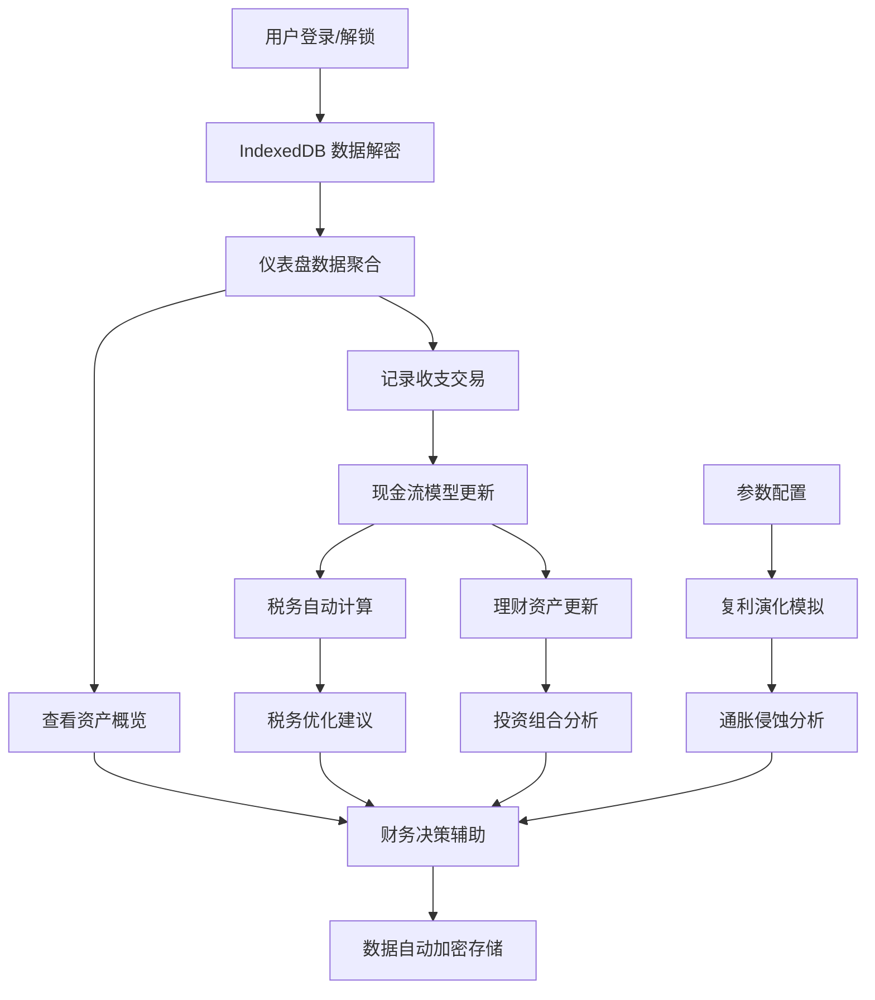

## 1. 产品概述
FinanceNexus 是一款面向个人用户的跨周期财务规划系统，整合记账、税务优化与理财辅助功能，通过现金流模型与通胀侵蚀分析，帮助用户实现长期财务健康。
- 核心价值：让用户清晰了解金钱的时间价值，抵御通胀侵蚀，实现资产的跨周期稳健增长
- 目标用户：有长期财务规划意识、希望科学管理个人财务的中青年群体

## 2. 核心特性

### 2.1 用户角色
| 角色 | 注册方式 | 核心权限 |
|------|----------|----------|
| 个人用户 | 本地密码加密注册 | 完整使用所有功能，数据仅本地存储 |

### 2.2 功能模块
1. **仪表盘首页**：资产概览、现金流趋势、通胀侵蚀预警、关键财务指标
2. **记账中心**：收支记录、分类管理、标签系统、批量导入
3. **税务规划**：个税计算、专项附加扣除、税务优化建议、年度汇算模拟
4. **理财辅助**：资产配置、风险评估、投资组合分析、收益预测
5. **模拟引擎**：复利演化模拟、通胀压力测试、多情景财务预测
6. **数据管理**：数据加密、备份恢复、导出导入、跨设备同步

### 2.3 页面详情
| 页面名称 | 模块名称 | 功能描述 |
|----------|----------|----------|
| 仪表盘 | 资产概览卡片 | 展示净资产、流动资产、固定资产、负债总额及变化趋势 |
| 仪表盘 | 现金流趋势图 | 月度/季度/年度收入支出对比，结余率分析 |
| 仪表盘 | 通胀侵蚀预警 | 显示当前资产在不同通胀率下的购买力衰减曲线 |
| 仪表盘 | 财务健康评分 | 综合评估财务状况，给出具体改进建议 |
| 记账中心 | 交易记录列表 | 支持筛选、搜索、编辑、删除、分类统计 |
| 记账中心 | 快速记账表单 | 支持收支类型、金额、分类、标签、备注、日期 |
| 记账中心 | 分类管理 | 自定义收支分类，设置预算提醒 |
| 税务规划 | 个税计算器 | 按月/按年计算应纳税额，支持各项扣除 |
| 税务规划 | 优化建议 | 根据收入结构给出税务筹划方案 |
| 理财辅助 | 资产配置看板 | 各类资产占比、风险等级分布、收益率对比 |
| 理财辅助 | 投资组合分析 | 夏普比率、最大回撤、相关性分析 |
| 模拟引擎 | 复利演化模拟 | 调整本金、利率、时间、通胀率等参数，可视化展示结果 |
| 模拟引擎 | 情景分析 | 失业、加息、通胀等不同情景下的财务抗压测试 |
| 数据管理 | 加密设置 | 设置本地数据加密密码，修改加密密钥 |
| 数据管理 | 备份恢复 | 导出加密备份文件，从备份恢复数据 |

## 3. 核心流程
用户首次使用时设置加密密码，系统初始化 IndexedDB 本地数据库。日常使用中，用户记录收支，系统自动更新现金流模型。税务模块根据收入记录计算应纳税额。理财模块整合资产数据，模拟引擎基于历史数据和用户设定参数进行复利演化预测，同时考虑通胀因素对实际购买力的侵蚀。所有数据实时加密存储于本地，保障数据主权。

## 4. 用户界面设计

### 4.1 设计风格
- 主色调：深邃藏青色 (#0F172A) 搭配 琥珀金 (#F59E0B)，营造专业金融感
- 辅助色：翡翠绿 (#10B981) 代表资产增长，玫瑰红 (#F43F5E) 代表支出预警
- 中性色：石板灰系列，确保内容可读性
- 字体：标题使用 Playfair Display 彰显品质，正文使用 Inter 保证可读性
- 布局：卡片式模块化布局，信息层级分明，数据可视化突出
- 动效：数据加载时的渐进式动画，图表的入场动画，卡片悬停微交互
- 背景：深色主题配合微妙的渐变和噪点纹理，营造高端金融数据仪表盘氛围

### 4.2 页面设计概览
| 页面名称 | 模块名称 | UI 元素 |
|----------|----------|----------|
| 仪表盘 | 资产概览 | 渐变色数值卡片、增长趋势迷你图、同比环比变化指示器 |
| 仪表盘 | 现金流趋势 | 面积对比图、时间范围切换器、数据点悬浮提示 |
| 仪表盘 | 通胀侵蚀 | 双曲线对比图（名义值vs实际购买力）、时间轴滑块 |
| 记账中心 | 交易列表 | 分组时间线布局、分类色标、快速编辑悬浮工具栏 |
| 税务规划 | 个税计算 | 阶梯式税率可视化、扣除项可折叠面板、优化建议高亮 |
| 模拟引擎 | 复利演化 | 可交互参数滑块、多情景曲线叠加、蒙特卡洛模拟散点图 |

### 4.3 响应式
- 桌面端：三栏布局，左侧导航 + 主内容区 + 右侧信息面板
- 平板端：两栏布局，底部导航，内容区自适应
- 移动端：单栏流式布局，底部标签导航，核心操作悬浮按钮
- 触控优化：所有可点击元素最小 44x44px，关键操作按钮放大

### 4.4 数据可视化设计
- 图表库：使用 Recharts 实现专业级数据可视化
- 动画：所有图表入场时带有渐进式绘制动画
- 交互：支持悬停查看详情、点击区域下钻、范围选择
- 主题：支持明暗主题切换，图表配色自动适配
