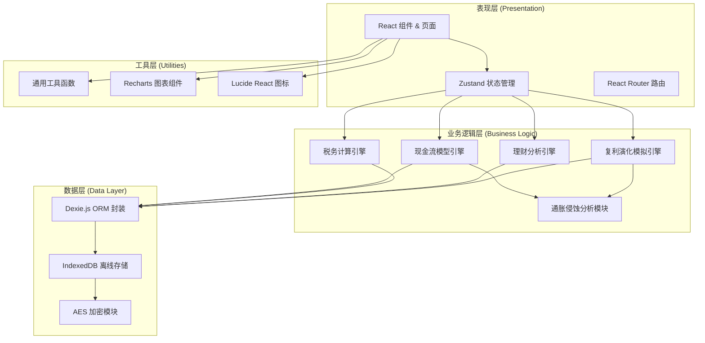
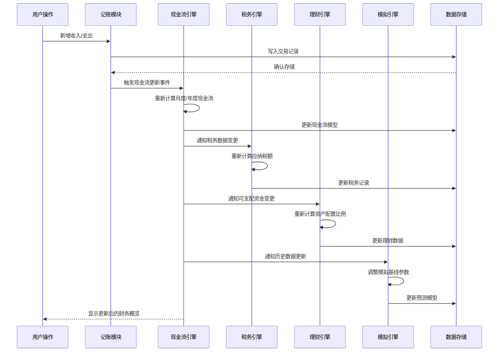
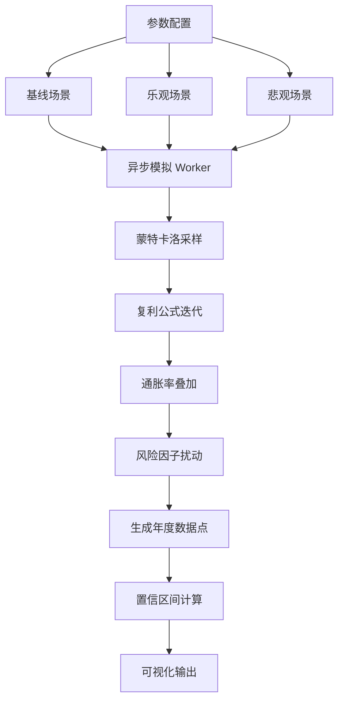
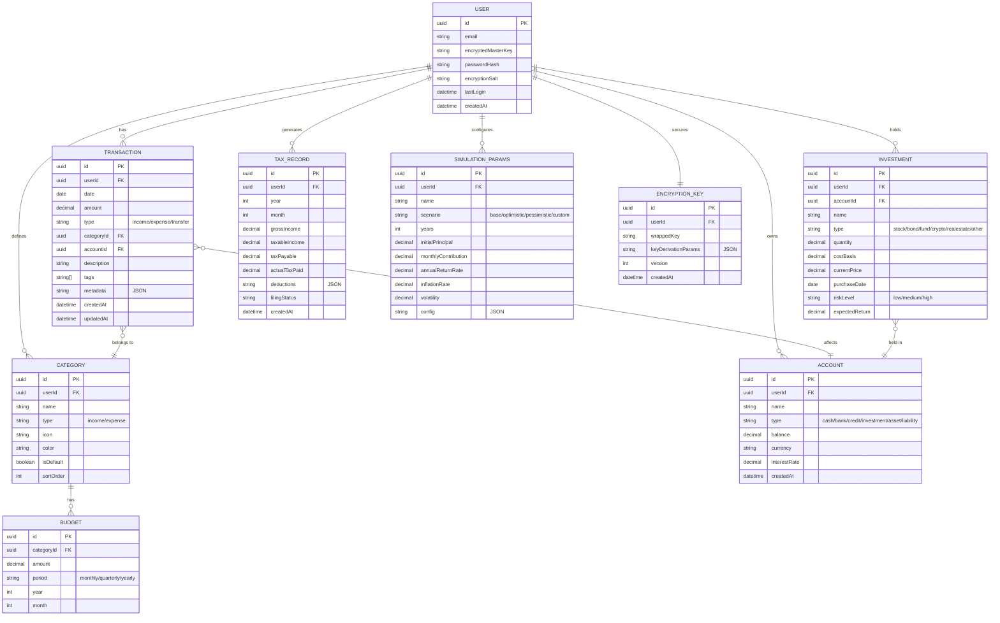

## 1. 架构设计



## 2. 技术选型说明

| 技术 | 版本 | 用途说明 |
|------|------|----------|
| React | 18.x | 前端框架，函数式组件 + Hooks |
| TypeScript | 5.x | 类型安全，减少运行时错误 |
| Vite | 5.x | 构建工具，快速开发体验 |
| TailwindCSS | 3.x | 原子化 CSS 框架 |
| Zustand | 4.x | 轻量级状态管理 |
| React Router | 6.x | 路由管理 |
| Dexie.js | 4.x | IndexedDB ORM 封装 |
| Recharts | 2.x | 数据可视化图表库 |
| Lucide React | 0.x | 图标库 |
| CryptoJS | 4.x | AES 加密算法实现 |
| date-fns | 3.x | 日期时间处理 |

## 3. 核心架构原则

### 3.1 数据主权与安全
- **本地优先**：所有财务数据优先存储于 IndexedDB，不上传云端
- **端到端加密**：使用用户密码派生密钥，AES-256 加密存储敏感数据
- **零知识架构**：系统无法访问用户明文数据，密码重置将丢失数据
- **可导出验证**：用户可导出加密备份，自行验证数据完整性

### 3.2 系统间逻辑联动机制


### 3.3 异步复利演化模拟引擎设计


## 4. 路由定义

| 路由路径 | 页面名称 | 权限要求 |
|----------|----------|----------|
| `/` | 登录/解锁页 | 公开 |
| `/dashboard` | 仪表盘 | 需要认证 |
| `/transactions` | 记账中心 | 需要认证 |
| `/transactions/new` | 新增交易 | 需要认证 |
| `/categories` | 分类管理 | 需要认证 |
| `/tax` | 税务规划 | 需要认证 |
| `/tax/calculator` | 个税计算器 | 需要认证 |
| `/finance` | 理财辅助 | 需要认证 |
| `/finance/portfolio` | 投资组合 | 需要认证 |
| `/simulation` | 模拟引擎 | 需要认证 |
| `/simulation/compound` | 复利演化 | 需要认证 |
| `/simulation/scenario` | 情景分析 | 需要认证 |
| `/settings` | 系统设置 | 需要认证 |
| `/settings/data` | 数据管理 | 需要认证 |
| `/settings/security` | 安全设置 | 需要认证 |

## 5. 数据模型设计

### 5.1 ER 图



### 5.2 IndexedDB 存储配置

| Object Store | 主键 | 索引 | 加密字段 |
|--------------|------|------|----------|
| users | id | email | encryptedMasterKey, passwordHash |
| transactions | id | userId, date, type, categoryId, accountId | amount, description, metadata |
| categories | id | userId, type | name |
| accounts | id | userId, type | name, balance |
| investments | id | userId, accountId, type | name, costBasis, currentPrice |
| tax_records | id | userId, year, month | grossIncome, deductions |
| simulation_params | id | userId, scenario | config |
| budgets | id | categoryId, period | amount |
| encryption_keys | id | userId, version | wrappedKey |

## 6. 核心算法设计

### 6.1 现金流模型计算公式

```typescript
// 月度现金流计算
interface MonthlyCashFlow {
  month: string;
  income: number;
  expense: number;
  netFlow: number;
  savingsRate: number; // 储蓄率 = 净现金流 / 收入
}

// 累计现金流
interface CumulativeCashFlow {
  date: string;
  cumulativeIncome: number;
  cumulativeExpense: number;
  netWorth: number;
}
```

### 6.2 通胀侵蚀计算

```typescript
// 名义价值 vs 实际购买力
interface InflationImpact {
  year: number;
  nominalValue: number;      // 名义价值
  realValue: number;         // 实际购买力（扣除通胀）
  erosionAmount: number;     // 通胀侵蚀金额
  erosionRate: number;       // 累计侵蚀率
}

// 复利公式（考虑通胀）
// FV_real = PV * (1 + r)^n / (1 + i)^n
// 其中: r = 名义收益率, i = 通胀率, n = 年数
```

### 6.3 异步复利演化模拟

```typescript
interface SimulationConfig {
  initialPrincipal: number;      // 初始本金
  monthlyContribution: number;   // 每月定投
  annualReturnRate: number;      // 年化收益率
  inflationRate: number;         // 通胀率
  years: number;                 // 投资年限
  volatility: number;            // 波动率（标准差）
  simulations: number;           // 模拟次数
}

interface SimulationResult {
  year: number;
  median: number;                // 中位数
  p5: number;                    // 5% 分位（悲观）
  p25: number;                   // 25% 分位
  p75: number;                   // 75% 分位
  p95: number;                   // 95% 分位（乐观）
  inflationAdjusted: {
    median: number;
    p5: number;
    p95: number;
  };
}
```

### 6.4 税务计算（中国个人所得税）

```typescript
// 综合所得税率表（年度）
const TAX_BRACKETS = [
  { min: 0, max: 36000, rate: 0.03, deduction: 0 },
  { min: 36000, max: 144000, rate: 0.10, deduction: 2520 },
  { min: 144000, max: 300000, rate: 0.20, deduction: 16920 },
  { min: 300000, max: 420000, rate: 0.25, deduction: 31920 },
  { min: 420000, max: 660000, rate: 0.30, deduction: 52920 },
  { min: 660000, max: 960000, rate: 0.35, deduction: 85920 },
  { min: 960000, max: Infinity, rate: 0.45, deduction: 181920 },
];

// 专项附加扣除
interface SpecialDeductions {
  childEducation: number;      // 子女教育
  continuingEducation: number; // 继续教育
  seriousIllness: number;      // 大病医疗
  housingLoanInterest: number; // 住房贷款利息
  housingRent: number;         // 住房租金
  elderlySupport: number;      // 赡养老人
  infantCare: number;          // 3岁以下婴幼儿照护
}
```

## 7. 项目目录结构

```
FinanceNexus/
├── src/
│   ├── components/          # 通用组件
│   │   ├── layout/         # 布局组件
│   │   ├── charts/         # 图表组件
│   │   ├── forms/          # 表单组件
│   │   └── ui/             # 基础 UI 组件
│   ├── pages/              # 页面组件
│   │   ├── Dashboard/
│   │   ├── Transactions/
│   │   ├── Tax/
│   │   ├── Finance/
│   │   ├── Simulation/
│   │   └── Settings/
│   ├── hooks/              # 自定义 Hooks
│   │   ├── useAuth.ts
│   │   ├── useCashFlow.ts
│   │   ├── useTax.ts
│   │   ├── useInvestment.ts
│   │   └── useSimulation.ts
│   ├── store/              # Zustand 状态管理
│   │   ├── useAuthStore.ts
│   │   ├── useDataStore.ts
│   │   └── useUISettingsStore.ts
│   ├── utils/              # 工具函数
│   │   ├── crypto/         # 加密模块
│   │   ├── database/       # 数据库操作
│   │   ├── calculations/   # 计算引擎
│   │   └── formatters/     # 格式化工具
│   ├── types/              # TypeScript 类型定义
│   ├── constants/          # 常量配置
│   └── workers/            # Web Workers（模拟引擎）
├── public/
├── index.html
├── package.json
├── vite.config.ts
├── tsconfig.json
└── tailwind.config.js
```

## 8. 性能优化策略

1. **Web Worker 异步计算**：复利模拟、税务计算等耗时操作在 Worker 线程执行
2. **数据增量更新**：仅重新计算变更影响的数据子集，避免全量重算
3. **虚拟滚动**：交易记录列表使用虚拟滚动，支持万级数据流畅浏览
4. **请求防抖**：搜索、筛选等高频操作使用防抖优化
5. **缓存策略**：计算结果缓存，相同参数直接复用
6. **懒加载**：非核心页面和组件使用 React.lazy 按需加载
