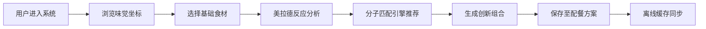

# FlavorNexus 产品需求文档 (PRD)

## 1. 产品概述

FlavorNexus 是一款基于 Vue 3 的家庭烹饪智能辅助系统，通过味觉坐标模型与美拉德反应数据科学，实现食谱研发与配餐模块间的语义同步映射，为家庭厨师提供创新烹饪组合推荐。

- **核心价值**: 将化学原理应用于家庭烹饪，科学地创造美味组合
- **目标用户**: 热爱烹饪的家庭厨师、美食爱好者、创意料理探索者
- **差异化优势**: 基于分子级别的风味匹配，结合 IndexedDB 离线缓存技术

## 2. 核心功能

### 2.1 用户角色

| 角色 | 注册方式 | 核心权限 |
|------|----------|----------|
| 家庭用户 | 本地初始化 | 浏览食谱、创建配餐、使用推荐引擎、管理收藏 |

### 2.2 功能模块

1. **味觉坐标系统**: 五味（甜酸苦咸鲜）空间定位，食材风味可视化
2. **美拉德反应分析**: 温度-时间-风味曲线，烹饪参数优化建议
3. **食谱研发工坊**: 食材组合探索，风味冲突检测，营养配比计算
4. **智能配餐模块**: 餐单设计，风味互补匹配，口味平衡分析
5. **分子匹配引擎**: 异步风味组合推荐，创新搭配发现
6. **离线数据中心**: IndexedDB 缓存管理，预设食谱库，本地数据持久化

### 2.3 页面详情

| 页面名称 | 模块名称 | 功能描述 |
|---------|----------|----------|
| 风味实验室首页 | Hero 区域 + 功能导航 | 系统概览，快速入口，味觉坐标可视化展示 |
| 味觉坐标页 | 五维雷达图 + 食材库 | 食材风味定位，多维比较，组合预览 |
| 美拉德分析页 | 反应曲线 + 参数调节 | 烹饪科学数据可视化，参数模拟 |
| 食谱工坊页 | 组合面板 + 实时分析 | 食材拖拽组合，风味冲突检测 |
| 智能配餐页 | 餐单设计器 + 推荐引擎 | 一键生成配餐方案，风味平衡分析 |
| 数据中心页 | 缓存管理 + 预设库 | IndexedDB 状态，预设食谱管理 |

## 3. 核心流程

### 3.1 风味探索主流程

### 3.2 智能配餐流程

1. 用户选择主菜食材
2. 系统分析风味坐标
3. 异步调用分子匹配引擎
4. 推荐互补/增强食材
5. 实时计算美拉德反应参数
6. 生成完整配餐方案
7. 本地缓存持久化

## 4. 用户界面设计

### 4.1 设计风格

**设计方向**: 科学实验室风格 × 温暖厨房氛围
- **主色调**: 深琥珀色 (#8B4513) - 代表焦糖与烹饪的温暖
- **辅助色**: 橄榄绿 (#556B2F) - 代表新鲜食材
- **强调色**: 藏红花橙 (#FF4500) - 代表美拉德反应的活力
- **背景色**: 深邃炭灰 (#1A1A1A) - 实验室质感
- **数据可视化色**: 渐变色系呈现风味维度

**视觉元素**:
- 卡片风格: 玻璃拟态 (Glassmorphism) + 微妙边框光晕
- 按钮: 圆角矩形，悬停时琥珀色光晕扩散
- 字体: Playfair Display (标题) + IBM Plex Mono (数据展示)
- 图标: 线性科学图标，微妙动画过渡
- 动效: 分子运动粒子背景，数据加载时的波动效果

### 4.2 页面设计概览

| 页面名称 | 模块名称 | UI 元素 |
|---------|----------|---------|
| 风味实验室首页 | Hero 区域 | 动态粒子背景，琥珀色渐变标题，卡片式功能入口 |
| 味觉坐标页 | 五维雷达图 | 交互式雷达图，食材列表侧栏，实时坐标更新动画 |
| 美拉德分析页 | 反应曲线 | SVG 动态曲线图，滑动调节器，实时数据反馈 |
| 食谱工坊页 | 组合面板 | 拖拽式食材卡片，风味匹配度指示器，冲突警告标识 |
| 智能配餐页 | 餐单设计器 | 时间轴布局，推荐气泡，风味平衡仪表盘 |
| 数据中心页 | 缓存管理 | 存储使用率环形图，同步状态指示器，预设卡片网格 |

### 4.3 响应式设计

- **桌面优先**: 1280px+ 为主设计尺寸
- **平板适配**: 768px - 1279px，两列布局转为单列
- **移动端**: 375px - 767px，精简导航，触控优化
- **离线体验**: 所有核心功能支持离线使用，加载骨架屏

### 4.4 动效设计指引

- **页面加载**: 分子粒子从四周汇聚形成 Logo
- **数据更新**: 雷达图数据点脉冲扩散效果
- **拖拽交互**: 食材卡片悬浮时的微妙倾斜与光晕
- **推荐生成**: 匹配度数值递增动画，环形进度条填充
- **背景动效**: 缓慢流动的分子布朗运动粒子系统
