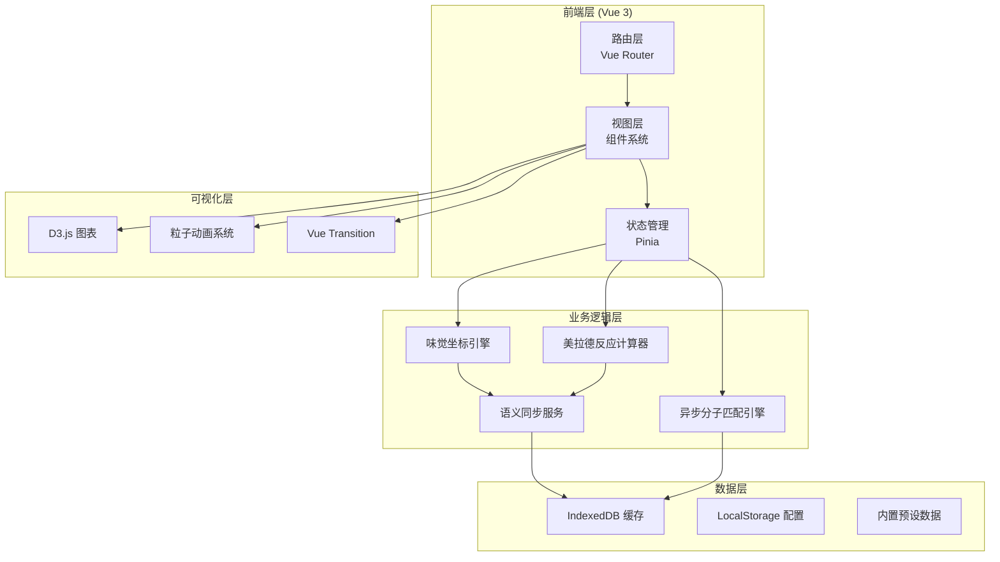
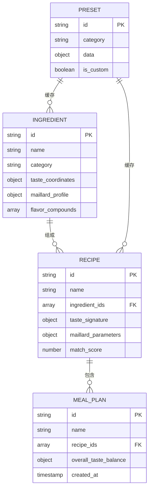

# FlavorNexus 技术架构文档

## 1. 架构设计



## 2. 技术栈描述

### 2.1 核心框架与构建

| 分类 | 技术选型 | 版本 | 用途 |
|------|----------|------|------|
| 前端框架 | Vue 3 | 3.4+ | Composition API，响应式系统 |
| 构建工具 | Vite | 5.0+ | 快速开发构建，HMR |
| 类型系统 | TypeScript | 5.3+ | 类型安全，IDE 支持 |
| 状态管理 | Pinia | 2.1+ | 全局状态，模块化 Store |
| 路由 | Vue Router | 4.2+ | SPA 路由管理 |

### 2.2 样式与可视化

| 分类 | 技术选型 | 版本 | 用途 |
|------|----------|------|------|
| CSS 框架 | Tailwind CSS | 3.4+ | 原子化样式，响应式 |
| 图表库 | D3.js | 7.8+ | 雷达图、曲线图可视化 |
| 动画 | Vue Motion | 2.0+ | 组件过渡动画 |
| 图标 | Phosphor Icons | 2.0+ | 科学风格线性图标 |

### 2.3 数据存储

| 分类 | 技术选型 | 版本 | 用途 |
|------|----------|------|------|
| 客户端数据库 | IndexedDB | 原生 | 大容量离线数据缓存 |
| 封装库 | idb | 7.1+ | IndexedDB Promise 封装 |
| 轻量存储 | LocalStorage | 原生 | 用户配置持久化 |

### 2.4 工具库

| 分类 | 技术选型 | 版本 | 用途 |
|------|----------|------|------|
| 工具函数 | Lodash-es | 4.17+ | 数据处理工具 |
| 拖拽 | Vue Draggable Plus | 2.0+ | 食材卡片拖拽 |
| 数值计算 | Math.js | 12.0+ | 科学计算引擎 |

## 3. 路由定义

| 路由路径 | 页面名称 | 用途 |
|----------|----------|------|
| `/` | 风味实验室首页 | 系统入口，功能导航 |
| `/taste-coordinate` | 味觉坐标页 | 五维风味雷达图，食材分析 |
| `/maillard` | 美拉德分析页 | 反应曲线，参数模拟 |
| `/workshop` | 食谱工坊页 | 食材组合，风味匹配 |
| `/planner` | 智能配餐页 | 餐单设计，推荐引擎 |
| `/data-center` | 数据中心页 | 缓存管理，预设库 |

## 4. 数据模型

### 4.1 数据实体关系



### 4.2 核心数据结构定义

```typescript
// 味觉坐标 - 五维风味模型
interface TasteCoordinate {
  sweet: number;      // 甜 0-100
  sour: number;       // 酸 0-100
  bitter: number;     // 苦 0-100
  salty: number;      // 咸 0-100
  umami: number;      // 鲜 0-100
}

// 美拉德反应参数
interface MaillardProfile {
  optimalTemp: number;      // 最佳温度 °C
  optimalTime: number;      // 最佳时间 min
  browningRate: number;     // 褐变速率
  aromaIntensity: number;   // 香气强度
  flavorCompounds: string[]; // 生成的风味化合物
}

// 食材数据模型
interface Ingredient {
  id: string;
  name: string;
  category: 'protein' | 'vegetable' | 'fruit' | 'spice' | 'carb' | 'dairy';
  taste: TasteCoordinate;
  maillard: MaillardProfile;
  flavorCompounds: string[];
  imageUrl: string;
}

// 分子匹配结果
interface MatchResult {
  ingredientA: string;
  ingredientB: string;
  score: number;           // 匹配度 0-100
  matchType: 'complement' | 'enhance' | 'contrast';
  sharedCompounds: string[];
  synergyEffect: string;
}

// 食谱模型
interface Recipe {
  id: string;
  name: string;
  ingredients: { id: string; amount: number; unit: string }[];
  tasteSignature: TasteCoordinate;
  maillardParams: MaillardProfile;
  matchScore: number;
  createdAt: Date;
}

// IndexedDB Store 配置
interface DBStores {
  ingredients: Ingredient[];
  recipes: Recipe[];
  mealPlans: MealPlan[];
  presets: Preset[];
  matchHistory: MatchResult[];
}
```

### 4.3 IndexedDB 数据库 schema

```typescript
// 数据库版本与 Store 配置
const DB_CONFIG = {
  name: 'FlavorNexusDB',
  version: 1,
  stores: [
    {
      name: 'ingredients',
      keyPath: 'id',
      indexes: [
        { name: 'category', keyPath: 'category', unique: false },
        { name: 'name', keyPath: 'name', unique: true }
      ]
    },
    {
      name: 'recipes',
      keyPath: 'id',
      indexes: [
        { name: 'createdAt', keyPath: 'createdAt', unique: false },
        { name: 'matchScore', keyPath: 'matchScore', unique: false }
      ]
    },
    {
      name: 'presets',
      keyPath: 'id',
      indexes: [
        { name: 'category', keyPath: 'category', unique: false }
      ]
    },
    {
      name: 'matchHistory',
      keyPath: 'id',
      indexes: [
        { name: 'score', keyPath: 'score', unique: false }
      ]
    }
  ]
};
```

## 5. 核心模块架构

### 5.1 味觉坐标引擎

```typescript
// composables/useTasteEngine.ts
export function useTasteEngine() {
  // 计算组合风味坐标
  const calculateCombinedTaste = (ingredients: Ingredient[]): TasteCoordinate => {
    // 加权平均算法
  };
  
  // 风味距离计算 (欧氏距离)
  const calculateTasteDistance = (a: TasteCoordinate, b: TasteCoordinate): number => {
    // 五维空间距离计算
  };
  
  // 风味平衡分析
  const analyzeBalance = (taste: TasteCoordinate): BalanceAnalysis => {
    // 标准差分析，识别过强/过弱维度
  };
  
  return { calculateCombinedTaste, calculateTasteDistance, analyzeBalance };
}
```

### 5.2 美拉德反应计算器

```typescript
// composables/useMaillardEngine.ts
export function useMaillardEngine() {
  // 模拟美拉德反应进程
  const simulateReaction = (temp: number, time: number, pH: number = 7.0) => {
    // 基于 Arrhenius 方程的动力学模型
  };
  
  // 预测风味化合物生成
  const predictFlavorCompounds = (ingredient: Ingredient, params: CookingParams) => {
    // 基于食材特性和参数的预测模型
  };
  
  // 优化烹饪参数
  const optimizeParams = (ingredients: Ingredient[], target: AromaTarget) => {
    // 多目标优化算法
  };
  
  return { simulateReaction, predictFlavorCompounds, optimizeParams };
}
```

### 5.3 异步分子匹配引擎

```typescript
// composables/useMolecularMatcher.ts
export function useMolecularMatcher() {
  // 异步匹配队列
  const matchQueue = ref<MatchRequest[]>([]);
  const isProcessing = ref(false);
  
  // 添加匹配请求
  const enqueueMatch = async (request: MatchRequest): Promise<MatchResult[]> => {
    // Web Worker 后台处理
  };
  
  // 化合物共享分析
  const analyzeSharedCompounds = (a: Ingredient, b: Ingredient) => {
    // Jaccard 相似度计算
  };
  
  // 协同效应检测
  const detectSynergy = (combination: Ingredient[]): SynergyInfo[] => {
    // 风味协同模式匹配
  };
  
  // 生成创新组合
  const generateInnovativeCombos = (base: Ingredient[], count: number = 5) => {
    // 遗传算法/模拟退火优化
  };
  
  return { enqueueMatch, generateInnovativeCombos };
}
```

## 6. 项目目录结构

```
FlavorNexus/
├── src/
│   ├── assets/              # 静态资源
│   │   ├── fonts/
│   │   ├── images/
│   │   └── data/            # 预设数据 JSON
│   ├── components/          # 通用组件
│   │   ├── charts/          # D3 图表组件
│   │   ├── cards/           # 卡片组件
│   │   ├── forms/           # 表单组件
│   │   └── layout/          # 布局组件
│   ├── composables/         # 组合式函数
│   │   ├── useTasteEngine.ts
│   │   ├── useMaillardEngine.ts
│   │   ├── useMolecularMatcher.ts
│   │   └── useIndexedDB.ts
│   ├── stores/              # Pinia Store
│   │   ├── ingredientStore.ts
│   │   ├── recipeStore.ts
│   │   └── appStore.ts
│   ├── views/               # 页面视图
│   │   ├── HomeView.vue
│   │   ├── TasteCoordinateView.vue
│   │   ├── MaillardView.vue
│   │   ├── WorkshopView.vue
│   │   ├── PlannerView.vue
│   │   └── DataCenterView.vue
│   ├── router/              # 路由配置
│   ├── types/               # TypeScript 类型定义
│   ├── utils/               # 工具函数
│   │   ├── db.ts            # IndexedDB 封装
│   │   ├── math.ts          # 数学计算
│   │   └── animations.ts    # 动画工具
│   ├── workers/             # Web Workers
│   │   └── matcher.worker.ts
│   ├── App.vue
│   └── main.ts
├── public/
├── index.html
├── package.json
├── vite.config.ts
├── tsconfig.json
└── tailwind.config.js
```

## 7. 性能优化策略

1. **IndexedDB 缓存策略**: 食材数据、预设食谱优先从本地读取
2. **Web Worker**: 分子匹配算法在后台线程执行，避免阻塞 UI
3. **虚拟滚动**: 大量食材列表使用虚拟滚动
4. **按需加载**: 路由级别的代码分割
5. **防抖节流**: 搜索、实时计算等高频操作优化
6. **动画优化**: 使用 CSS Transform 和 Opacity 动画，避免 Layout 抖动
