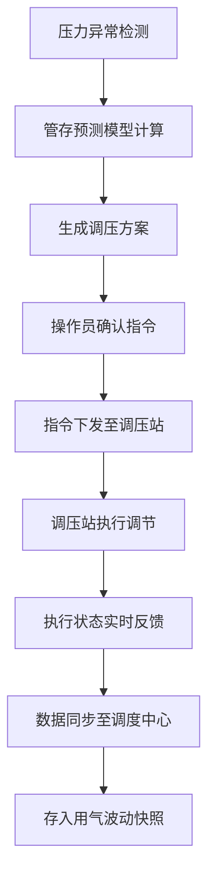

## 1. 产品概述

GasMatrix 是一套基于 Next.js 的城镇燃气管网动态平衡调峰系统，实现调度中心与调压站之间的压力数据实时同步，利用异步非稳态准一维流模型进行管存预测，通过 IndexedDB 存储长周期用气波动快照，显著提升高峰期用气调配的跨系统协同效率。

- 核心目标：解决城镇燃气管网在高峰期用气波动大、压力调控滞后、跨系统协同效率低等问题
- 目标用户：燃气公司调度中心操作人员、调压站运维人员、管网运行分析工程师

## 2. 核心功能

### 2.1 用户角色

| 角色 | 注册方式 | 核心权限 |
|------|----------|----------|
| 调度中心操作员 | 工号登录 | 实时监控管网压力、下发调压指令、查看管存预测 |
| 调压站运维员 | 工号登录 | 执行调压指令、上报设备状态、查看本站点数据 |
| 系统管理员 | 系统分配 | 用户管理、参数配置、系统维护 |
| 分析工程师 | 工号登录 | 查看历史数据、导出分析报告、模型参数调优 |

### 2.2 功能模块

1. **实时监控大屏**：全网压力热力图、关键站点实时数据、异常告警提示
2. **调压指令中心**：指令下发、执行状态追踪、指令历史记录
3. **管存预测分析**：准一维流模型计算、管存趋势预测、调峰方案推荐
4. **历史数据中心**：用气波动快照查询、多维度数据分析、报表导出
5. **系统配置管理**：站点管理、模型参数配置、用户权限管理

### 2.3 页面详情

| 页面名称 | 模块名称 | 功能描述 |
|----------|----------|----------|
| 实时监控大屏 | 管网热力图 | 基于 GIS 的全网压力分布可视化，支持缩放和站点详情 |
| 实时监控大屏 | 实时数据面板 | 关键指标卡片展示，包括总供气量、平均压力、异常站点数 |
| 实时监控大屏 | 告警中心 | 实时告警列表，分级展示，支持确认和处理 |
| 调压指令中心 | 指令下发 | 选择调压站、设定目标压力、下发执行指令 |
| 调压指令中心 | 执行追踪 | 指令执行进度、状态反馈、超时预警 |
| 管存预测分析 | 模型计算 | 异步非稳态准一维流模型计算，展示管存分布 |
| 管存预测分析 | 趋势预测 | 未来 24/72 小时管存趋势曲线，调峰方案对比 |
| 历史数据中心 | 快照查询 | IndexedDB 存储的长周期用气快照，多条件检索 |
| 历史数据中心 | 数据分析 | 同比环比分析、峰谷值统计、自定义报表 |
| 系统配置 | 站点管理 | 调压站信息维护、GIS 坐标配置 |
| 系统配置 | 模型参数 | 准一维流模型参数配置、算法调优 |

## 3. 核心流程

调度中心操作员在监控大屏发现压力异常 → 系统自动触发管存预测计算 → 生成调压建议方案 → 操作员确认并下发调压指令 → 调压站接收指令并执行 → 执行结果实时反馈到调度中心 → 系统记录本次调峰过程并存入 IndexedDB 快照。

## 4. 用户界面设计

### 4.1 设计风格

- **主色调**：深蓝色 (#0A1628) 作为背景主色，科技感青色 (#00D4FF) 作为强调色，橙色 (#FF8A00) 作为告警色
- **按钮风格**：圆角 4px，扁平化设计，hover 状态有轻微发光效果
- **字体**：数字使用 JetBrains Mono 等宽字体，正文使用 Noto Sans SC
- **布局风格**：深色科技风格，网格布局，数据卡片悬浮设计
- **图标风格**：线性图标，统一 stroke 宽度 1.5px

### 4.2 页面设计概述

| 页面名称 | 模块名称 | UI 元素 |
|----------|----------|----------|
| 实时监控大屏 | 管网热力图 | 深色地图背景、渐变色压力热力图层、站点标记点、悬浮详情卡片 |
| 实时监控大屏 | 数据面板 | 玻璃态卡片设计、数字滚动动画、状态指示灯 |
| 调压指令中心 | 指令表单 | 分步式表单、站点选择器、压力滑块、实时预览 |
| 管存预测分析 | 趋势图表 | 面积图、多曲线对比、时间轴缩放、预测区间着色 |
| 历史数据中心 | 快照列表 | 时间轴布局、快照卡片、快速筛选标签 |

### 4.3 响应式

- 桌面端：1920px 优先，四列网格布局，监控大屏支持全屏展示
- 平板端：1024px 适配，两列布局，侧边栏可折叠
- 移动端：768px 以下，单列布局，底部导航栏，核心功能优先展示

### 4.4 数据可视化设计

- 压力热力图使用蓝-绿-黄-橙-红五色渐变表示压力从低到高
- 管存预测曲线使用实线表示历史数据，虚线表示预测数据，半透明区域表示置信区间
- 告警级别使用不同颜色标识：蓝色提示、黄色警告、橙色严重、红色紧急
