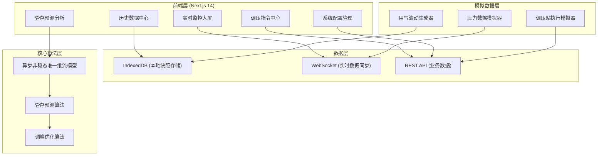
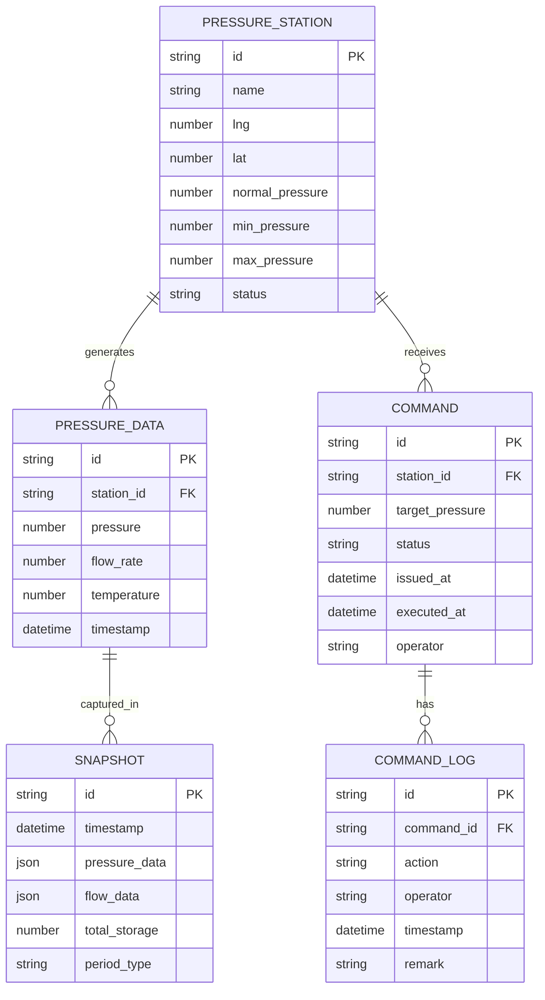

## 1. 架构设计



## 2. 技术描述

- **前端框架**：Next.js 14 (App Router) + React 18 + TypeScript
- **样式方案**：TailwindCSS 3 + CSS Variables
- **图表可视化**：ECharts 5 + React ECharts
- **地图可视化**：Leaflet + 自定义热力图层
- **本地存储**：IndexedDB (idb 封装库)
- **实时通信**：WebSocket (模拟实现)
- **状态管理**：Zustand
- **UI 组件**：Radix UI + 自定义组件库
- **图标**：Lucide React
- **动画**：Framer Motion

## 3. 路由定义

| 路由 | 页面用途 |
|------|----------|
| / | 登录页 |
| /dashboard | 实时监控大屏 |
| /commands | 调压指令中心 |
| /prediction | 管存预测分析 |
| /history | 历史数据中心 |
| /settings | 系统配置管理 |

## 4. 数据模型

### 4.1 核心数据结构



### 4.2 IndexedDB 存储结构

| Object Store | 主键 | 索引 | 用途 |
|--------------|------|------|------|
| snapshots | id | timestamp, periodType | 长周期用气波动快照 |
| pressureHistory | id | stationId, timestamp | 压力历史数据 |
| commandHistory | id | stationId, status, issuedAt | 指令历史记录 |
| systemSettings | key | - | 系统配置参数 |

## 5. 核心算法模块

### 5.1 异步非稳态准一维流模型

```typescript
interface PipeSegment {
  id: string;
  length: number;           // 管段长度 (m)
  diameter: number;         // 管径 (m)
  roughness: number;        // 管壁粗糙度 (m)
  inletPressure: number;    // 入口压力 (Pa)
  outletPressure: number;   // 出口压力 (Pa)
  flowRate: number;         // 流量 (m³/s)
  temperature: number;      // 温度 (K)
}

interface FlowModelResult {
  pressureDistribution: number[];  // 沿程压力分布
  velocityDistribution: number[];  // 沿程流速分布
  storageVolume: number;           // 管存体积 (m³)
  storageMass: number;             // 管存质量 (kg)
}
```

### 5.2 管存预测算法

基于历史数据和时间序列预测模型，结合用气规律进行管存预测：

- 输入：过去 72 小时压力数据、天气数据、日期类型（工作日/节假日）
- 输出：未来 24/72 小时管存趋势预测、置信区间

### 5.3 调峰优化算法

根据管存预测结果，自动生成调压方案：

- 目标函数：最小化压力波动、最大化管网稳定性
- 约束条件：调压站可调范围、安全压力上下限
- 优化算法：遗传算法 + 梯度下降混合策略

## 6. 实时同步机制

### 6.1 WebSocket 数据格式

```typescript
interface RealtimeMessage {
  type: 'pressure_update' | 'command_status' | 'alert' | 'snapshot_created';
  timestamp: number;
  payload: any;
}

interface PressureUpdate {
  stationId: string;
  pressure: number;
  flowRate: number;
  temperature: number;
  timestamp: number;
}
```

### 6.2 数据同步策略

- 压力数据：每秒推送一次（模拟），前端批量更新
- 指令状态：变更时即时推送
- 快照数据：每小时自动生成，存入 IndexedDB
- 历史数据：按需加载，分页查询
