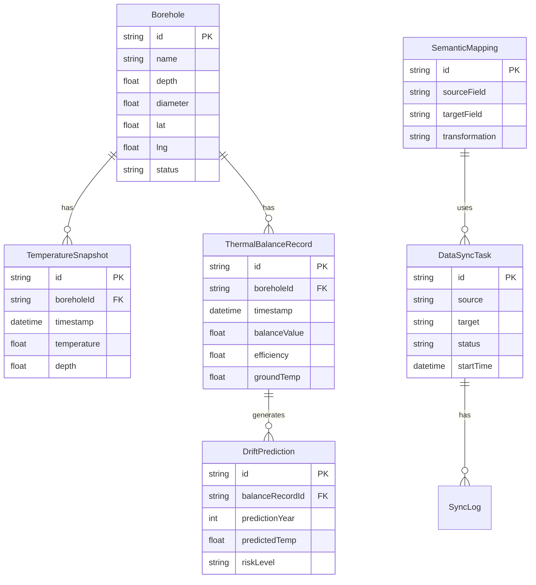

## 1. 架构设计

```mermaid
flowchart TD
    subgraph "前端 (Next.js 14)"
        "UI 层 (React 组件)" --> "状态管理 (Zustand)"
        "状态管理" --> "数据层"
        "数据层" --> "IndexedDB (本地缓存)"
        "数据层" --> "API 层 (Next.js API Routes)"
    end
    subgraph "后端 (Next.js API)"
        "API Routes" --> "业务逻辑层"
        "业务逻辑层" --> "数据模拟层 (Mock)"
    end
    subgraph "数据存储"
        "IndexedDB" --> "换热孔历史地温快照"
        "IndexedDB" --> "系统配置缓存"
    end
    subgraph "外部服务"
        "建筑节能系统 API" --> "数据同步"
        "数据同步" --> "语义转换层"
    end
```

## 2. 技术选型

- 前端框架: Next.js 14 (App Router) + React 18 + TypeScript
- 样式方案: Tailwind CSS 3
- 状态管理: Zustand
- 图表可视化: recharts
- 本地数据库: IndexedDB (idb)
- HTTP 客户端: fetch API (Next.js 内置)
- 图标库: lucide-react
- 动画: framer-motion
- 工具库: date-fns, uuid

## 3. 路由定义

| 路由 | 页面组件 | 用途 |
|------|----------|------|
| / | DashboardPage | 系统首页 - 实时监控面板 |
| /thermal-balance | ThermalBalancePage | 热平衡分析页 |
| /thermal-drift | ThermalDriftPage | 热漂移预测页 |
| /boreholes | BoreholesPage | 换热孔管理页 |
| /data-sync | DataSyncPage | 数据同步页 |
| /settings | SettingsPage | 系统设置页 |

## 4. API 定义

### 4.1 热平衡分析 API

```typescript
// POST /api/thermal-balance/calculate
interface ThermalBalanceRequest {
  boreholeId: string;
  startDate: string;
  endDate: string;
  parameters: {
    groundThermalConductivity: number;
    specificHeatCapacity: number;
    fluidFlowRate: number;
    inletTemperature: number;
    outletTemperature: number;
  };
}

interface ThermalBalanceResponse {
  balanceStatus: 'stable' | 'warning' | 'critical';
  heatExtractionRate: number;
  heatRejectionRate: number;
  netHeatBalance: number;
  efficiency: number;
  recommendations: string[];
}

// GET /api/thermal-balance/history
interface ThermalBalanceHistoryResponse {
  data: Array<{
    timestamp: string;
    balanceValue: number;
    efficiency: number;
    groundTemperature: number;
  }>;
}
```

### 4.2 热漂移预测 API

```typescript
// POST /api/thermal-drift/predict
interface ThermalDriftRequest {
  boreholeIds: string[];
  predictionYears: number;
  scenario: 'conservative' | 'moderate' | 'aggressive';
}

interface ThermalDriftResponse {
  predictionId: string;
  status: 'processing' | 'completed';
  results: Array<{
    year: number;
    groundTemperature: number;
    thermalSaturation: number;
    overdrawRisk: 'low' | 'medium' | 'high';
  }>;
  modelParameters: {
    thermalDiffusivity: number;
    geothermalGradient: number;
    heatPumpCoefficient: number;
  };
}
```

### 4.3 换热孔管理 API

```typescript
// GET /api/boreholes
interface BoreholesListResponse {
  total: number;
  page: number;
  pageSize: number;
  data: Borehole[];
}

interface Borehole {
  id: string;
  name: string;
  depth: number;
  diameter: number;
  location: { lat: number; lng: number };
  status: 'active' | 'inactive' | 'maintenance';
  currentTemperature: number;
  lastSyncTime: string;
}

// GET /api/boreholes/:id/snapshots
interface TemperatureSnapshotsResponse {
  boreholeId: string;
  snapshots: Array<{
    timestamp: string;
    temperature: number;
    depth: number;
  }>;
}
```

### 4.4 数据同步 API

```typescript
// POST /api/data-sync/execute
interface DataSyncRequest {
  source: 'operations' | 'energy-management';
  target: 'operations' | 'energy-management';
  dataTypes: string[];
  schedule?: string;
}

interface DataSyncResponse {
  syncId: string;
  status: 'pending' | 'running' | 'completed' | 'failed';
  recordsProcessed: number;
  startTime: string;
  endTime?: string;
  errors: string[];
}

// GET /api/data-sync/mappings
interface SemanticMapping {
  id: string;
  sourceField: string;
  targetField: string;
  transformation: string;
  description: string;
}
```

## 5. 数据模型

### 5.1 数据模型定义



### 5.2 IndexedDB Schema

```typescript
// 本地数据库表结构
interface DBSchema {
  boreholes: {
    key: string;
    indexes: { 'by-status': string; 'by-location': string };
    data: Borehole;
  };
  temperatureSnapshots: {
    key: string;
    indexes: { 'by-borehole': string; 'by-timestamp': string };
    data: TemperatureSnapshot & { boreholeId: string };
  };
  thermalBalanceCache: {
    key: string;
    indexes: { 'by-borehole': string };
    data: ThermalBalanceRecord;
  };
  syncQueue: {
    key: string;
    indexes: { 'by-status': string };
    data: { id: string; type: string; payload: unknown; status: string };
  };
}
```
