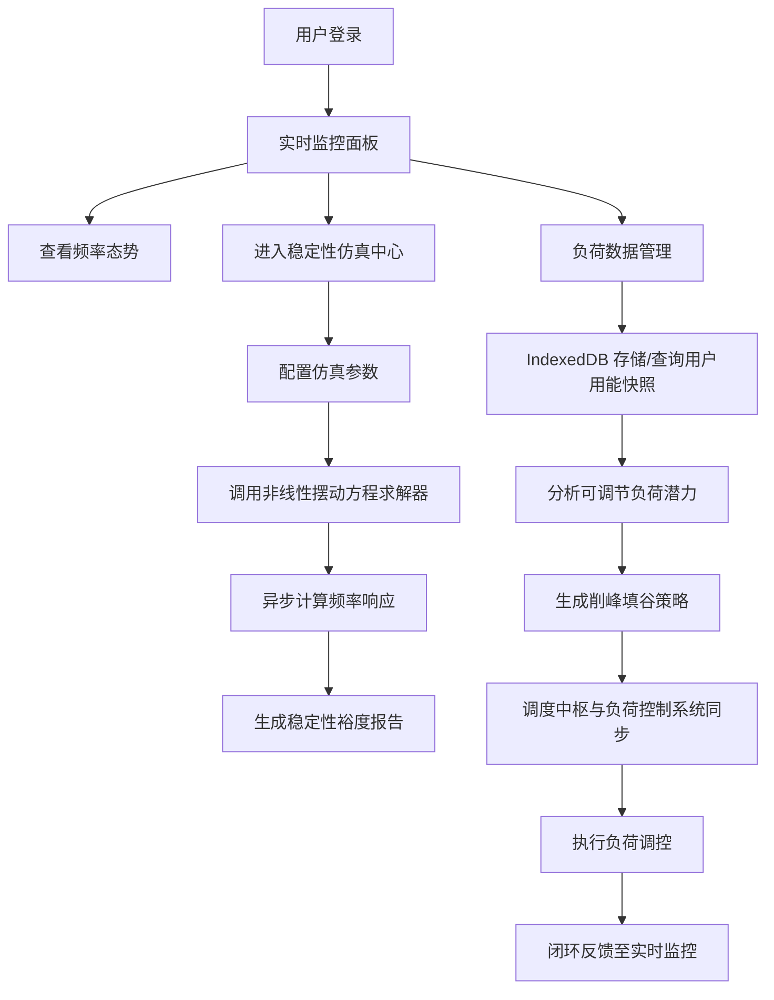

## 1. 产品概述

GridPulse 是一款基于 Svelte 5 的微电网并网运行频率稳定性建模与分析平台，专注于新型电力系统的频率动态特性仿真与稳定性评估。平台通过异步非线性摆动方程求解器实现对微电网频率响应的高精度预测，结合 IndexedDB 实现万级用户用能特征的高效存储与检索，为电力调度中枢与负荷控制系统提供实时数据同步能力，支撑削峰填谷的协同优化决策。

- 解决问题：传统电力系统仿真工具难以处理高比例新能源接入下的频率稳定性问题，缺乏对用户侧负荷响应的精细化建模
- 目标用户：电网调度工程师、新能源电力系统研究者、微电网运营管理者
- 市场价值：为新型电力系统的安全稳定运行提供数字化仿真支撑，提升电网对波动性新能源的消纳能力

## 2. 核心功能

### 2.1 用户角色

| 角色 | 注册方式 | 核心权限 |
|------|----------|----------|
| 系统管理员 | 账号密码登录 | 系统配置、用户管理、数据备份 |
| 调度工程师 | 账号密码登录 | 频率稳定性仿真、负荷调控决策、数据导出 |
| 研究人员 | 账号密码登录 | 算法参数调整、多场景对比分析、报告生成 |

### 2.2 功能模块

1. **实时监控面板**：频率动态曲线展示、系统运行状态概览、关键指标告警
2. **稳定性仿真中心**：异步非线性摆动方程求解、负荷跳变场景模拟、稳定裕度计算
3. **负荷数据管理**：万级用户用能特征快照管理、IndexedDB 数据查询与统计
4. **调度协同模块**：调度中枢与负荷控制系统数据同步、削峰填谷策略生成
5. **系统配置**：求解器参数配置、预警阈值设置、用户权限管理

### 2.3 页面详情

| 页面名称 | 模块名称 | 功能描述 |
|----------|----------|------------|
| 实时监控面板 | 频率态势图 | 实时绘制系统频率动态曲线，展示频率偏差、变化率等关键指标 |
| 实时监控面板 | 运行状态卡片 | 展示系统有功功率平衡、旋转备用、稳定性裕度等核心参数 |
| 实时监控面板 | 告警通知区 | 实时推送频率越限、稳定裕度不足等预警信息 |
| 稳定性仿真中心 | 参数配置区 | 配置电网拓扑、发电机参数、负荷特性、扰动类型与强度 |
| 稳定性仿真中心 | 求解器执行区 | 调用异步非线性摆动方程求解器，展示求解进度与中间结果 |
| 稳定性仿真中心 | 结果可视化 | 多维度展示仿真结果，包括频率响应曲线、相空间轨迹、稳定裕度热力图 |
| 稳定性仿真中心 | 场景对比 | 支持多组仿真参数的对比分析，辅助决策 |
| 负荷数据管理 | 用户快照列表 | 分页展示万级用户用能特征快照，支持多条件筛选 |
| 负荷数据管理 | 数据统计分析 | 聚合统计用户用能模式，识别可调节负荷潜力 |
| 负荷数据管理 | 数据导入导出 | 支持批量导入用户用能数据，导出分析报告 |
| 调度协同模块 | 数据同步状态 | 展示调度中枢与负荷控制系统间的数据同步链路状态 |
| 调度协同模块 | 削峰填谷策略 | 基于用户用能特征生成优化调控策略，评估调控效果 |
| 系统配置 | 求解器参数 | 配置数值积分方法、求解步长、收敛阈值等 |
| 系统配置 | 告警规则 | 设置频率阈值、稳定裕度预警等级 |
| 系统配置 | 用户管理 | 账号管理、角色分配、权限控制 |

## 3. 核心流程

用户登录系统后，首先进入实时监控面板查看当前系统运行状态。调度工程师可进入稳定性仿真中心，配置仿真参数后触发异步求解器进行频率稳定性计算，系统利用非线性摆动方程预测系统在负荷跳变等扰动下的频率响应，并计算稳定性裕度。同时，系统通过 IndexedDB 管理万级用户的用能特征快照，为削峰填谷策略提供数据支撑。调度协同模块实现调度中枢指令与负荷控制系统的实时同步，形成完整的闭环调控流程。

## 4. 用户界面设计

### 4.1 设计风格
- **主色调**：采用电力行业特色的深蓝色系（#1E3A8A）作为主色，搭配科技感的青色（#06B6D4）作为强调色，传递专业、可靠的视觉感受
- **辅助色**：预警色采用橙色（#F97316）和红色（#EF4444），安全状态用绿色（#22C55E）标识
- **按钮风格**：采用扁平化设计，圆角 6px，点击反馈采用轻微的阴影变化
- **字体**：使用 JetBrains Mono 作为代码与数据展示字体，Inter 作为界面文本字体，确保数字与技术术语的可读性
- **布局风格**：采用深色主题的仪表板式布局，左侧导航栏 + 顶部状态栏 + 主内容区三栏结构，支持多面板联动
- **图标风格**：使用 Font Awesome 线性图标，保持简洁一致的视觉语言

### 4.2 页面设计概述

| 页面名称 | 模块名称 | UI 元素 |
|----------|----------|----------|
| 实时监控面板 | 频率态势图 | 全屏 SVG 实时曲线图表，支持缩放、暂停、多指标叠加 |
| 实时监控面板 | 运行状态卡片 | 采用玻璃拟态效果，展示关键参数数值与趋势箭头 |
| 实时监控面板 | 告警通知区 | 右侧滑出式通知面板，按时间倒序展示告警信息 |
| 稳定性仿真中心 | 参数配置区 | 表单式布局，支持参数分组折叠，提供参数预设模板 |
| 稳定性仿真中心 | 求解器执行区 | 进度条动画展示求解进度，实时日志输出窗口 |
| 稳定性仿真中心 | 结果可视化 | 多 Tab 页签切换不同图表类型，支持图表导出为 PNG |
| 负荷数据管理 | 用户快照列表 | 虚拟滚动表格，支持 10000+ 条数据流畅渲染 |
| 负荷数据管理 | 数据统计分析 | 热力图 + 柱状图组合展示用户用能模式聚类结果 |
| 调度协同模块 | 数据同步状态 | 拓扑图展示数据同步链路，节点状态实时更新 |
| 调度协同模块 | 削峰填谷策略 | 甘特图形式展示调控时间窗口与预期效果 |

### 4.3 响应式设计
- **桌面端优先**：针对 1920×1080 及以上分辨率优化，支持多窗口并列展示
- **平板适配**：导航栏可折叠为图标模式，图表自适应缩放
- **移动端**：核心监控指标卡片化展示，简化操作流程
- **触控优化**：关键操作按钮尺寸不小于 44×44px，支持手势缩放图表

### 4.4 数据可视化设计
- **频率动态曲线**：采用 Canvas 高性能渲染，支持 10000+ 数据点实时绘制
- **稳定裕度热力图**：基于 WebGL 实现的二维热力图，直观展示系统稳定性空间分布
- **相空间轨迹**：3D 可视化展示系统状态演化轨迹，支持旋转、缩放交互
- **网络拓扑图**：力导向布局展示微电网节点连接关系，节点颜色反映运行状态
