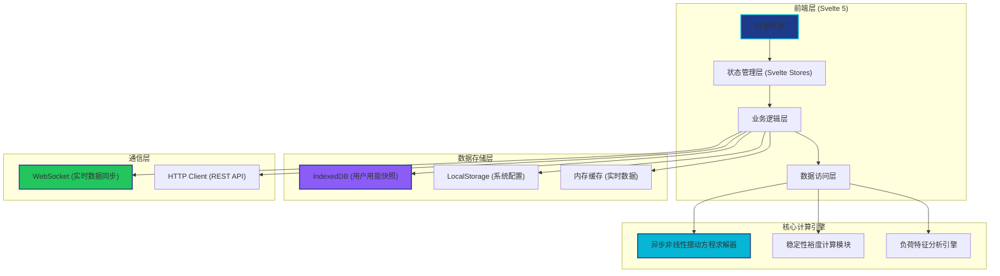
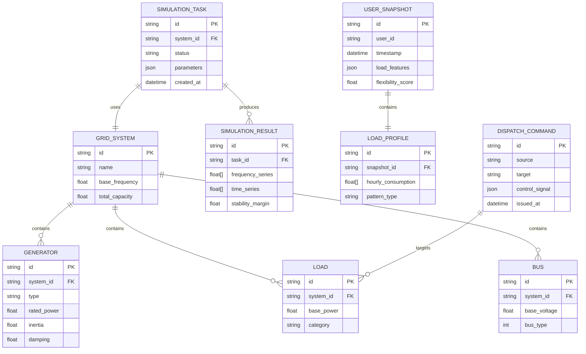

## 1. 架构设计



## 2. 技术描述

### 2.1 技术栈选型
- **前端框架**：Svelte 5 (使用 Runes 语法)
- **构建工具**：Vite 5.x
- **语言**：TypeScript 5.x
- **样式方案**：TailwindCSS 3.x + CSS 变量
- **图表可视化**：D3.js 7.x (自定义图表) + Canvas API
- **状态管理**：Svelte 5 Runes + 自定义 Stores
- **路由**：SvelteKit 2.x
- **数据库**：IndexedDB (idb 库封装)
- **实时通信**：WebSocket 原生 API
- **数学计算**：自定义数值求解器 + math.js

### 2.2 核心技术点
- **异步非线性摆动方程求解器**：基于四阶龙格-库塔法 (RK4) 实现，支持多机系统的频率动态仿真
- **Web Worker 计算**：将复杂数值计算移入 Web Worker，避免阻塞主线程
- **IndexedDB 高性能存储**：支持万级用户用能快照的批量写入与复杂查询
- **Canvas 高性能渲染**：实时频率曲线采用 Canvas 绘制，支持 10000+ 数据点 60fps 渲染
- **响应式数据流**：基于 Svelte 5 Runes 实现细粒度响应式更新

## 3. 路由定义

| 路由 | 页面组件 | 功能描述 |
|------|----------|------------|
| `/` | `Dashboard.svelte` | 实时监控面板，频率态势总览 |
| `/simulation` | `SimulationCenter.svelte` | 稳定性仿真中心 |
| `/load-data` | `LoadDataManager.svelte` | 负荷数据管理 |
| `/dispatch` | `DispatchCoordination.svelte` | 调度协同模块 |
| `/settings` | `SystemSettings.svelte` | 系统配置 |
| `/login` | `Login.svelte` | 用户登录 |

## 4. 数据模型

### 4.1 核心数据结构



### 4.2 IndexedDB 数据模型
- **Object Store: `user_snapshots`**：存储万级用户用能特征快照
  - 主键：`id`
  - 索引：`user_id`, `timestamp`, `flexibility_score`, `pattern_type`
- **Object Store: `simulation_tasks`**：存储仿真任务记录
  - 主键：`id`
  - 索引：`status`, `created_at`
- **Object Store: `simulation_results`**：存储仿真结果
  - 主键：`task_id`
- **Object Store: `system_settings`**：存储系统配置
  - 主键：`key`

## 5. 核心算法模块

### 5.1 异步非线性摆动方程求解器
```typescript
// 核心方程: M * d²δ/dt² + D * dδ/dt = Pm - Pe
// 其中:
//   M - 惯性时间常数
//   D - 阻尼系数
//   Pm - 机械功率
//   Pe - 电磁功率
//   δ - 功角

interface SwingEquationParams {
  M: number;        // 惯性常数 (s)
  D: number;        // 阻尼系数 (pu)
  Pm: number;       // 机械功率 (pu)
  E: number;        // 内电势 (pu)
  V: number;        // 母线电压 (pu)
  X: number;        // 电抗 (pu)
}

async function solveSwingEquation(
  params: SwingEquationParams,
  timeSpan: [number, number],
  dt: number
): Promise<{ time: number[]; delta: number[]; omega: number[] }> {
  // 四阶龙格-库塔法求解
  // ... 实现细节
}
```

### 5.2 稳定性裕度计算
```typescript
function calculateStabilityMargin(
  frequencySeries: number[],
  fn: number = 50
): {
  margin: number;           // 稳定裕度 (Hz)
  maxDeviation: number;     // 最大偏差 (Hz)
  nadir: number;           // 频率最低点 (Hz)
  recoveryTime: number;    // 恢复时间 (s)
  isStable: boolean;       // 是否稳定
} {
  // 基于频率响应曲线计算稳定性指标
  // ... 实现细节
}
```

### 5.3 削峰填谷策略生成
```typescript
function generatePeakShavingStrategy(
  userSnapshots: UserSnapshot[],
  systemLoadForecast: number[],
  peakThreshold: number
): DispatchCommand[] {
  // 基于用户用能特征生成优化调控策略
  // ... 实现细节
}
```

## 6. 项目目录结构

```
src/
├── app/                     # SvelteKit 应用目录
│   ├── routes/              # 路由页面
│   │   ├── +page.svelte     # 首页 (实时监控)
│   │   ├── simulation/      # 仿真中心
│   │   ├── load-data/       # 负荷数据管理
│   │   ├── dispatch/        # 调度协同
│   │   └── settings/        # 系统设置
│   └── layout.svelte        # 全局布局
├── lib/
│   ├── components/          # 可复用组件
│   │   ├── charts/          # 图表组件
│   │   ├── ui/              # UI 基础组件
│   │   └── layout/          # 布局组件
│   ├── engine/              # 核心计算引擎
│   │   ├── swing-solver.ts  # 摆动方程求解器
│   │   ├── stability.ts     # 稳定性分析
│   │   └── worker.ts        # Web Worker 封装
│   ├── stores/              # 状态管理
│   │   ├── grid.ts          # 电网状态
│   │   ├── simulation.ts    # 仿真状态
│   │   └── user.ts          # 用户状态
│   ├── db/                  # 数据库层
│   │   ├── indexed-db.ts    # IndexedDB 封装
│   │   └── schema.ts        # 数据模型定义
│   ├── types/               # TypeScript 类型定义
│   └── utils/               # 工具函数
├── workers/                 # Web Worker 脚本
│   └── simulation.worker.ts # 仿真计算 Worker
├── styles/                  # 全局样式
└── assets/                  # 静态资源
```

## 7. 性能优化策略

1. **计算分离**：复杂数值计算在 Web Worker 中执行，主线程仅处理 UI 渲染
2. **虚拟滚动**：万级用户快照列表采用虚拟滚动，仅渲染可视区域
3. **增量更新**：Svelte 5 细粒度响应式，避免不必要的重渲染
4. **数据分块**：IndexedDB 批量操作采用分块写入，避免阻塞
5. **Canvas 渲染**：高频数据可视化采用 Canvas 而非 SVG
6. **内存管理**：及时释放大数组引用，避免内存泄漏

## 8. 浏览器兼容性

- 支持现代浏览器：Chrome 110+, Firefox 110+, Safari 16+, Edge 110+
- 依赖特性：Web Worker, IndexedDB, ES2022, BigInt
- 不支持 IE 系列浏览器
