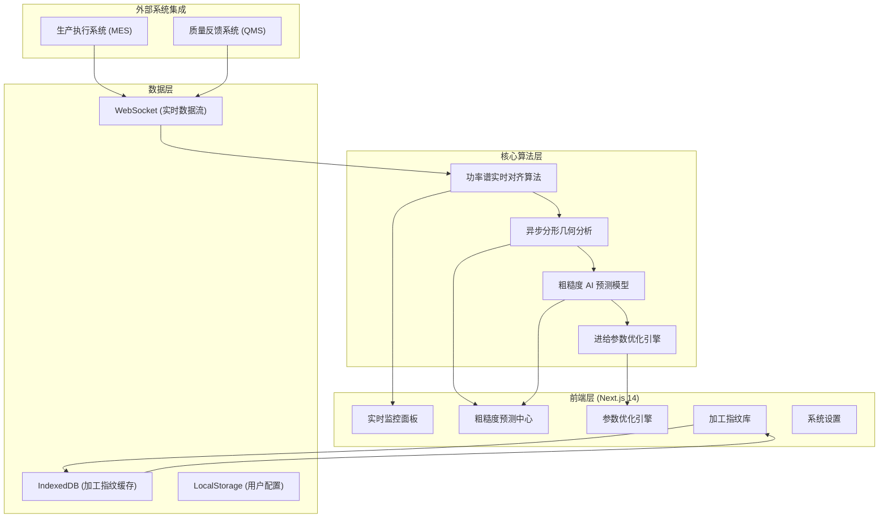

## 1. 架构设计



## 2. 技术描述

### 2.1 技术栈选择
- **前端框架**：Next.js 14 (App Router) + React 18 + TypeScript
- **状态管理**：Zustand (轻量级状态管理)
- **样式方案**：TailwindCSS 3 + CSS Variables
- **数据可视化**：ECharts 5 + Three.js (3D 表面形貌)
- **本地存储**：IndexedDB (Dexie.js 封装) + LocalStorage
- **实时通信**：WebSocket (原生 API)
- **数学计算**：math.js + dsp.js (数字信号处理)
- **UI 组件**：Headless UI + Framer Motion (动画)
- **开发工具**：ESLint + Prettier + Husky

### 2.2 核心算法实现
1. **功率谱数据实时对齐**
   - 基于 NTP 时间戳的多源数据同步
   - 滑动窗口相关性分析实现亚毫秒级对齐
   - 支持时间戳漂移自动校正

2. **异步分形几何分析**
   - 盒维数法 (Box Counting) 计算分形维数
   - 多重分形谱分析提取表面形貌特征
   - Web Worker 异步计算避免阻塞 UI

3. **粗糙度 AI 预测模型**
   - 基于 XGBoost 的回归预测模型
   - 特征工程：分形维数、谱峰特征、统计特征
   - 在线学习机制，支持模型增量更新

4. **进给参数优化引擎**
   - 多目标优化算法 (NSGA-II)
   - 约束条件：表面粗糙度、加工效率、刀具磨损
   - 支持 Pareto 最优解集可视化

## 3. 路由定义

| 路由 | 页面组件 | 功能说明 |
|------|----------|----------|
| `/` | `app/page.tsx` | 实时监控面板，功率谱数据展示与生产状态概览 |
| `/prediction` | `app/prediction/page.tsx` | 粗糙度预测中心，分形特征提取与 AI 预测 |
| `/optimization` | `app/optimization/page.tsx` | 参数优化引擎，进给参数优化与对比 |
| `/fingerprint` | `app/fingerprint/page.tsx` | 加工指纹库，零件快照管理与数字化复刻 |
| `/settings` | `app/settings/page.tsx` | 系统设置，数据源配置与参数管理 |
| `/api/realtime` | `app/api/realtime/route.ts` | 实时数据 WebSocket 接口 |
| `/api/predict` | `app/api/predict/route.ts` | 粗糙度预测 API |
| `/api/optimize` | `app/api/optimize/route.ts` | 参数优化 API |

## 4. 数据模型

### 4.1 核心数据结构

```typescript
// 功率谱数据点
interface PowerSpectrumPoint {
  timestamp: number;
  frequency: number;
  amplitude: number;
  channel: string;
}

// 分形特征参数
interface FractalFeatures {
  boxDimension: number;
  informationDimension: number;
  correlationDimension: number;
  lacunarity: number;
  multifractalSpectrum: number[];
}

// 粗糙度预测结果
interface RoughnessPrediction {
  id: string;
  partId: string;
  timestamp: number;
  predictedRa: number;
  predictedRz: number;
  confidence: number;
  confidenceInterval: [number, number];
  features: FractalFeatures;
  processingParams: ProcessingParams;
}

// 加工参数
interface ProcessingParams {
  feedRate: number;
  spindleSpeed: number;
  depthOfCut: number;
  grindingWheelSpeed: number;
  coolantPressure: number;
}

// 加工指纹快照
interface PartFingerprint {
  id: string;
  partNumber: string;
  batchId: string;
  startTime: number;
  endTime: number;
  processingParams: ProcessingParams;
  powerSpectrumSummary: PowerSpectrumSummary;
  predictedRoughness: RoughnessPrediction;
  measuredRoughness?: MeasuredRoughness;
  qualityStatus: 'PASS' | 'FAIL' | 'PENDING';
  createdAt: number;
}

// 实测粗糙度数据
interface MeasuredRoughness {
  ra: number;
  rz: number;
  rq: number;
  measuredAt: number;
  inspector: string;
}
```

### 4.2 IndexedDB 数据模型
```typescript
// Dexie.js 数据库定义
interface GrindLogicDB {
  fingerprints: PartFingerprint & { id: string };
  predictions: RoughnessPrediction & { id: string };
  paramsHistory: {
    id: string;
    timestamp: number;
    params: ProcessingParams;
    partId: string;
  };
  systemConfig: {
    key: string;
    value: any;
    updatedAt: number;
  };
}
```

## 5. 核心模块设计

### 5.1 实时数据流模块
```
WebSocket 连接 → 数据缓冲队列 → 时间戳对齐 → 分帧处理 → UI 渲染
   ↑                                                         ↓
   └────────── 质量反馈系统数据 ────────────────────────────┘
```

### 5.2 分形分析模块
- **Web Worker 封装**：独立线程运行分形计算
- **异步队列**：支持批量任务调度
- **进度回调**：实时返回计算进度
- **结果缓存**：相同输入直接返回缓存结果

### 5.3 IndexedDB 管理模块
- **Dexie.js 封装**：简化 IndexedDB 操作
- **自动缓存策略**：LRU 淘汰机制
- **数据同步**：支持与后端增量同步
- **离线查询**：断网时仍可查询历史数据

### 5.4 可视化组件库
- 实时功率谱图组件 (Canvas 实现)
- 3D 表面形貌组件 (Three.js 实现)
- 分形维数可视化组件
- 预测结果对比组件
- 参数热力图组件

## 6. 性能优化策略

### 6.1 前端性能
- **虚拟列表**：大量历史数据使用虚拟滚动
- **Web Worker**：计算密集型任务离线处理
- **请求去重**：相同 API 请求合并
- **懒加载**：非首屏组件动态导入
- **内存管理**：大数据集及时释放引用

### 6.2 数据可视化性能
- **Canvas 渲染**：百万级数据点使用 Canvas
- **降采样**：不同缩放级别使用不同精度数据
- **WebGL 加速**：3D 可视化使用硬件加速
- **节流更新**：高频数据限制 UI 更新频率

### 6.3 存储优化
- **数据压缩**：历史数据使用 LZ4 压缩存储
- **分片存储**：大文件分片存入 IndexedDB
- **索引优化**：常用查询字段建立索引
