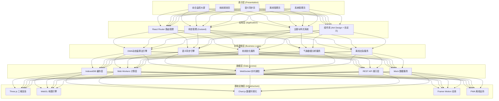
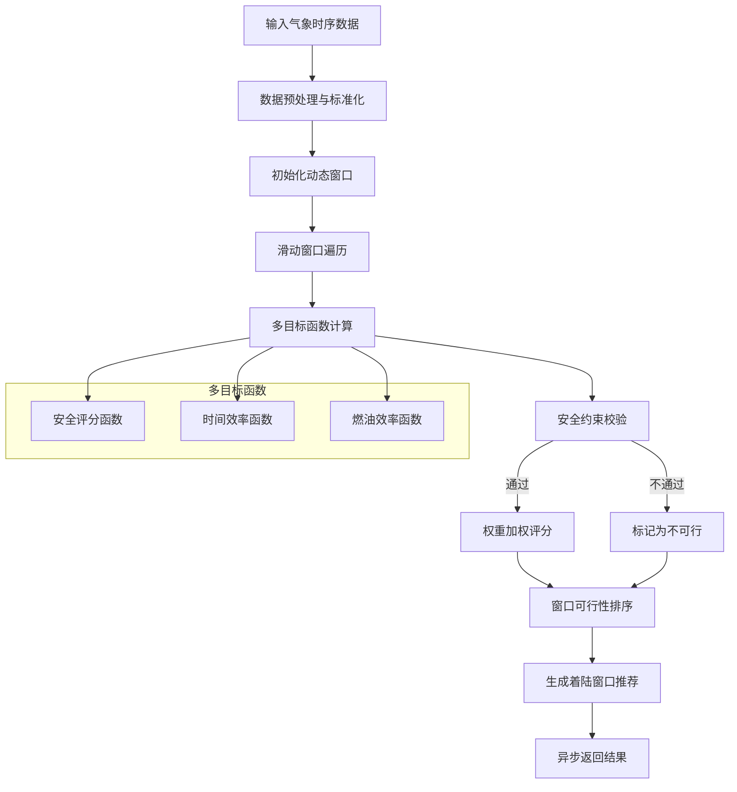
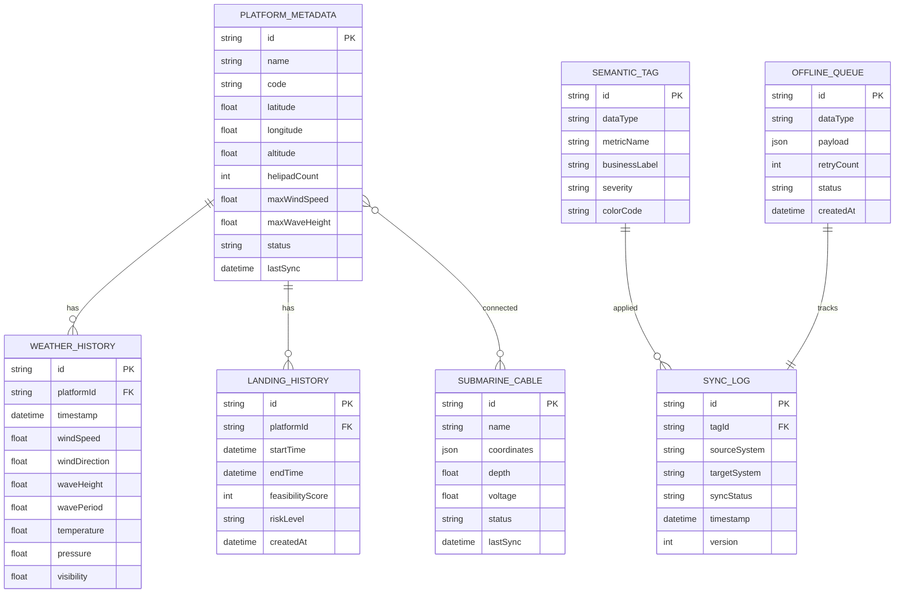

## 1. 架构设计



## 2. 技术描述

### 2.1 前端技术栈
- **核心框架**: React@18.2.0 + TypeScript@5.3.0
- **构建工具**: Vite@5.0.0
- **状态管理**: Zustand@4.4.7（轻量级，支持持久化）
- **路由管理**: React Router@6.20.0
- **UI组件库**: Ant Design@5.12.0 + 自定义工业风组件
- **样式方案**: TailwindCSS@3.3.5 + CSS Variables
- **三维渲染**: Three@0.159.0 + @react-three/fiber@8.15.12 + @react-three/drei@9.92.7
- **数据可视化**: Chart.js@4.4.0 + react-chartjs-2@5.2.0
- **动效库**: Framer Motion@10.16.5
- **离线支持**: PWA + Workbox@7.0.0
- **IndexedDB封装**: Dexie.js@3.2.4
- **多线程**: Web Workers + Comlink@4.4.1
- **测试框架**: Vitest@1.0.0 + React Testing Library@14.1.2

### 2.2 初始化工具
- 使用 `npm create vite@latest HeliLink -- --template react-ts` 初始化项目

### 2.3 后端服务
- 本版本采用前端模拟 + Mock数据方案，无需真实后端
- 实时数据通过 WebSocket Mock 服务模拟
- 预留 REST API 接口层，便于后续接入真实后端

### 2.4 数据库
- 浏览器端: IndexedDB（通过Dexie.js封装）
- 缓存全球海缆坐标、平台元数据、历史气象数据
- 支持离线查询与数据同步

## 3. 路由定义

| 路由路径 | 页面名称 | 权限要求 | 说明 |
|----------|----------|----------|------|
| / | 综合监控大屏 | 所有登录用户 | 系统首页，展示核心监控指标 |
| /monitor | 综合监控大屏 | 所有登录用户 | 气象、着陆窗口、航线、同步状态总览 |
| /route-planning | 航线规划页 | 机队指挥员、气象分析师 | DWA算法调优、航线规划与对比 |
| /semantic-sync | 语义同步页 | 气象分析师、系统管理员 | 数据映射配置、同步链路监控 |
| /offline | 离线管理页 | 所有登录用户 | 缓存监控、应急模式切换 |
| /settings | 系统管理页 | 系统管理员 | 用户权限、系统配置 |
| /login | 登录页 | 公开 | 用户身份认证 |
| * | 404页面 | 公开 | 路由不存在时的 fallback |

## 4. API 定义

### 4.1 TypeScript 类型定义

```typescript
// 气象数据类型
interface WeatherData {
  id: string;
  timestamp: number;
  platformId: string;
  windSpeed: number;      // 风速 m/s
  windDirection: number;  // 风向 0-360°
  waveHeight: number;     // 浪高 m
  wavePeriod: number;     // 浪周期 s
  temperature: number;    // 气温 ℃
  pressure: number;       // 气压 hPa
  visibility: number;     // 能见度 km
  dataQuality: 'good' | 'warning' | 'critical';
}

// 平台坐标元数据
interface PlatformMetadata {
  id: string;
  name: string;
  code: string;
  latitude: number;
  longitude: number;
  altitude: number;       // 海拔高度 m
  helipadCount: number;   // 直升机坪数量
  maxWindSpeed: number;   // 最大允许风速
  maxWaveHeight: number;  // 最大允许浪高
  status: 'active' | 'maintenance' | 'emergency';
  cables: string[];       // 关联海缆ID
}

// 海缆数据
interface SubmarineCable {
  id: string;
  name: string;
  coordinates: { lat: number; lng: number }[];
  depth: number;          // 海缆深度 m
  voltage: number;        // 电压 kV
  status: 'normal' | 'warning' | 'damaged';
}

// DWA算法参数
interface DWAParams {
  safetyWeight: number;      // 安全权重 0-1
  timeWeight: number;        // 时间权重 0-1
  fuelWeight: number;        // 燃油权重 0-1
  windowSize: number;        // 动态窗口大小 (分钟)
  predictionHorizon: number; // 预测范围 (小时)
  minLandingDuration: number; // 最短着陆窗口 (分钟)
}

// 着陆窗口
interface LandingWindow {
  id: string;
  startTime: number;
  endTime: number;
  feasibilityScore: number;  // 可行性评分 0-100
  safetyScore: number;
  timeScore: number;
  fuelScore: number;
  weatherConditions: {
    avgWindSpeed: number;
    maxWaveHeight: number;
    visibility: number;
  };
  riskLevel: 'safe' | 'caution' | 'danger';
}

// 航线规划结果
interface RoutePlan {
  id: string;
  name: string;
  origin: string;           // 起点平台ID
  destination: string;      // 终点平台ID
  waypoints: { lat: number; lng: number; alt: number }[];
  distance: number;         // 总距离 km
  estimatedTime: number;    // 预计时间 分钟
  fuelConsumption: number;  // 预计油耗 kg
  riskScore: number;        // 风险评分
  obstacles: string[];      // 规避障碍物列表
  isRecommended: boolean;
}

// 语义同步数据
interface SemanticSyncData {
  id: string;
  dataType: 'weather' | 'landing' | 'route' | 'alert';
  sourceSystem: 'meteorology' | 'fleet' | 'platform';
  semanticTags: string[];
  payload: unknown;
  timestamp: number;
  syncStatus: 'pending' | 'synced' | 'conflict' | 'failed';
  version: number;
}
```

### 4.2 Mock API 接口

```typescript
// 获取实时气象数据
GET /api/weather/:platformId → Promise<WeatherData>

// 获取历史气象数据
GET /api/weather/history?platformId=xxx&startTime=xxx&endTime=xxx → Promise<WeatherData[]>

// 获取平台列表
GET /api/platforms → Promise<PlatformMetadata[]>

// 获取单个平台信息
GET /api/platforms/:id → Promise<PlatformMetadata>

// 获取海缆数据
GET /api/cables → Promise<SubmarineCable[]>

// DWA算法解算着陆窗口
POST /api/dwa/calculate → { platformId: string, params: DWAParams } → Promise<LandingWindow[]>

// 航线规划
POST /api/route/plan → { origin: string, destination: string, params: DWAParams } → Promise<RoutePlan[]>

// 语义同步状态查询
GET /api/sync/status → Promise<{ system: string; status: string; latency: number }[]>

// 语义标签配置
GET /api/sync/tags → Promise<SemanticTag[]>
PUT /api/sync/tags/:id → Promise<SemanticTag>
```

## 5. 核心算法架构

### 5.1 DWA异步多目标动态窗算法流程



### 5.2 IndexedDB 数据模型



### 5.3 DDL 语句 (IndexedDB via Dexie.js)

```typescript
import Dexie from 'dexie';

export class HeliLinkDB extends Dexie {
  platformMetadata: Dexie.Table<PlatformMetadata, string>;
  submarineCables: Dexie.Table<SubmarineCable, string>;
  weatherHistory: Dexie.Table<WeatherData, string>;
  landingHistory: Dexie.Table<LandingWindow, string>;
  semanticTags: Dexie.Table<SemanticTag, string>;
  syncLog: Dexie.Table<SyncLogEntry, string>;
  offlineQueue: Dexie.Table<OfflineQueueItem, string>;

  constructor() {
    super('HeliLinkDB');
    
    this.version(1).stores({
      platformMetadata: '&id, code, status, lastSync',
      submarineCables: '&id, status, lastSync',
      weatherHistory: '&id, platformId, timestamp',
      landingHistory: '&id, platformId, startTime, feasibilityScore',
      semanticTags: '&id, dataType, metricName',
      syncLog: '&id, tagId, sourceSystem, timestamp, syncStatus',
      offlineQueue: '&id, dataType, status, createdAt'
    });

    this.platformMetadata = this.table('platformMetadata');
    this.submarineCables = this.table('submarineCables');
    this.weatherHistory = this.table('weatherHistory');
    this.landingHistory = this.table('landingHistory');
    this.semanticTags = this.table('semanticTags');
    this.syncLog = this.table('syncLog');
    this.offlineQueue = this.table('offlineQueue');
  }
}

export const db = new HeliLinkDB();
```

## 6. 核心模块设计

### 6.1 DWA算法模块设计

```typescript
// 核心算法类
class DWASolver {
  private params: DWAParams;
  private worker: Worker;

  constructor(params: DWAParams) {
    this.params = params;
    this.worker = new Worker(new URL('./dwa.worker.ts', import.meta.url));
  }

  // 异步解算最佳着陆窗口
  async solve(weatherData: WeatherData[]): Promise<LandingWindow[]> {
    return new Promise((resolve, reject) => {
      this.worker.onmessage = (e) => resolve(e.data);
      this.worker.onerror = reject;
      this.worker.postMessage({ weatherData, params: this.params });
    });
  }

  // 安全评分函数
  private calculateSafetyScore(window: WeatherData[]): number {
    const maxWind = Math.max(...window.map(d => d.windSpeed));
    const maxWave = Math.max(...window.map(d => d.waveHeight));
    const minVisibility = Math.min(...window.map(d => d.visibility));
    
    // 归一化评分
    const windScore = Math.max(0, 100 - (maxWind / this.params.maxWindSpeed) * 100);
    const waveScore = Math.max(0, 100 - (maxWave / this.params.maxWaveHeight) * 100);
    const visibilityScore = Math.min(100, (minVisibility / 10) * 100);
    
    return (windScore * 0.4 + waveScore * 0.4 + visibilityScore * 0.2);
  }

  // 时间效率评分
  private calculateTimeScore(window: WeatherData[]): number {
    const duration = (window[window.length - 1].timestamp - window[0].timestamp) / 60000;
    return Math.min(100, (duration / this.params.minLandingDuration) * 100);
  }

  // 燃油效率评分
  private calculateFuelScore(window: WeatherData[]): number {
    const avgWindSpeed = window.reduce((sum, d) => sum + d.windSpeed, 0) / window.length;
    // 风速越大，油耗越高
    return Math.max(0, 100 - avgWindSpeed * 5);
  }
}
```

### 6.2 语义同步引擎设计

```typescript
class SemanticSyncEngine {
  private tagMappings: Map<string, SemanticTag>;
  private syncCallbacks: Map<string, Function[]>;

  constructor() {
    this.tagMappings = new Map();
    this.syncCallbacks = new Map();
    this.loadTagMappings();
  }

  // 将技术指标映射为业务语义
  mapToSemantic(data: WeatherData | LandingWindow | RoutePlan): SemanticSyncData {
    const tags = this.extractSemanticTags(data);
    return {
      id: crypto.randomUUID(),
      dataType: this.getDataType(data),
      sourceSystem: this.detectSourceSystem(),
      semanticTags: tags,
      payload: data,
      timestamp: Date.now(),
      syncStatus: 'pending',
      version: 1
    };
  }

  // 提取语义标签
  private extractSemanticTags(data: unknown): string[] {
    const tags: string[] = [];
    
    if (this.isWeatherData(data)) {
      if (data.windSpeed > 15) tags.push('高风速预警');
      if (data.waveHeight > 3) tags.push('大浪预警');
      if (data.visibility < 2) tags.push('低能见度');
      if (data.dataQuality === 'critical') tags.push('数据质量告警');
    }
    
    if (this.isLandingWindow(data)) {
      if (data.feasibilityScore >= 80) tags.push('优佳着陆窗口');
      else if (data.feasibilityScore >= 60) tags.push('可行着陆窗口');
      else tags.push('高风险窗口');
      
      if (data.riskLevel === 'danger') tags.push('禁止着陆');
    }
    
    return tags;
  }

  // 三端一致性校验
  async validateConsistency(data: SemanticSyncData): Promise<boolean> {
    const meteorologyData = await this.getSystemData('meteorology', data.id);
    const fleetData = await this.getSystemData('fleet', data.id);
    const platformData = await this.getSystemData('platform', data.id);
    
    return this.compareSemanticTags(
      meteorologyData?.semanticTags,
      fleetData?.semanticTags,
      platformData?.semanticTags
    );
  }

  // 冲突自动解决
  async resolveConflict(data: SemanticSyncData): Promise<SemanticSyncData> {
    // 以气象系统数据为准，结合人工配置的权重
    const resolved = { ...data };
    resolved.semanticTags = this.mergeTagsByPriority(data.semanticTags);
    resolved.syncStatus = 'synced';
    resolved.version += 1;
    
    return resolved;
  }
}
```
