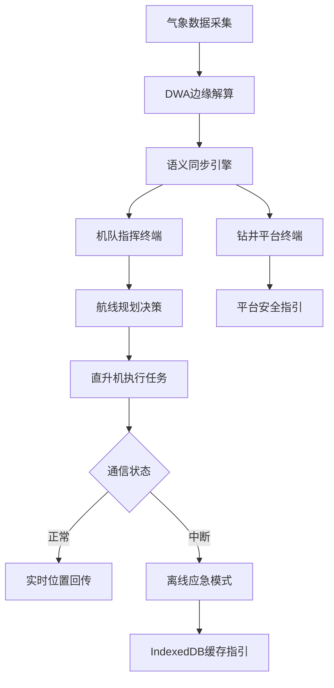
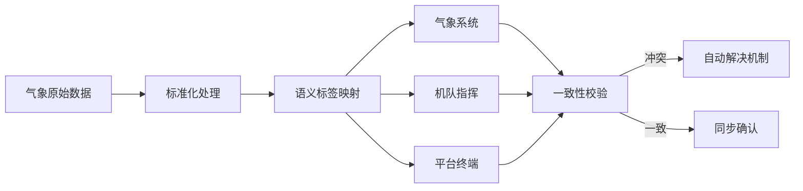

## 1. 产品概述

HeliLink 是面向海上钻井平台的直升机应急通航路由优化系统，解决极端海况下风场浪高突变导致的通航安全问题，实现气象系统、机队指挥中心与平台终端间的数据语义同步。

- 核心目标：通过异步多目标动态窗算法（DWA）在边缘侧实时解算最佳着陆窗口，保障极端海况下的应急救援与物资运输安全
- 目标用户：海上钻井平台安全员、直升机机队指挥员、气象监测分析师、应急救援调度员

## 2. 核心特性

### 2.1 用户角色

| 角色 | 注册方式 | 核心权限 |
|------|----------|----------|
| 平台安全员 | 企业账号授权 | 查看本平台实时气象、着陆窗口预测、应急离线指引 |
| 机队指挥员 | 企业账号授权 | 多平台监控、航线规划、调度决策、历史数据分析 |
| 气象分析师 | 企业账号授权 | 气象数据校准、语义标签配置、模型参数调优 |
| 系统管理员 | 超级管理员 | 用户管理、数据备份、系统配置 |

### 2.2 功能模块

1. **气象数据仪表盘**：实时风场浪高监控、突变预警、多维度数据可视化
2. **DWA着陆窗口解算**：异步多目标动态窗算法实时计算、着陆可行性评分、时间窗口推荐
3. **航线优化规划**：三维航线可视化、障碍物规避、海缆与平台坐标展示
4. **语义同步中心**：气象-机队-平台三端数据语义映射、标签一致性校验、同步状态监控
5. **离线缓存管理**：IndexedDB缓存状态、离线数据同步、极端海况应急模式
6. **系统管理中心**：用户权限、数据配置、日志审计

### 2.3 页面详情

| 页面名称 | 模块名称 | 功能描述 |
|----------|----------|----------|
| 综合监控大屏 | 气象概览面板 | 实时风速风向、浪高周期、气温气压可视化展示，支持多平台切换 |
| 综合监控大屏 | 着陆窗口预测 | DWA算法输出的最佳着陆时间轴，可行性评分热力图 |
| 综合监控大屏 | 航线三维地图 | 全球海缆与平台坐标叠加，直升机实时位置追踪 |
| 综合监控大屏 | 语义同步状态 | 三端数据同步延迟、标签匹配度、异常告警展示 |
| 航线规划页 | 航线参数配置 | 起点/终点平台选择、机型参数、燃油载荷输入 |
| 航线规划页 | DWA算法调优 | 目标权重配置（安全/时间/燃油）、动态窗口参数调整 |
| 航线规划页 | 航线对比分析 | 多条候选航线的风险、时长、油耗对比 |
| 语义同步页 | 数据映射配置 | 气象指标与业务语义标签映射关系管理 |
| 语义同步页 | 同步链路监控 | 各终端同步状态、延迟统计、冲突解决日志 |
| 离线管理页 | 缓存状态监控 | IndexedDB存储空间、数据版本、同步队列状态 |
| 离线管理页 | 应急模式 | 通信中断时的离线安全指引、备用着陆点推荐 |
| 系统管理页 | 用户权限管理 | 角色分配、权限配置、操作日志 |

## 3. 核心流程

### 3.1 应急通航决策流程

气象系统实时采集风场浪高数据 → 边缘节点DWA算法异步解算着陆窗口 → 语义同步引擎将技术指标映射为业务语义 → 机队指挥与平台终端同步接收一致信息 → 指挥员基于评分选择最佳航线 → 直升机执行任务并实时回传位置 → 极端海况触发离线模式 → 基于IndexedDB缓存提供应急指引

### 3.2 数据语义同步流程

气象原始数据 → 标准化处理 → 语义标签映射 → 三端一致性校验 → 冲突自动解决 → 同步状态确认

## 4. 用户界面设计

### 4.1 设计风格

- **主色调**：深海蓝 #0A2463（专业、可信），搭配警示橙 #F46036（预警、应急），安全绿 #1B998B（正常、安全）
- **辅助色**：钢灰色系用于数据面板，高对比度确保恶劣环境下可读性
- **按钮风格**：工业风直角设计，边框高亮，点击反馈明显，支持键盘快捷操作
- **字体**：显示字体采用 Orbitron（科技感、航空风格），正文字体采用 JetBrains Mono（等宽、数字清晰可读）
- **布局风格**：仪表盘网格布局，核心指标卡片悬浮式设计，数据密度高但层次分明
- **视觉元素**：雷达扫描动效、数据波形、等高线纹理，营造专业海事监控氛围

### 4.2 页面设计概述

| 页面名称 | 模块名称 | UI元素 |
|----------|----------|--------|
| 综合监控大屏 | 气象概览面板 | 径向风速仪表盘、浪高波形图、气温气压趋势曲线，实时数据脉冲动画 |
| 综合监控大屏 | 着陆窗口预测 | 时间轴甘特图、可行性评分热力条、状态色块切换动效 |
| 综合监控大屏 | 航线三维地图 | WebGL地球仪、海缆路径发光效果、直升机飞行轨迹动效 |
| 综合监控大屏 | 语义同步状态 | 三端连接拓扑图、同步延迟脉冲、异常告警闪烁 |
| 航线规划页 | DWA算法调优 | 滑块权重调节器、目标函数雷达图、参数配置卡片 |
| 航线规划页 | 航线对比分析 | 多维度蜘蛛图、横向对比柱状图、推荐标签高亮 |
| 离线管理页 | 缓存状态监控 | 存储进度环形图、数据版本时间线、同步队列列表 |
| 离线管理页 | 应急模式 | 红色警示边框、关键数据放大显示、应急步骤指引卡片 |

### 4.3 响应式设计

- 桌面端优先（1920×1080及以上）：多面板并列布局，完整数据展示
- 平板端（1024×768）：面板可折叠，标签页切换，关键指标保留
- 移动端（375×667）：单柱流式布局，核心告警优先展示，支持手势操作
- 触控优化：增大按钮最小尺寸（48×48px），支持双指缩放地图

### 4.4 三维场景设计指导

- **环境氛围**：深蓝色海洋背景，配合星空/云层粒子效果，根据时间模拟昼夜更替
- **光照设置**：主光源模拟太阳光方向，环境光保证数据可读性，点光源标记重点平台
- **相机动画**：航线规划时自动飞行动画，支持用户自由旋转缩放，聚焦模式平滑过渡
- **构图焦点**：当前选中平台为视觉中心，航线动态发光，着陆区域脉冲高亮
- **交互动效**：悬停平台显示详情气泡，点击航线显示剖面分析，双指缩放控制层级
- **后期效果**：Bloom发光效果突出关键数据，轻微暗角聚焦视线，色彩分级增强专业感
- **性能预算**：单帧渲染时间<16ms，粒子数量控制在2000以内，LOD层级优化
