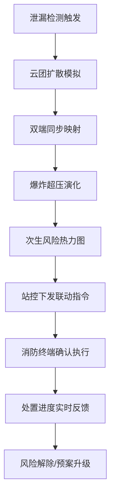
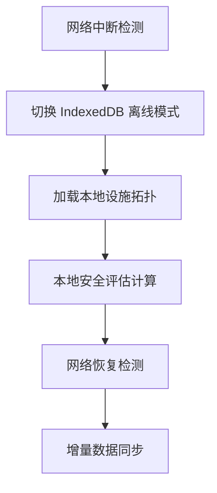

## 1. 产品概述

HydrogenNexus 是一套基于 SolidJS 的加氢站全流程安全状态评价与应急协同平台，面向氢能基础设施运营方、站控中心调度员及区域消防联动终端，解决高压氢气泄漏云团扩散监测、次生爆炸风险预演与跨部门应急信息同步等核心问题。

- 主旨：实现加氢站从储氢、压缩、加注到泄漏应急的全流程安全态势感知与协同处置
- 目标：提升氢能基础设施的跨部门应急协同能力，实现"秒级感知—分钟级预演—即时联动"

## 2. 核心功能

### 2.1 用户角色

| 角色 | 注册方式 | 核心权限 |
|------|----------|----------|
| 站控调度员 | 管理员分配账号 | 监控全站安全状态、启动/终止应急预案、查看泄漏云团映射 |
| 消防联动操作员 | 管理员分配账号 | 接收同步映射数据、确认联动指令、反馈处置进度 |
| 系统管理员 | 超级账号 | 管理用户、配置站内设施拓扑、维护预案库 |

### 2.2 功能模块

1. **安全态势总览页**：全站安全状态仪表盘、实时告警、设施状态矩阵
2. **泄漏云团映射页**：高压泄漏云团扩散可视化、站控中心与消防终端双端同步映射
3. **爆炸超压预演页**：异步爆炸超压演化模型仿真、次生风险热力图、时间轴推演
4. **应急协同页**：跨部门联动指令流、处置进度追踪、离线拓扑恢复

### 2.3 页面详情

| 页面名称 | 模块名称 | 功能描述 |
|----------|----------|----------|
| 安全态势总览页 | 安全评分仪表盘 | 实时计算全站安全综合评分（0-100），按储氢/压缩/加注/环境四维度分解 |
| 安全态势总览页 | 设施状态矩阵 | 以网格矩阵展示压缩机、储罐、加注机等核心设施运行/告警/离线状态 |
| 安全态势总览页 | 实时告警流 | 按时间倒序展示压力异常、温度越限、泄漏检测等告警事件 |
| 泄漏云团映射页 | 云团扩散画布 | 基于 Canvas 2D 渲染高压氢气泄漏云团扩散范围，支持浓度等值线 |
| 泄漏云团映射页 | 双端同步面板 | 左侧站控中心视角、右侧消防终端视角，实时同步云团数据与标注 |
| 泄漏云团映射页 | 风场参数控制 | 调节风速、风向、大气稳定度等参数，实时影响云团扩散模拟 |
| 爆炸超压预演页 | 超压演化曲线 | 展示不同时刻爆炸超压峰值随距离衰减曲线（TNT当量模型） |
| 爆炸超压预演页 | 次生风险热力图 | 在站区平面图上叠加超压伤害区域（致命/重伤/轻伤/安全） |
| 爆炸超压预演页 | 时间轴推演 | 可拖拽时间轴，查看不同时刻的云团形态与超压分布 |
| 应急协同页 | 联动指令流 | 站控中心下发联动指令，消防终端确认/执行/反馈 |
| 应急协同页 | 离线拓扑恢复 | IndexedDB 存储站内核心设施拓扑，断网时可恢复查看 |
| 应急协同页 | 处置进度追踪 | 以甘特图形式追踪各部门处置任务进度 |

## 3. 核心流程

### 3.1 泄漏应急联动流程

站控中心检测到高压泄漏告警 → 系统自动生成云团扩散模拟 → 站控与消防终端同步映射云团数据 → 异步触发爆炸超压演化模型 → 预演次生风险范围 → 站控中心下发联动指令 → 消防终端确认并执行 → 实时反馈处置进度

### 3.2 离线应急恢复流程

网络中断 → 自动切换 IndexedDB 离线模式 → 加载站内设施拓扑 → 基于本地数据进行安全评估 → 网络恢复后增量同步

## 4. 用户界面设计

### 4.1 设计风格

- 主色调：深靛蓝（#0A1628）搭配氢焰橙（#FF6B35）强调色，营造工业监控专业感
- 辅助色：暗夜青（#1B3A4B）面板底色、警示红（#E63946）告警色、安全绿（#2EC4B6）正常状态色
- 按钮风格：圆角矩形（8px），次要按钮描边风格，主要按钮填充氢焰橙渐变
- 字体：数字/数据使用 JetBrains Mono 等宽字体，正文使用 Noto Sans SC
- 布局风格：左侧固定导航栏 + 顶部状态栏 + 主内容区深色卡片布局
- 图标风格：线性描边图标（Lucide），2px 描边宽度

### 4.2 页面设计概述

| 页面名称 | 模块名称 | UI 元素 |
|----------|----------|---------|
| 安全态势总览页 | 安全评分仪表盘 | 环形进度条（0-100），四维度分项条形图，数字动态递增动画 |
| 安全态势总览页 | 设施状态矩阵 | 6×4 网格卡片，状态色块指示灯，hover 展开详情面板 |
| 安全态势总览页 | 实时告警流 | 时间轴列表，告警级别色带，脉冲动画高亮新告警 |
| 泄漏云团映射页 | 云团扩散画布 | 深色 Canvas 画布，半透明渐变云团，等值线标注，风向标罗盘 |
| 泄漏云团映射页 | 双端同步面板 | 左右分栏，顶部同步状态指示灯，数据流虚线动画 |
| 爆炸超压预演页 | 超压演化曲线 | 多色折线图（Chart.js），区域填充，鼠标悬停数据点气泡 |
| 爆炸超压预演页 | 次生风险热力图 | 站区平面图叠加四色热力区，图例面板，缩放控制 |
| 应急协同页 | 联动指令流 | 对话气泡式指令卡片，发送/确认/执行状态徽章 |
| 应急协同页 | 离线拓扑恢复 | 树形拓扑图，离线状态黄色指示，恢复进度条 |

### 4.3 响应式设计

- 桌面优先设计，最小支持 1280px 宽度
- 大屏（≥1920px）：双端同步面板并排展示，热力图全幅渲染
- 中屏（1280-1919px）：双端面板上下堆叠，热力图自适应缩放
- 触控优化：关键操作按钮 ≥44px 触控区域

### 4.4 3D 场景指引

本项目不涉及 3D 场景，采用 2D Canvas + SVG 实现可视化需求。
