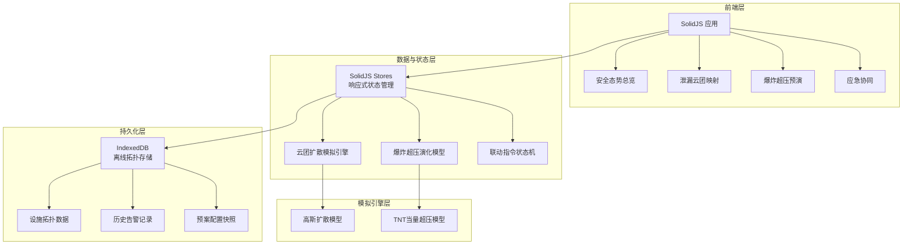
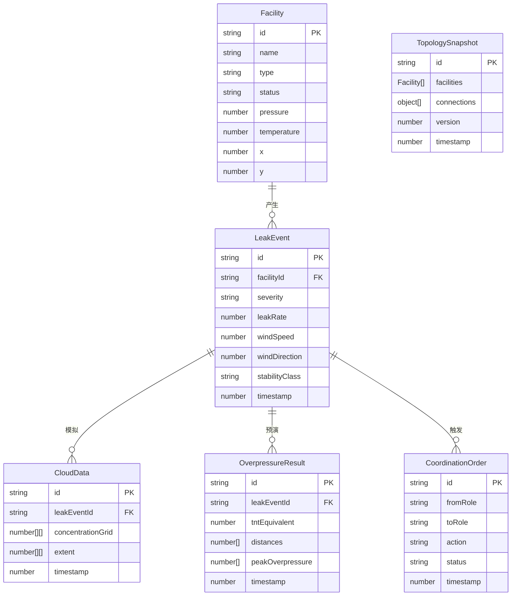

## 1. 架构设计



## 2. 技术说明

- 前端框架：SolidJS（使用 Solid Start 或 Vite + Solid 插件）
- 状态管理：SolidJS 内置 Store / createContext
- 样式方案：TailwindCSS 3
- 构建工具：Vite（vite-plugin-solid）
- 图表库：Chart.js（爆炸超压曲线）
- 离线存储：IndexedDB（idb 封装库）
- 数据可视化：Canvas 2D（云团扩散）、SVG（拓扑结构）
- 无后端：纯前端模拟，数据使用 Mock 生成

## 3. 路由定义

| 路由 | 用途 |
|------|------|
| / | 安全态势总览页，全站安全评分与设施状态矩阵 |
| /leak-mapping | 泄漏云团映射页，双端同步云团数据 |
| /overpressure | 爆炸超压预演页，次生风险演化仿真 |
| /coordination | 应急协同页，联动指令与离线拓扑 |

## 4. 数据模型

### 4.1 数据模型定义



### 4.2 IndexedDB 存储定义

- 数据库名：`hydrogen-nexus-db`
- 版本：1
- Object Stores：
  - `facilities`：keyPath = `id`，索引 = `type`, `status`
  - `leakEvents`：keyPath = `id`，索引 = `facilityId`, `timestamp`
  - `topologySnapshots`：keyPath = `id`，索引 = `version`
  - `coordinationOrders`：keyPath = `id`，索引 = `status`, `timestamp`

## 5. 核心算法

### 5.1 高斯扩散模型

采用高斯烟羽模型模拟高压氢气泄漏云团扩散：

```
C(x,y,z) = Q/(2π·σy·σz·u) · exp(-y²/2σy²) · [exp(-(z-H)²/2σz²) + exp(-(z+H)²/2σz²)]
```

- Q：泄漏源强（kg/s）
- u：风速（m/s）
- σy, σz：横向/垂直扩散参数（Pasquill-Gifford 曲线）
- H：泄漏源有效高度

### 5.2 TNT 当量超压模型

```
ΔP = 0.84 · (Z)^(-1) + 2.7 · (Z)^(-2) + 7.0 · (Z)^(-3)
Z = R / (E/Patm)^(1/3)
```

- ΔP：峰值超压（atm）
- R：距爆心距离（m）
- E：TNT 当量能量（J）
- Patm：标准大气压

### 5.3 伤害区域划分

| 区域 | 超压范围 | 伤害描述 |
|------|----------|----------|
| 致命区 | ΔP > 0.1 MPa | 建筑倒塌、人员死亡 |
| 重伤区 | 0.03 < ΔP ≤ 0.1 MPa | 建筑严重损坏、人员重伤 |
| 轻伤区 | 0.01 < ΔP ≤ 0.03 MPa | 门窗损坏、人员轻伤 |
| 安全区 | ΔP ≤ 0.01 MPa | 玻璃破裂、基本无伤害 |
