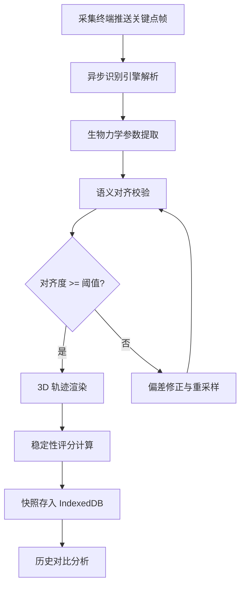

## 1. 产品概述

KineticPro 是一款基于 React 的竞技运动稳定性提升分析系统，专注于挥杆运动（高尔夫/棒球）的生物力学数据采集与可视化分析。系统通过异步人体关键点序列识别引擎实时解析运动姿态，结合 3D 轨迹渲染与重心动态可视化，实现分析系统与采集终端间的语义对齐，帮助运动员和教练精准定位力学参数波动、优化动作稳定性。

- 核心目标：构建端到端的运动数据集成总线，从关键点采集 → 生物力学参数提取 → 3D 可视化 → 历史对比的完整闭环
- 目标用户：专业运动员、运动教练、体育科研人员、康复治疗师

## 2. 核心功能

### 2.1 用户角色

| 角色 | 注册方式 | 核心权限 |
|------|----------|----------|
| 运动员 | 邮箱注册 | 查看个人挥杆数据、历史对比、稳定性评分 |
| 教练 | 邮箱注册 | 查看所有关联运动员数据、标注分析、训练建议推送 |
| 研究员 | 邀请码注册 | 批量数据导出、群体统计分析、模型参数调整 |

### 2.2 功能模块

1. **运动数据仪表盘**：实时 3D 挥杆轨迹、重心轨迹动画、力学参数波动图表、稳定性综合评分
2. **关键点序列分析页**：人体骨架关键点时序可视化、异步识别引擎状态监控、语义对齐度指标
3. **历史对比与快照页**：挥杆历史轨迹快照管理、多轨迹叠加对比、参数趋势分析

### 2.3 页面详情

| 页面名称 | 模块名称 | 功能描述 |
|----------|----------|----------|
| 运动数据仪表盘 | 3D 挥杆轨迹面板 | Three.js 渲染杆头/球杆 3D 运动轨迹，支持旋转/缩放视角切换，轨迹颜色映射速度/力度 |
| 运动数据仪表盘 | 重心动效面板 | 实时渲染身体重心在三维空间的运动曲线，动画回放支持逐帧/倍速控制 |
| 运动数据仪表盘 | 力学参数面板 | 实时折线图展示角速度、线速度、关节力矩等力学参数波动，异常区间高亮标注 |
| 运动数据仪表盘 | 稳定性评分卡 | 综合评分展示（0-100），分解子维度（节奏一致性/重心稳定性/关节协调性）雷达图 |
| 运动数据仪表盘 | 数据采集状态栏 | 显示采集终端连接状态、帧率、语义对齐度、引擎处理延迟 |
| 关键点序列分析页 | 骨架时序图 | 时间轴上展示人体 17 关键点的位置序列，支持拖拽选取时间窗口 |
| 关键点序列分析页 | 识别引擎监控 | 异步引擎队列状态、处理吞吐量、关键点置信度分布 |
| 关键点序列分析页 | 语义对齐面板 | 采集端原始数据与系统分析结果的语义映射关系可视化，对齐偏差热力图 |
| 历史对比与快照页 | 快照列表 | IndexedDB 存储的挥杆历史快照列表，支持按日期/评分/参数筛选 |
| 历史对比与快照页 | 轨迹叠加对比 | 选择 2-4 条历史轨迹在 3D 空间叠加渲染，差异区间色彩标注 |
| 历史对比与快照页 | 参数趋势图 | 力学参数随时间的变化趋势，移动平均线与异常点标记 |

## 3. 核心流程

用户启动数据采集 → 采集终端实时推送关键点帧数据 → 异步识别引擎解析关键点序列 → 生物力学参数提取（角速度/力矩/重心）→ 语义对齐校验（采集端 ↔ 分析端）→ 3D 轨迹与重心渲染 → 稳定性评分计算 → 快照存入 IndexedDB → 历史对比分析

## 4. 用户界面设计

### 4.1 设计风格

- 主色调：深邃暗蓝 `#0A0E1A`（背景）+ 荧光青绿 `#00F0B5`（主强调）+ 琥珀橙 `#FF6B2B`（警示/异常）
- 辅助色：冷灰 `#1A1F2E`（卡片）+ 蓝紫 `#6366F1`（数据色）+ 冰白 `#E8ECF4`（文字）
- 按钮风格：圆角微凸 3D 按钮，hover 时发光扩散效果
- 字体：标题使用 Orbitron（科技感等宽展示字体），正文使用 DM Sans（清晰几何无衬线体）
- 布局：左侧导航栏 + 主区域网格卡片布局，3D 面板占据主要视觉区域
- 图标风格：线性描边图标（Lucide），线条粗细 1.5px，荧光青绿色

### 4.2 页面设计概览

| 页面名称 | 模块名称 | UI 元素 |
|----------|----------|---------|
| 运动数据仪表盘 | 3D 挥杆轨迹面板 | 深色背景 3D 画布、轨迹线条渐变色（速度映射）、发光粒子效果、视角控制浮窗 |
| 运动数据仪表盘 | 重心动效面板 | 3D 曲线动画、重心点发光脉冲、地面投影网格、回放控制栏 |
| 运动数据仪表盘 | 力学参数面板 | 深色折线图、异常区间橙红高亮填充、参数切换标签页 |
| 运动数据仪表盘 | 稳定性评分卡 | 圆形进度环、雷达图子维度、数字动画跳动效果 |
| 运动数据仪表盘 | 数据采集状态栏 | 状态指示灯（绿/黄/红）、脉冲动画、帧率计数器 |
| 关键点序列分析页 | 骨架时序图 | 水平时间轴、关键点连线动画、拖拽选区手柄 |
| 关键点序列分析页 | 识别引擎监控 | 管道式流程图、吞吐量柱状图、置信度热力色带 |
| 关键点序列分析页 | 语义对齐面板 | 双列映射连线图、偏差热力矩阵、对齐度进度条 |
| 历史对比与快照页 | 快照列表 | 卡片网格、缩略 3D 预览、评分徽章、筛选标签栏 |
| 历史对比与快照页 | 轨迹叠加对比 | 3D 画布多轨迹叠加、差异区间渐变色带、图例面板 |
| 历史对比与快照页 | 参数趋势图 | 面积折线图、移动平均虚线、异常点脉冲标记 |

### 4.3 响应式设计

- 桌面优先设计，3D 面板占据 60%+ 视觉区域
- 平板端：侧边栏折叠为底部标签栏，3D 面板全宽
- 移动端：单列堆叠布局，3D 面板简化为 2D 投影视图

### 4.4 3D 场景指导

- 环境：深色星空粒子背景 + 地面网格参考面
- 灯光：冷色调环境光 + 轨迹跟随点光源（青绿色）
- 相机：默认 45° 俯视斜角，OrbitControls 自由旋转，限制最小距离
- 构图：挥杆轨迹居中，重心曲线偏下方平行展示
- 交互：鼠标拖拽旋转、滚轮缩放、双击重置视角
- 后处理：Bloom 发光效果（轨迹线）、环境遮蔽
- 性能预算：保持 60fps，轨迹点数上限 5000，自动降采样
