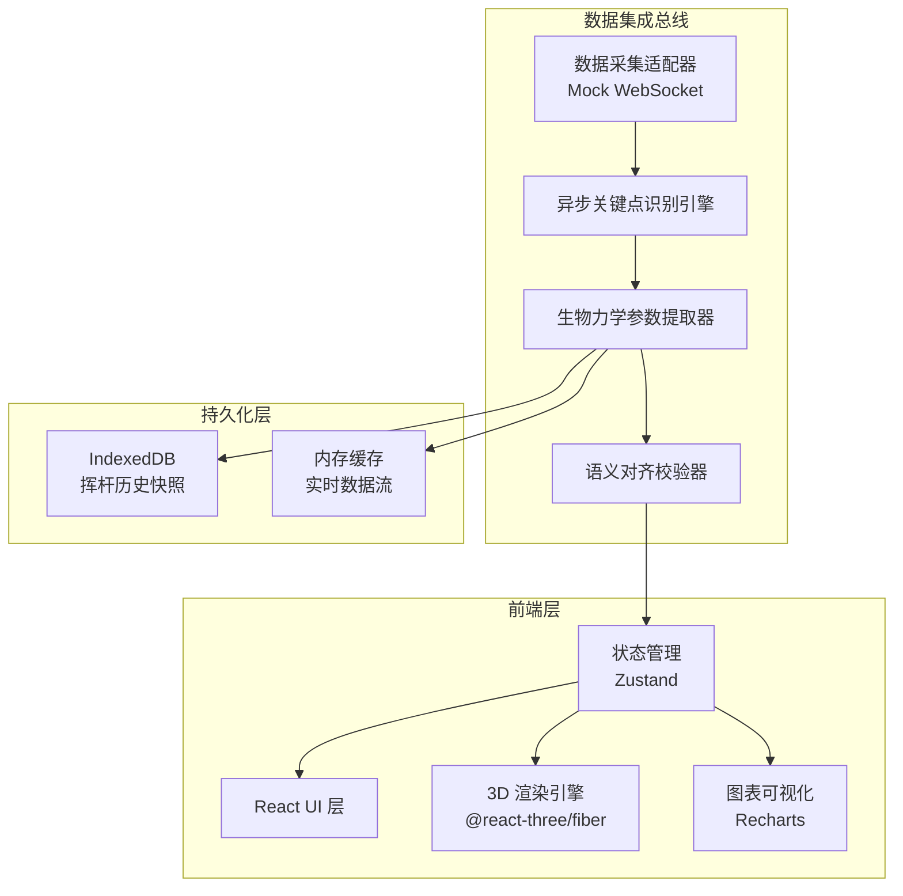
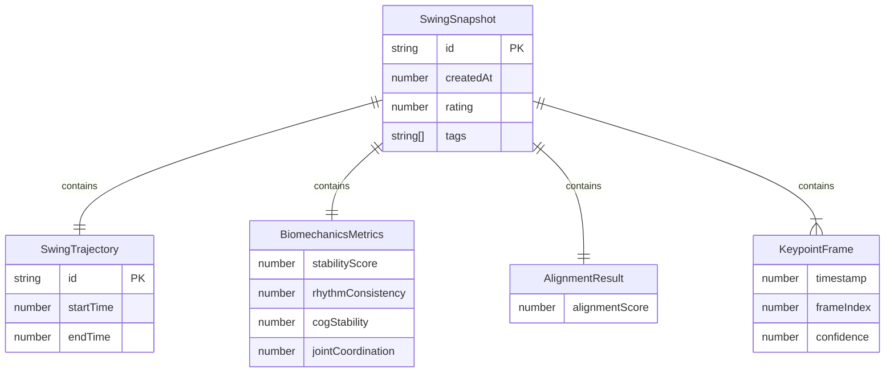

## 1. 架构设计



## 2. 技术说明

- 前端：React@18 + TypeScript + Tailwind CSS@3 + Vite
- 初始化工具：vite-init（react-ts 模板）
- 3D 渲染：three + @react-three/fiber + @react-three/drei + @react-three/postprocessing
- 图表：recharts
- 状态管理：zustand
- 路由：react-router-dom
- 本地存储：idb（IndexedDB Promise 封装库）
- 后端：无（纯前端项目，数据通过 Mock 引擎模拟生成）
- 数据库：IndexedDB（浏览器端存储挥杆历史快照）

## 3. 路由定义

| 路由 | 用途 |
|------|------|
| `/` | 运动数据仪表盘（默认首页），3D 轨迹 + 重心动效 + 力学参数 + 稳定性评分 |
| `/keypoints` | 关键点序列分析页，骨架时序 + 引擎监控 + 语义对齐 |
| `/history` | 历史对比与快照页，快照列表 + 轨迹叠加 + 参数趋势 |

## 4. API 定义（无后端，Mock 数据接口）

### 4.1 数据采集适配器

```typescript
interface KeypointFrame {
  timestamp: number;
  keypoints: Keypoint[];
  confidence: number;
  frameIndex: number;
}

interface Keypoint {
  id: number;
  name: string;
  position: [number, number, number];
  confidence: number;
}

interface SwingTrajectory {
  id: string;
  startTime: number;
  endTime: number;
  clubHeadPath: [number, number, number][];
  centerOfGravityPath: [number, number, number][];
  phases: SwingPhase[];
}

interface SwingPhase {
  name: 'address' | 'backswing' | 'downswing' | 'impact' | 'follow_through';
  startFrame: number;
  endFrame: number;
}

interface BiomechanicsMetrics {
  angularVelocity: TimeSeriesData;
  linearVelocity: TimeSeriesData;
  jointTorques: TimeSeriesData[];
  centerOfGravityDisplacement: TimeSeriesData;
  stabilityScore: number;
  subScores: {
    rhythmConsistency: number;
    cogStability: number;
    jointCoordination: number;
  };
}

interface TimeSeriesData {
  timestamps: number[];
  values: number[];
  anomalies: { index: number; severity: number }[];
}

interface AlignmentResult {
  alignmentScore: number;
  fieldMappings: FieldMapping[];
  deviationHeatmap: number[][];
}

interface FieldMapping {
  sourceField: string;
  targetField: string;
  confidence: number;
  deviation: number;
}

interface SwingSnapshot {
  id: string;
  createdAt: number;
  trajectory: SwingTrajectory;
  metrics: BiomechanicsMetrics;
  alignment: AlignmentResult;
  keypointFrames: KeypointFrame[];
  tags: string[];
  rating: number;
}
```

## 5. 数据模型

### 6.1 数据模型定义



### 6.2 IndexedDB 存储结构

- 数据库名：`kineticpro-db`
- 对象存储：`swing_snapshots`
  - 主键：`id`
  - 索引：`createdAt`、`rating`、`tags`
- 对象存储：`trajectory_cache`
  - 主键：`id`
  - 索引：`snapshotId`
