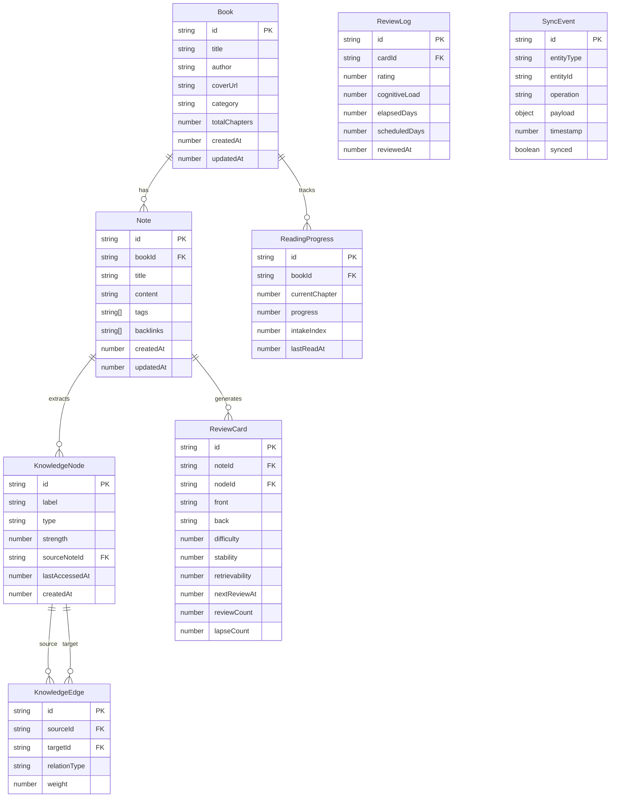

## 1. 架构设计

```mermaid
graph TB
    subgraph "前端展示层"
        "阅读库页面"
        "笔记系统页面"
        "复习引擎页面"
        "知识图谱页面"
        "成长仪表板页面"
    end

    subgraph "状态管理层"
        "Svelte 5 Runes 状态"
        "Svelte Store 跨组件通信"
    end

    subgraph "核心引擎层"
        "知识图谱引擎"
        "增量对齐引擎"
        "认知负荷预测模型"
        "间隔重复调度器"
    end

    subgraph "数据持久层"
        "IndexedDB 离线存储"
        "增量索引器"
        "全文搜索服务"
    end

    "前端展示层" --> "状态管理层"
    "状态管理层" --> "核心引擎层"
    "核心引擎层" --> "数据持久层"
```

## 2. 技术说明

- **前端框架**：Svelte 5 + TypeScript（使用 Runes 响应式原语 `$state`、`$derived`、`$effect`）
- **构建工具**：Vite 6
- **样式方案**：Tailwind CSS 4
- **路由**：svelte-spa-router（轻量单页路由）
- **图谱可视化**：D3.js v7（力导向图）
- **图表**：Chart.js（记忆曲线、成长趋势）
- **离线存储**：IndexedDB（via idb 库封装）
- **全文搜索**：基于 IndexedDB 的自定义倒排索引
- **状态管理**：Svelte 5 Runes + Svelte Store（跨组件共享）
- **无后端**：纯前端应用，所有数据本地存储

## 3. 路由定义

| 路由 | 用途 |
|------|------|
| `/` | 重定向至 `/library` |
| `/library` | 阅读库主页面，书籍列表 |
| `/library/:id` | 阅读详情页 |
| `/notes` | 笔记列表页 |
| `/notes/:id` | 笔记编辑页 |
| `/review` | 复习队列页 |
| `/review/session` | 复习会话页 |
| `/review/curves` | 记忆曲线页 |
| `/graph` | 知识图谱全局视图 |
| `/dashboard` | 成长仪表板 |

## 4. 数据模型

### 4.1 数据模型定义



### 4.2 IndexedDB 存储设计

**数据库名称**：`knowledgelink_db`
**版本**：1

| 对象存储 | 索引 | 用途 |
|----------|------|------|
| `books` | `title`, `category`, `updatedAt` | 书籍主存储 |
| `readingProgress` | `bookId` | 阅读进度 |
| `notes` | `bookId`, `tags`, `createdAt`, `updatedAt` | 笔记主存储 |
| `knowledgeNodes` | `label`, `type`, `sourceNoteId` | 知识图谱节点 |
| `knowledgeEdges` | `sourceId`, `targetId` | 知识图谱边 |
| `reviewCards` | `noteId`, `nodeId`, `nextReviewAt` | 复习卡片 |
| `reviewLogs` | `cardId`, `reviewedAt` | 复习日志 |
| `searchIndex` | `term`, `entityType`, `entityId` | 全文倒排索引 |
| `syncEvents` | `entityType`, `timestamp`, `synced` | 增量同步事件 |

## 5. 核心算法

### 5.1 认知负荷预测模型

采用异步计算的简化 ELO 认知负荷评估：

```
cognitiveLoad = baseLoad × difficultyFactor × recencyFactor × densityFactor

其中：
- baseLoad = 0.5（基准负荷）
- difficultyFactor = 1 + (card.difficulty / 10)（难度因子）
- recencyFactor = 1 / (1 + daysSinceLastReview × 0.1)（新近因子）
- densityFactor = 1 + (relatedCardCount / 20)（密度因子，同时间段相关卡片数）
```

### 5.2 间隔重复调度（FSRS 简化版）

```
stability_new = stability × (1 + easeFactor × (rating - 3))
retrievability = (1 + elapsedDays / (stability × 9))^(-1)
nextInterval = stability × 9 × (desiredRetention / (1 - desiredRetention))^(1/decay) - elapsedDays

参数：
- desiredRetention = 0.85（目标留存率）
- decay = -0.5（衰减系数）
- easeFactor 初始 = 0.5
```

### 5.3 增量对齐引擎

三场景对齐策略：
1. **阅读库→笔记**：标注事件触发笔记创建/更新，更新关联知识节点强度
2. **笔记→复习引擎**：笔记保存时抽取关键概念生成复习卡片，同步至知识图谱
3. **复习→图谱**：复习反馈更新节点 retrievability，触发边权重重计算
4. **图谱→全局**：图谱演化事件写入 syncEvents，各场景订阅消费实现增量同步

## 6. 项目结构

```
src/
├── lib/
│   ├── db/
│   │   ├── index.ts          # IndexedDB 初始化与连接
│   │   ├── repositories/     # 各实体 Repository
│   │   └── search.ts         # 全文搜索服务
│   ├── engines/
│   │   ├── graph.ts          # 知识图谱引擎
│   │   ├── aligner.ts        # 增量对齐引擎
│   │   ├── cognitive-load.ts # 认知负荷预测
│   │   └── scheduler.ts      # 间隔重复调度器
│   ├── stores/
│   │   ├── library.ts        # 阅读库状态
│   │   ├── notes.ts          # 笔记状态
│   │   ├── review.ts         # 复习状态
│   │   ├── graph.ts          # 图谱状态
│   │   └── dashboard.ts      # 仪表板状态
│   ├── components/
│   │   ├── layout/           # 布局组件
│   │   ├── library/          # 阅读库组件
│   │   ├── notes/            # 笔记组件
│   │   ├── review/           # 复习组件
│   │   ├── graph/            # 图谱组件
│   │   └── dashboard/        # 仪表板组件
│   └── utils/
│       ├── id.ts             # ID 生成
│       └── time.ts           # 时间工具
├── routes/
│   └── [各路由页面]
├── App.svelte
└── main.ts
```
