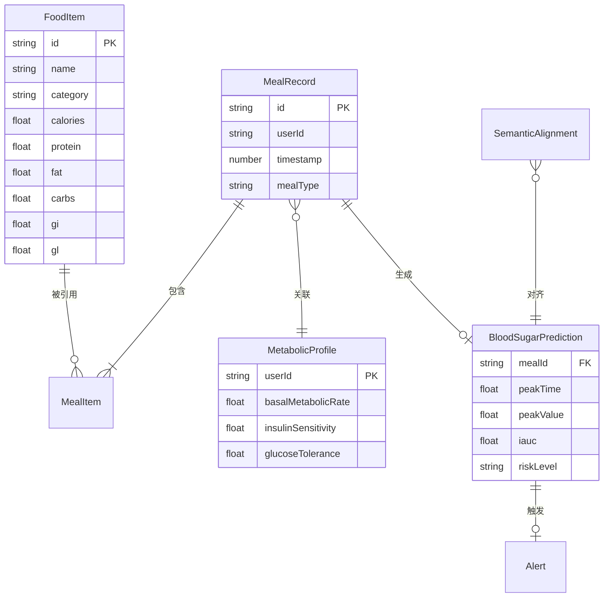

## 1. 架构设计

```mermaid
flowchart TB
    subgraph "前端层 (SolidJS)"
        "用户端 - 膳食控制台"
        "专业端 - 代谢分析终端"
        "食物营养库浏览器"
    end
    subgraph "核心引擎层"
        "异步代谢动力学预测引擎"
        "语义对齐层"
        "营养素聚合计算器"
    end
    subgraph "数据层"
        "IndexedDB 千万级食物索引"
        "用户膳食记录存储"
        "代谢参数配置"
    end
    "用户端 - 膳食控制台" --> "营养素聚合计算器"
    "营养素聚合计算器" --> "异步代谢动力学预测引擎"
    "异步代谢动力学预测引擎" --> "语义对齐层"
    "语义对齐层" --> "专业端 - 代谢分析终端"
    "语义对齐层" --> "用户端 - 膳食控制台"
    "用户端 - 膳食控制台" --> "IndexedDB 千万级食物索引"
    "食物营养库浏览器" --> "IndexedDB 千万级食物索引"
    "专业端 - 代谢分析终端" --> "用户膳食记录存储"
    "异步代谢动力学预测引擎" --> "代谢参数配置"
```

## 2. 技术说明

- **前端框架**：SolidJS + Solid Router（细粒度响应式，零虚拟DOM开销，适合高频数据更新场景）
- **样式方案**：TailwindCSS@3 + CSS Variables 主题系统
- **构建工具**：Vite@5 + @solidjs/vite-plugin
- **状态管理**：SolidJS 内置 Signal/Memo/Store（无需额外状态库）
- **数据可视化**：Chart.js + solid-chart（血糖曲线、营养环形图）+ 自定义 SVG 组件（语义对齐图）
- **离线存储**：idb（IndexedDB Promise封装）+ 自定义批量索引引擎
- **后端服务**：无（纯前端应用，所有计算在客户端完成，数据存储在 IndexedDB）
- **数据库**：IndexedDB（千万级食物数据 + 用户膳食记录）

## 3. 路由定义

| 路由 | 用途 |
|------|------|
| `/` | 登录/注册页面，角色选择 |
| `/dashboard` | 用户端膳食控制台主页 |
| `/dashboard/meal-input` | 膳食录入面板 |
| `/dashboard/blood-sugar` | 血糖预测曲线详情 |
| `/dashboard/nutrition` | 实时营养仪表盘 |
| `/dashboard/timeline` | 膳食时间轴 |
| `/analyst` | 专业分析终端主页 |
| `/analyst/alignment` | 语义对齐面板 |
| `/analyst/overview` | 多用户代谢概览 |
| `/analyst/alerts` | 波峰异常告警 |
| `/analyst/reports` | 专业报告生成 |
| `/food-database` | 食物营养库浏览器 |
| `/food-database/:id` | 食物详情卡片 |

## 4. API 定义

本项目为纯前端应用，无后端API。所有数据交互通过以下内部模块完成：

### 4.1 IndexedDB 数据接口

```typescript
interface FoodItem {
  id: string;
  name: string;
  nameEn: string;
  category: string;
  calories: number;
  protein: number;
  fat: number;
  carbs: number;
  fiber: number;
  gi: number;
  gl: number;
  vitamins: Record<string, number>;
  minerals: Record<string, number>;
  tags: string[];
}

interface MealRecord {
  id: string;
  userId: string;
  timestamp: number;
  mealType: 'breakfast' | 'lunch' | 'dinner' | 'snack';
  items: MealItem[];
  totalNutrition: NutritionSummary;
}

interface MealItem {
  foodId: string;
  amount: number;
  unit: string;
}

interface NutritionSummary {
  calories: number;
  protein: number;
  fat: number;
  carbs: number;
  fiber: number;
  gi: number;
  gl: number;
}

interface MetabolicProfile {
  userId: string;
  basalMetabolicRate: number;
  insulinSensitivity: number;
  glucoseTolerance: number;
  bodyWeight: number;
  age: number;
  sex: 'male' | 'female';
}

interface BloodSugarPrediction {
  mealId: string;
  curve: { time: number; glucose: number }[];
  peakTime: number;
  peakValue: number;
  iauc: number;
  riskLevel: 'low' | 'medium' | 'high';
}

interface SemanticAlignment {
  userDimension: string;
  professionalDimension: string;
  mappingConfidence: number;
  description: string;
}
```

### 4.2 代谢动力学引擎接口

```typescript
interface MetabolicEngine {
  predict(meal: MealRecord, profile: MetabolicProfile): Promise<BloodSugarPrediction>;
  batchPredict(meals: MealRecord[], profile: MetabolicProfile): Promise<BloodSugarPrediction[]>;
  getPeakAlert(prediction: BloodSugarPrediction): Alert | null;
}
```

## 5. 服务器架构图

不适用 — 纯前端应用，无服务器端架构。

## 6. 数据模型

### 6.1 数据模型定义



### 6.2 IndexedDB Schema 定义

```sql
-- 对象仓库: foods
CREATE OBJECT_STORE foods {
  keyPath: id,
  indexes: [
    name (unique),
    category (non-unique),
    gi (non-unique),
    tags (multiEntry),
    [category, gi] (compound)
  ]
}

-- 对象仓库: meals
CREATE OBJECT_STORE meals {
  keyPath: id,
  indexes: [
    userId (non-unique),
    timestamp (non-unique),
    mealType (non-unique),
    [userId, timestamp] (compound)
  ]
}

-- 对象仓库: profiles
CREATE OBJECT_STORE profiles {
  keyPath: userId
}

-- 对象仓库: predictions
CREATE OBJECT_STORE predictions {
  keyPath: mealId,
  indexes: [
    riskLevel (non-unique),
    peakValue (non-unique)
  ]
}

-- 对象仓库: alignments
CREATE OBJECT_STORE alignments {
  keyPath: id,
  indexes: [
    userDimension (non-unique),
    professionalDimension (non-unique)
  ]
}
```
