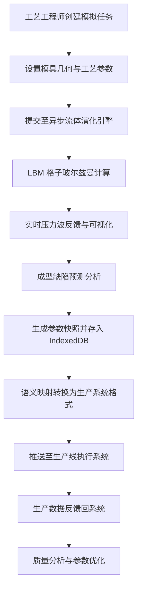

## 1. 产品概述

MoldNexus 是一个基于 SolidJS 的注塑成型充填动力学演化模拟平台，实现熔接痕数据在工艺部门与生产线执行系统间的语义映射。通过异步粘性流体演化引擎预测成型缺陷，实时反馈压力波，并利用 IndexedDB 缓存万级成型参数的版本快照，实现复杂模具生产的高效率跨部门协作。

## 2. 核心功能

### 2.1 用户角色

| 角色 | 描述 | 核心权限 |
|------|------|----------|
| 工艺工程师 | 负责注塑工艺参数设计与优化 | 创建模拟、调整参数、查看分析报告 |
| 生产线操作员 | 负责执行生产工艺参数 | 查看生产参数、监控实时状态、提交生产数据 |
| 质量工程师 | 负责产品质量分析与缺陷追溯 | 查看历史数据、缺陷分析、生成质量报告 |
| 系统管理员 | 负责系统配置与用户管理 | 用户管理、数据备份、系统配置 |

### 2.2 功能模块

1. **充填动力学演化模拟**：基于 LBM 格子玻尔兹曼方法的粘性流体演化引擎，实时模拟熔料充填过程
2. **熔接痕语义映射**：工艺参数与生产执行系统间的语义转换与映射
3. **压力波实时反馈**：实时显示充填过程中的压力波传播与分布
4. **成型缺陷预测**：基于流体动力学模型预测熔接痕、气泡、短射等缺陷
5. **参数版本管理**：基于 IndexedDB 的万级参数快照存储与版本对比
6. **跨部门协作工作台**：工艺部门与生产部门的数据共享与协同工作

### 2.3 页面详情

| 页面名称 | 模块名称 | 功能描述 |
|-----------|-------------|---------------------|
| 模拟工作台 | 流体演化画布 | 2D/3D 充填过程实时可视化 |
| 模拟工作台 | 参数控制面板 | 温度、压力、流速等工艺参数调节 |
| 模拟工作台 | 缺陷检测面板 | 实时显示预测的成型缺陷位置与类型 |
| 参数管理 | 参数快照列表 | 历史参数版本浏览与搜索 |
| 参数管理 | 参数对比视图 | 多版本参数差异对比分析 |
| 语义映射 | 映射规则配置 | 工艺参数与生产系统字段映射关系 |
| 语义映射 | 数据转换预览 | 映射转换前后数据预览与验证 |
| 协作中心 | 任务看板 | 跨部门任务分配与进度追踪 |
| 协作中心 | 数据共享区 | 工艺文件、模拟报告的共享与评论 |
| 分析报告 | 缺陷统计 | 各类缺陷发生率统计分析 |
| 分析报告 | 参数优化建议 | 基于历史数据的参数优化推荐 |

## 3. 核心流程

## 4. 用户界面设计

### 4.1 设计风格

- **主色调**：深蓝色系 (#0F172A) 作为工业科技感基底，配合橙红色 (#F97316) 作为警告与高亮
- **辅助色**：青色 (#06B6D4) 用于流体可视化，绿色 (#10B981) 表示正常状态
- **按钮风格**：扁平化设计，微圆角 (4px)，悬停时轻微上浮阴影
- **字体**：JetBrains Mono 作为数据展示字体，Inter 作为界面字体
- **布局风格**：深色主题，三栏布局（左侧导航 + 中间画布 + 右侧控制面板）
- **图标**：Lucide 工业风图标，统一线性风格

### 4.2 页面设计概述

| 页面名称 | 模块名称 | UI 元素 |
|-----------|-------------|-------------|
| 模拟工作台 | 流体演化画布 | WebGL 渲染的 2D/3D 流体模拟，网格背景，实时数据叠加层 |
| 模拟工作台 | 参数控制面板 | 滑块、数值输入、实时曲线图，参数联动验证 |
| 参数管理 | 参数快照列表 | 卡片式列表，版本标签，搜索过滤，时间轴视图 |
| 语义映射 | 映射规则配置 | 拖拽式字段映射，表格视图，正则表达式编辑器 |
| 协作中心 | 任务看板 | 看板式布局，任务卡片拖拽，评论区，@提及 |

### 4.3 响应式

- 桌面端：三栏布局，1200px 以上最佳展示
- 平板端：两栏布局，控制面板可折叠
- 移动端：单栏滚动布局，优先展示核心数据与操作

### 4.4 可视化场景指导

- **流体渲染**：使用 WebGL 实现粒子系统与密度场渲染，压力波使用等值线可视化
- **熔接痕显示**：红色半透明叠加层，边缘模糊效果，显示熔合强度数值
- **压力波动画**：波纹扩散动画，速度与振幅对应实际压力数据
- **缺陷高亮**：脉冲闪烁动画，不同缺陷类型使用不同颜色编码
