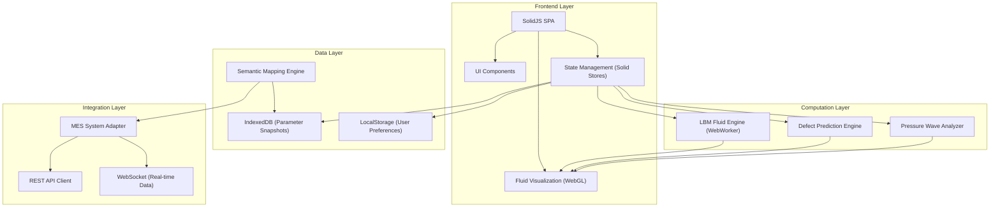
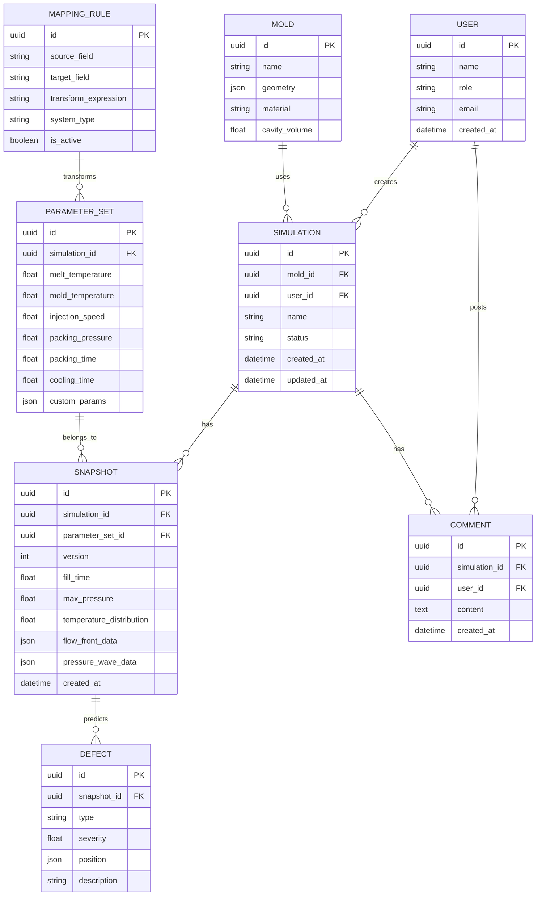

## 1. 架构设计

## 2. 技术描述

- **前端框架**：SolidJS 1.8 + TypeScript 5.0
- **构建工具**：Vite 5.0
- **样式方案**：TailwindCSS 3.4
- **状态管理**：SolidJS 内置 Store
- **流体可视化**：WebGL2 + 自定义粒子渲染引擎
- **计算引擎**：WebWorker + LBM 格子玻尔兹曼方法实现
- **数据存储**：IndexedDB (idb) + LocalStorage
- **路由管理**：@solidjs/router
- **图表库**：@antv/g2
- **图标库**：lucide-solid
- **日期处理**：date-fns

## 3. 路由定义

| 路由 | 页面组件 | 权限控制 | 描述 |
|-------|---------|----------|------|
| / | Dashboard | 所有角色 | 系统概览与快捷入口 |
| /simulation | SimulationWorkbench | 工艺工程师/质量工程师 | 充填动力学模拟工作台 |
| /parameters | ParameterManager | 工艺工程师/质量工程师 | 参数快照管理与对比 |
| /mapping | SemanticMapping | 工艺工程师/管理员 | 语义映射规则配置 |
| /collaboration | CollaborationCenter | 所有角色 | 跨部门协作中心 |
| /analytics | AnalyticsReport | 质量工程师/管理员 | 分析报告与统计 |
| /settings | SystemSettings | 管理员 | 系统设置 |

## 4. 数据模型

### 4.1 核心数据结构

### 4.2 IndexedDB Schema

| Object Store | Key Path | Indexes | 描述 |
|-------------|----------|---------|------|
| snapshots | id | [simulation_id, version, created_at] | 模拟快照存储 |
| parameter_sets | id | [simulation_id, created_at] | 参数集存储 |
| mapping_rules | id | [system_type, is_active] | 语义映射规则 |
| simulations | id | [user_id, status, created_at] | 模拟任务 |
| molds | id | [material, created_at] | 模具信息 |
| defects | id | [snapshot_id, type, severity] | 缺陷预测结果 |

## 5. 核心模块

### 5.1 流体演化引擎 (LBM)

**核心算法**：D2Q9 格子玻尔兹曼模型
- 平衡分布函数计算
- 碰撞步 (BGK 模型)
- 迁移步
- 边界条件处理 (反弹边界)

**性能优化**：
- WebWorker 异步计算
- TypedArray 内存优化
- 分块计算策略
- 增量数据传输

### 5.2 缺陷预测模型

**缺陷类型**：
- 熔接痕 (Weld Line)：基于流速差与温度梯度检测
- 气泡 (Air Trap)：基于压力场与充填顺序分析
- 短射 (Short Shot)：基于充填率与压力阈值判断
- 焦烧 (Burn Mark)：基于剪切速率与温度预测

### 5.3 语义映射引擎

**映射策略**：
- 字段级直接映射
- 单位转换映射
- 公式计算映射
- 枚举值映射
- 条件分支映射

## 6. 性能指标

- 流体模拟帧率：2D 模拟 ≥ 30fps (100x100 网格)
- 快照存储性能：单条写入 < 10ms
- 万级数据查询：< 500ms
- 压力波可视化延迟：< 100ms
- 页面加载时间：< 2s
