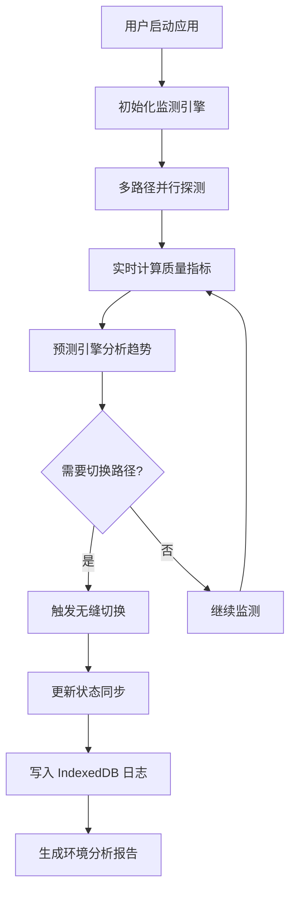

## 1. 产品概述

NetPulse 是面向竞技场景的网络连接动态反馈系统，通过实时监测丢包率与时延抖动，实现终端与加速服务器间的语义同步，智能预测网络状态并自动切换最优路径，为在线竞技游戏、实时通信等高要求场景提供稳定的网络保障。

- 核心价值：解决复杂互联网环境下网络波动导致的竞技体验下降问题，通过 AI 预测引擎实现毫秒级路径切换
- 目标用户：竞技游戏玩家、实时音视频从业者、对网络稳定性有高要求的专业用户

## 2. 核心特性

### 2.1 用户角色

| 角色 | 注册方式 | 核心权限 |
|------|----------|----------|
| 普通用户 | 本地启动应用 | 查看实时网络数据、配置加速策略、查看历史分析报告 |
| 管理员 | 服务器端配置 | 管理加速节点集群、查看全局网络质量数据、配置系统参数 |

### 2.2 功能模块

1. **实时监测仪表盘**：网络质量实时展示、丢包率/时延/抖动可视化、多路径并行监控
2. **路径智能切换引擎**：异步时延抖动预测、多目标路径评分、毫秒级无缝切换
3. **终端-服务器语义同步**：双向状态同步、协商机制、数据一致性保障
4. **长效日志分析系统**：IndexedDB 本地存储、网络环境画像、趋势预测报告
5. **链路质量协同中枢**：全局链路调度、节点负载均衡、故障自动转移

### 2.3 页面详情

| 页面名称 | 模块名称 | 功能描述 |
|----------|----------|----------|
| 实时监控仪表盘 | 核心指标卡片 | 展示当前时延、丢包率、抖动值、连接状态，支持阈值告警 |
| 实时监控仪表盘 | 路径切换轨迹 | 可视化展示路径切换历史、切换原因、切换耗时 |
| 实时监控仪表盘 | 实时波形图 | 动态渲染时延/抖动/丢包率的实时波形，支持多路径对比 |
| 路径管理 | 节点列表 | 展示所有可用加速节点的实时状态、负载、地理位置 |
| 路径管理 | 智能推荐 | 基于当前网络环境自动推荐最优路径，支持手动切换 |
| 历史分析 | 趋势图表 | 展示日/周/月的网络质量趋势，支持多维度筛选 |
| 历史分析 | 环境画像 | 基于历史数据分析用户网络环境特征，生成优化建议 |
| 系统设置 | 策略配置 | 配置切换灵敏度、告警阈值、数据保留周期等参数 |
| 系统设置 | 高级选项 | 协议配置、端口映射、日志导出等高级功能 |

## 3. 核心流程

用户启动应用后，系统自动初始化网络监测模块，开始多路径探测。预测引擎持续分析时延抖动趋势，当检测到当前路径质量下降时，自动触发路径切换。所有数据同步到加速服务器集群，并在本地 IndexedDB 持久化存储，用于后续分析。

## 4. 用户界面设计

### 4.1 设计风格
- **主色调**：深空蓝 (#0B1220) 作为背景主色，霓虹青 (#00F5FF) 作为主强调色，警示红 (#FF4757) 用于告警状态
- **辅色调**：电子紫 (#7B61FF) 用于辅助数据点，金属灰 (#8B9CBF) 用于次要信息
- **按钮风格**：科技感圆角矩形，带发光边框效果，hover 状态有脉冲动画
- **字体**：展示字体使用 Orbitron（科技感等宽字体），正文字体使用 JetBrains Mono（程序员等宽字体）
- **布局风格**：深色仪表盘风格，网格化布局，数据卡片带半透明玻璃态效果
- **视觉元素**：动态波形图、粒子背景、数据流动画、发光指示器

### 4.2 页面设计概述

| 页面名称 | 模块名称 | UI 元素 |
|----------|----------|----------|
| 实时监控仪表盘 | 核心指标卡片 | 玻璃态卡片、发光数字、动态趋势箭头、状态指示灯 |
| 实时监控仪表盘 | 实时波形图 | Canvas 动态渲染、多色线条、区域填充渐变、实时数据点标记 |
| 实时监控仪表盘 | 路径切换轨迹 | 时间轴布局、节点图标、切换动画连接线、状态颜色编码 |
| 路径管理 | 节点列表 | 卡片式布局、地理位置标记、负载进度条、延迟热力图 |
| 历史分析 | 趋势图表 | 可交互时间轴、数据区域选择、多维度对比折线 |
| 系统设置 | 策略配置 | 滑块控件、开关按钮、数字输入框、实时预览 |

### 4.3 响应式设计
- **桌面端优先**：1280px 以上分辨率展示完整仪表盘布局
- **平板适配**：1024px-1279px，两列布局，次要指标折叠到抽屉
- **移动适配**：768px-1023px，单列布局，核心指标优先展示，图表简化
- **触控优化**：所有交互元素最小 44x44px，支持滑动操作，禁用悬停状态

### 4.4 动效设计
- **数据更新**：新数据点进入时使用淡入+位移动画，数字变化使用滚动数字效果
- **状态切换**：路径切换时使用流动光效动画，状态变化使用颜色渐变过渡
- **告警提示**：超阈值时使用脉冲闪烁动画 + 轻微震动反馈
- **页面过渡**：路由切换使用左右滑入动画，元素入场使用交错延迟动画
