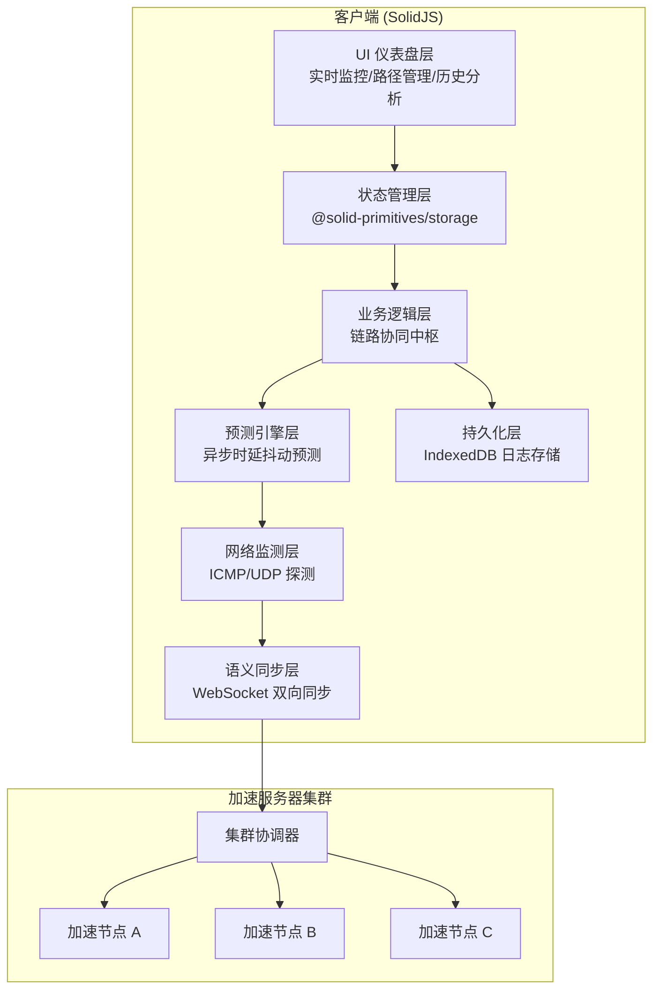

## 1. 架构设计



## 2. 技术栈描述

### 2.1 前端技术
- **核心框架**：SolidJS@1.8 + TypeScript@5
- **构建工具**：Vite@5 + vite-plugin-solid
- **状态管理**：@solid-primitives/storage + 原生 createContext
- **路由**：@solidjs/router@0.13
- **样式方案**：TailwindCSS@3.4 + PostCSS
- **图表库**：Chart.js@4 + solid-chartjs
- **图标库**：lucide-solid
- **本地存储**：idb@8 (IndexedDB 封装)
- **实时通信**：WebSocket + protobufjs

### 2.2 后端技术（模拟层）
- **HTTP 服务**：Express@4
- **WebSocket**：ws@8
- **类型共享**：TypeScript 类型定义在 shared 目录

### 2.3 开发工具
- **代码规范**：ESLint + Prettier
- **类型检查**：TypeScript tsc
- **单元测试**：Vitest@1 + solid-testing-library

## 3. 目录结构

```
NetPulse/
├── src/
│   ├── components/          # 可复用组件
│   │   ├── dashboard/       # 仪表盘组件
│   │   ├── charts/          # 图表组件
│   │   └── ui/              # 基础 UI 组件
│   ├── pages/               # 页面组件
│   │   ├── Dashboard.tsx
│   │   ├── Paths.tsx
│   │   ├── History.tsx
│   │   └── Settings.tsx
│   ├── core/                # 核心业务逻辑
│   │   ├── monitor/         # 网络监测模块
│   │   ├── predictor/       # 预测引擎
│   │   ├── sync/            # 语义同步
│   │   ├── storage/         # IndexedDB 存储
│   │   └── hub/             # 链路协同中枢
│   ├── store/               # 状态管理
│   ├── types/               # TypeScript 类型定义
│   ├── utils/               # 工具函数
│   ├── App.tsx
│   ├── main.tsx
│   └── index.css
├── api/                     # 后端模拟服务
│   ├── server.ts
│   └── websocket.ts
├── shared/                  # 前后端共享类型
│   └── protocol.ts
├── public/                  # 静态资源
├── package.json
├── tsconfig.json
├── vite.config.ts
├── tailwind.config.js
└── postcss.config.js
```

## 4. 路由定义

| 路由路径 | 页面组件 | 功能描述 |
|----------|----------|----------|
| `/` | Dashboard | 实时监控仪表盘 - 核心指标、波形图、切换轨迹 |
| `/paths` | Paths | 路径管理 - 节点列表、智能推荐、手动切换 |
| `/history` | History | 历史分析 - 趋势图表、环境画像、报告导出 |
| `/settings` | Settings | 系统设置 - 策略配置、高级选项、日志管理 |

## 5. 核心数据模型

### 5.1 网络质量指标

```typescript
// 单次探测结果
interface ProbeResult {
  timestamp: number;
  pathId: string;
  latency: number;           // 单向时延 (ms)
  jitter: number;            // 时延抖动 (ms)
  packetLoss: number;        // 丢包率 (0-1)
  bandwidth: number;         // 可用带宽 (Mbps)
  hopCount: number;          // 跳数
}

// 路径质量评分
interface PathQuality {
  pathId: string;
  overallScore: number;      // 综合评分 (0-100)
  latencyScore: number;
  jitterScore: number;
  lossScore: number;
  stability: number;         // 稳定性系数
  prediction: {
    trend: 'improving' | 'stable' | 'deteriorating';
    next5sLatency: number;   // 预测未来 5 秒时延
    switchRisk: number;      // 切换风险系数
  };
}

// 路径切换事件
interface SwitchEvent {
  id: string;
  timestamp: number;
  fromPath: string;
  toPath: string;
  reason: 'latency' | 'jitter' | 'loss' | 'manual' | 'predictive';
  switchTime: number;        // 切换耗时 (ms)
  success: boolean;
}

// 加速节点信息
interface AcceleratorNode {
  id: string;
  name: string;
  location: {
    city: string;
    country: string;
    lat: number;
    lng: number;
  };
  status: 'online' | 'offline' | 'maintenance';
  load: number;              // 负载率 (0-1)
  currentUsers: number;
  maxCapacity: number;
  protocols: string[];       // 支持的协议
}
```

### 5.2 IndexedDB 数据模型

```typescript
// 数据库结构
interface NetPulseDB {
  probeResults: ProbeResult & { id: string };
  switchEvents: SwitchEvent;
  dailySummaries: {
    date: string;            // YYYY-MM-DD
    avgLatency: number;
    avgJitter: number;
    avgPacketLoss: number;
    totalSwitches: number;
    uptime: number;          // 在线时长 (秒)
    qualityDistribution: {
      excellent: number;
      good: number;
      fair: number;
      poor: number;
    };
  };
  environmentProfiles: {
    id: string;
    createdAt: number;
    period: 'peak' | 'off-peak' | 'weekend' | 'holiday';
    typicalLatency: number;
    typicalJitter: number;
    typicalLoss: number;
    recommendedPaths: string[];
  };
}
```

## 6. 语义同步协议

### 6.1 消息类型定义

```typescript
// 客户端 -> 服务器
type ClientMessage =
  | { type: 'PROBE_REPORT'; data: ProbeResult[] }
  | { type: 'PATH_SWITCH_REQUEST'; targetPathId: string; reason: string }
  | { type: 'STATUS_SYNC'; clientState: ClientState }
  | { type: 'NODE_DISCOVERY'; };

// 服务器 -> 客户端
type ServerMessage =
  | { type: 'NODE_STATUS'; nodes: AcceleratorNode[] }
  | { type: 'PATH_SWITCH_ACK'; switchId: string; approved: boolean; estimatedTime: number }
  | { type: 'QUALITY_ALERT'; pathId: string; severity: 'warning' | 'critical'; metric: string }
  | { type: 'OPTIMIZATION_SUGGESTION'; suggestion: OptimizationSuggestion };

// 协商握手
interface SyncHandshake {
  clientVersion: string;
  protocolVersion: string;
  supportedMetrics: string[];
  syncInterval: number;      // 同步间隔 (ms)
}
```

### 6.2 同步机制

1. **增量同步**：仅发送自上次同步以来的变化数据，减少带宽占用
2. **版本向量**：使用向量时钟保证数据一致性，解决并发冲突
3. **幂等操作**：所有写操作设计为幂等，支持重试不产生副作用
4. **离线缓存**：网络中断时本地缓存数据，恢复后自动同步

## 7. 预测引擎算法

### 7.1 时延抖动预测模型

基于滑动窗口的指数加权移动平均 (EWMA) + 线性回归预测：

```typescript
interface PredictionConfig {
  windowSize: number;        // 滑动窗口大小 (样本数)
  ewmaAlpha: number;         // EWMA 平滑系数
  predictionHorizon: number; // 预测范围 (秒)
  confidenceThreshold: number; // 置信度阈值
}

// 核心算法步骤：
// 1. 采集最近 N 个样本形成滑动窗口
// 2. 计算 EWMA 平滑值消除短期波动
// 3. 对平滑数据进行线性回归得到趋势斜率
// 4. 结合历史波动模式计算预测区间
// 5. 输出预测值 + 置信度评分
```

### 7.2 路径切换决策

多目标决策模型，权衡：
- 当前路径质量下降速率
- 候选路径综合评分
- 切换成本（中断时间、流量重排开销）
- 历史切换成功率

## 8. API 定义（模拟后端）

### 8.1 HTTP 接口

| 方法 | 路径 | 描述 | 请求参数 | 响应结构 |
|------|------|------|----------|----------|
| GET | `/api/nodes` | 获取加速节点列表 | - | `AcceleratorNode[]` |
| GET | `/api/nodes/:id` | 获取节点详情 | id | `AcceleratorNode` |
| POST | `/api/paths/switch` | 触发路径切换 | `{ fromPathId, toPathId, reason }` | `{ switchId, success, estimatedTime }` |
| GET | `/api/history/summary` | 获取历史汇总 | `{ startDate, endDate }` | `DailySummary[]` |
| POST | `/api/report/export` | 导出分析报告 | `{ format, period }` | `{ downloadUrl }` |

### 8.2 WebSocket 接口

- 连接地址：`ws://localhost:3001/ws`
- 心跳间隔：30s
- 重连策略：指数退避，最大间隔 5min
