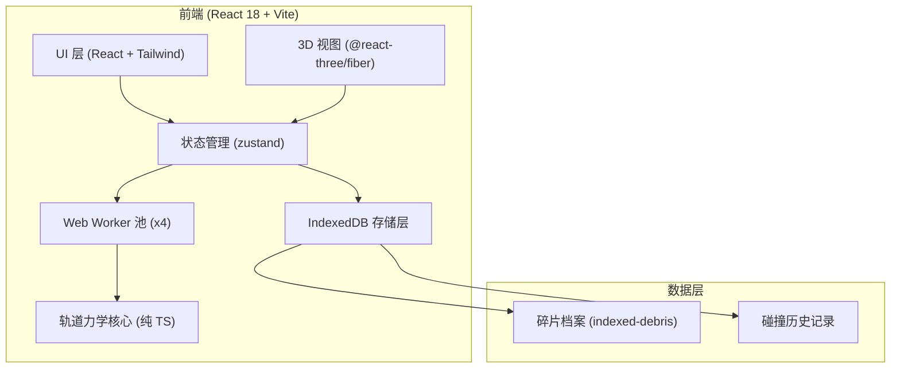
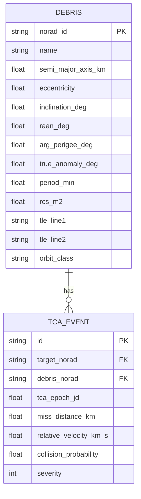

# OrbitLink 技术架构文档

## 1. 架构设计


## 2. 技术说明
- 前端：React 18 + TypeScript 5 + Vite 5 + Tailwind CSS 3
- 3D：three@0.161 + @react-three/fiber@8 + @react-three/drei@9 + @react-three/postprocessing@2
- 状态管理：zustand@4
- 异步计算：Web Worker（vite 内建 `?worker` 导入）
- 本地持久化：IndexedDB（使用 `idb` 轻封装）
- 后端：无（纯前端工程）
- 包管理：pnpm

## 3. 路由定义
| 路由 | 用途 |
|------|------|
| `/` | 态势总览（默认），包含 3D 视图、指标条、事件列表 |
| `/catalog` | 碎片档案检索与详情 |
| `/lab` | 仿真实验室，参数配置 + 计算监控 |

## 4. 核心数据模型

### 4.1 数据模型定义


### 4.2 IndexedDB Schema
- 数据库名：`orbitlink-db`，版本 1
- Store `debris`：主键 `norad_id`，索引 `orbit_class`、`period_min`、`rcs_m2`
- Store `events`：主键 `id`（自增），索引 `tca_epoch_jd`、`collision_probability`、`severity`

## 5. 目录结构
```
src/
  components/        # 可复用 UI 组件
  pages/             # 路由页面
  store/             # zustand store
  workers/           # Web Worker 脚本
  orbital/           # 轨道力学核心（二体、摄动、Pc 计算）
  db/                # IndexedDB 封装
  hooks/             # 自定义 hooks
  utils/             # 工具函数
```
