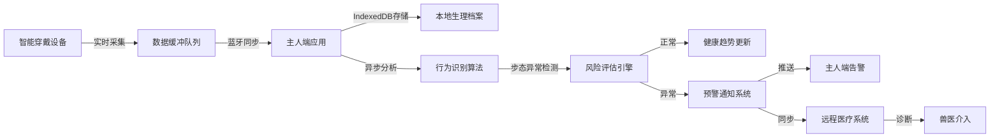
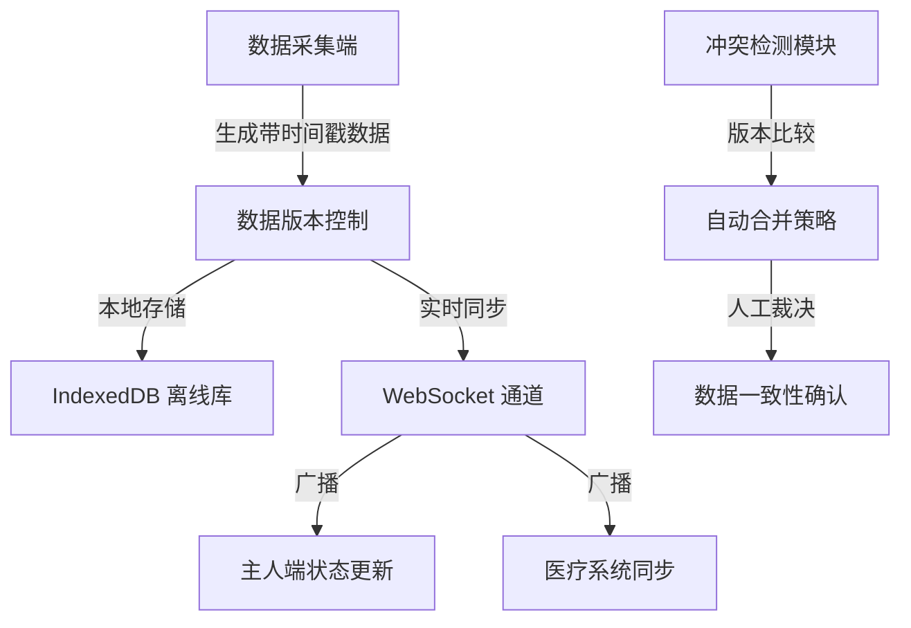

## 1. 产品概述

PetLink 是一个基于 Next.js 的宠物全生命周期健康节律监控平台，通过智能穿戴设备实时采集宠物生理数据，利用异步行为识别算法检测步态异常，实现主人端、智能穿戴与远程医疗系统间的数据实时对齐，为宠物医疗提供精准的离线数据支撑。

- **核心目标**: 实现宠物健康状态的全天候监控、异常行为的智能预警、医疗数据的跨平台共享
- **目标用户**: 宠物主人、兽医机构、宠物穿戴设备厂商
- **市场价值**: 填补宠物健康数字化监控领域的空白，提升宠物医疗诊断效率

## 2. 核心功能

### 2.1 用户角色

| 角色 | 注册方式 | 核心权限 |
|------|----------|----------|
| 宠物主人 | 手机号/邮箱注册 | 查看宠物健康数据、接收异常预警、绑定智能设备、预约远程医疗 |
| 兽医 | 机构认证注册 | 访问宠物历史健康档案、提供远程诊断、开具健康建议 |
| 系统管理员 | 后台账号 | 设备管理、用户管理、系统配置 |

### 2.2 功能模块

1. **主人端仪表盘**: 宠物健康概览、实时数据监控、异常告警通知
2. **智能穿戴管理**: 设备绑定、数据同步、固件升级
3. **行为识别分析**: 步态异常检测、活动节律分析、健康趋势预测
4. **生理档案管理**: 长周期数据存储、离线数据访问、医疗记录导出
5. **远程医疗系统**: 在线问诊、视频会诊、处方管理
6. **数据实时对齐**: 多端数据同步、冲突解决、状态一致性保障

### 2.3 页面详情

| 页面名称 | 模块名称 | 功能描述 |
|----------|----------|----------|
| 登录页 | 身份认证模块 | 用户登录、角色选择、忘记密码 |
| 主人仪表盘 | 健康概览模块 | 宠物健康评分、实时心率/步数、今日活动曲线 |
| 宠物详情页 | 数据监控模块 | 24小时生理数据图表、历史趋势分析、异常记录 |
| 行为分析页 | 步态检测模块 | 步态热力图、异常风险评估、AI分析报告 |
| 健康档案页 | 档案管理模块 | 生理数据时间线、医疗记录、离线下载 |
| 远程医疗页 | 医疗对接模块 | 医生列表、在线问诊、视频会诊、处方查看 |
| 设备管理页 | 穿戴设备模块 | 设备绑定、电量监控、数据同步状态 |
| 兽医工作台 | 医生端模块 | 患者列表、档案访问、诊断记录 |

## 3. 核心流程

### 3.1 健康数据采集与分析流程

智能穿戴设备实时采集宠物的步态、心率、体温等生理数据，通过蓝牙同步到主人端应用，系统利用异步行为识别算法进行实时分析，检测到异常行为时立即触发预警。

### 3.2 跨系统数据对齐流程

多端数据通过版本控制和时间戳对齐机制，确保主人端、穿戴设备、医疗系统之间的数据一致性，支持离线场景下的本地操作与后续同步。

## 4. 用户界面设计

### 4.1 设计风格

- **主色调**: 深青色 (#0D9488) - 代表健康、信任、科技感
- **辅助色**: 暖橙色 (#F97316) - 用于告警、强调交互元素
- **中性色**: 深灰 (#1E293B)、中灰 (#64748B)、浅灰背景 (#F8FAFC)
- **按钮风格**: 圆角 (12px)、微阴影、hover 状态有轻微上浮动效
- **字体**: 标题使用 Poppins，正文使用 Inter，确保现代感与可读性
- **布局风格**: 卡片式布局、分层阴影、充足留白营造呼吸感
- **图标风格**: 线性图标配合彩色点缀，医疗相关图标使用蓝绿色调

### 4.2 页面设计概览

| 页面名称 | 模块名称 | UI 元素 |
|----------|----------|---------|
| 主人仪表盘 | 健康概览卡片 | 环形健康评分、实时数据卡片、渐变色活动曲线、微动效数字跳动 |
| 行为分析页 | 步态检测面板 | 3D 步态可视化热力图、风险等级色阶指示、AI 分析时间线 |
| 健康档案页 | 时间线浏览 | 垂直时间轴、可折叠数据卡片、离线状态徽章、导出按钮 |
| 远程医疗页 | 问诊界面 | 医生头像卡片、视频通话浮窗、处方预览面板、聊天消息流 |

### 4.3 响应式设计

- **桌面优先**: 1440px 断点起步，支持 1920px 大屏展示
- **平板适配**: 768px 断点，侧边栏转为底部导航，卡片布局自适应
- **手机优化**: 375px 断点，单列布局，触摸目标最小 48px，关键操作单手可达
- **离线体验**: IndexedDB 支持下的完整离线浏览，离线状态有明确视觉提示

### 4.4 数据可视化设计

- **实时监控图表**: 使用 SVG 路径动画实现数据流的平滑过渡
- **步态热力图**: Canvas 渲染，支持缩放和时间轴拖拽
- **健康趋势图**: 多层折线图，异常区间使用红色渐变背景高亮
- **数据卡片**: 数字滚动动画，数值变化时的色彩反馈
