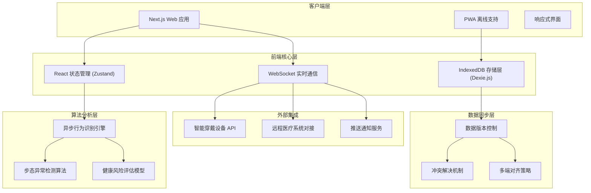
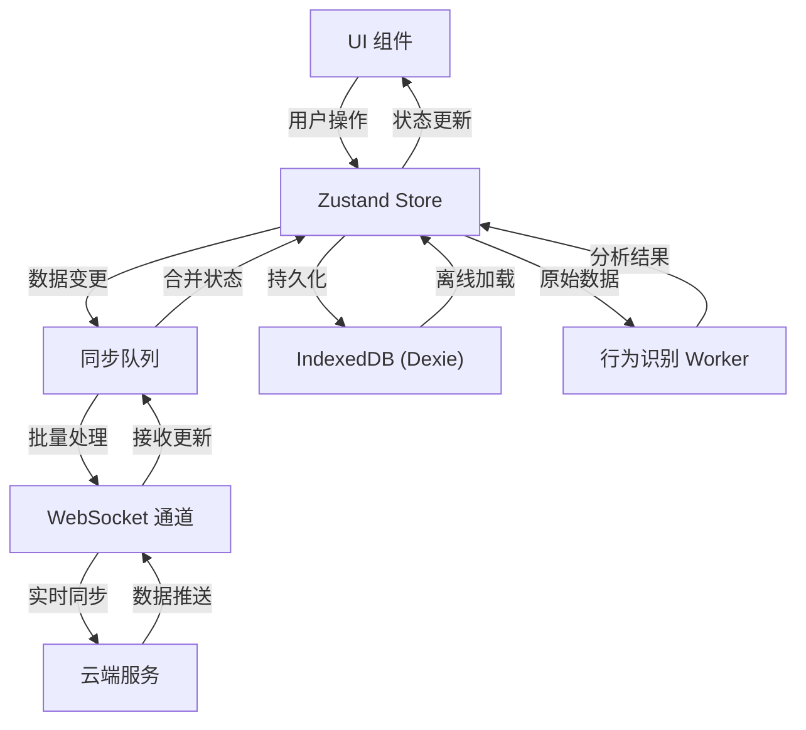
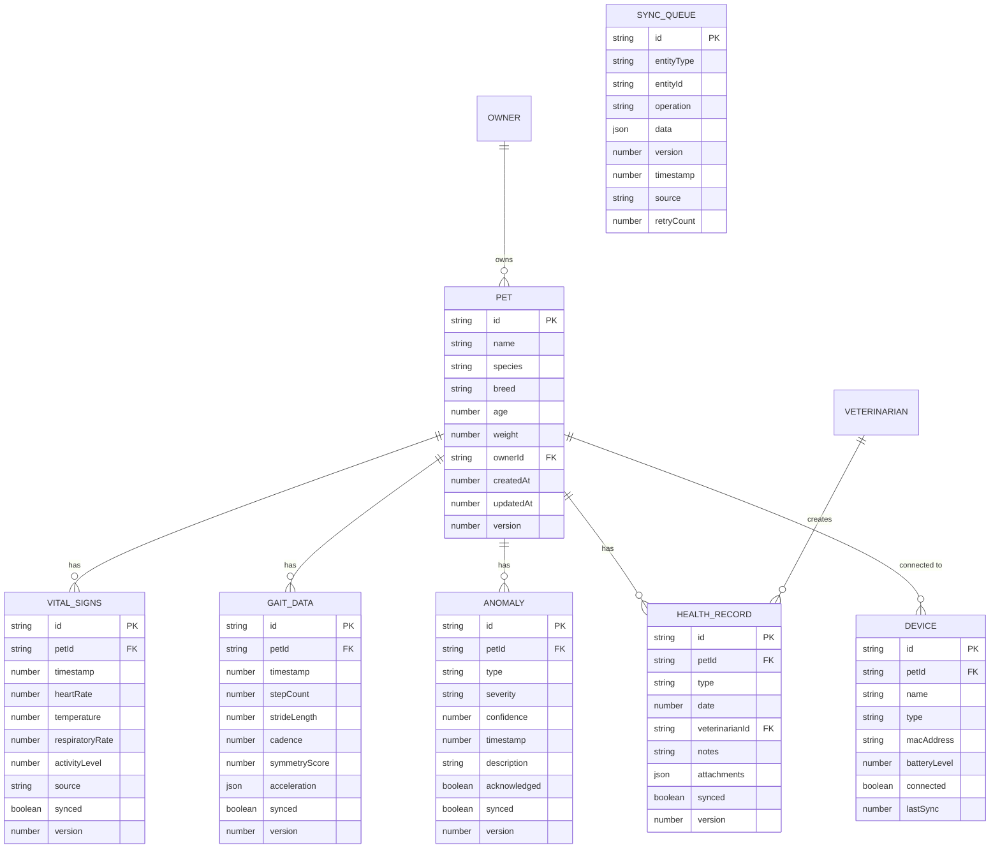

## 1. 架构设计



## 2. 技术选型说明

### 2.1 核心技术栈
- **前端框架**: Next.js 14 (App Router) - 服务端渲染、路由管理、API 路由
- **UI 框架**: React 18 + TypeScript + TailwindCSS 3
- **状态管理**: Zustand - 轻量级状态管理，支持持久化
- **离线存储**: Dexie.js (IndexedDB 封装) - 长周期生理档案存储
- **实时通信**: Socket.io Client - WebSocket 数据同步
- **图表可视化**: Recharts - 健康数据图表展示
- **动画库**: Framer Motion - 流畅的交互动画

### 2.2 初始化方式
- 使用 `create-next-app@latest` 初始化 Next.js 项目
- 配置 TypeScript、TailwindCSS、ESLint
- 集成 PWA 支持实现离线访问

### 2.3 数据存储方案
- **IndexedDB (Dexie.js)**: 存储宠物生理数据、健康档案、离线操作记录
- **LocalStorage**: 用户偏好设置、UI 状态
- **内存缓存**: 实时数据流、临时计算结果

## 3. 路由定义

| 路由路径 | 页面用途 | 权限控制 |
|----------|----------|----------|
| `/login` | 用户登录页 | 公开 |
| `/dashboard` | 主人端仪表盘 | 宠物主人 |
| `/pet/[id]` | 宠物详情页 | 宠物主人 |
| `/pet/[id]/analysis` | 行为分析页 | 宠物主人 |
| `/pet/[id]/archive` | 健康档案页 | 宠物主人/兽医 |
| `/telemedicine` | 远程医疗页 | 宠物主人 |
| `/devices` | 设备管理页 | 宠物主人 |
| `/vet/workspace` | 兽医工作台 | 兽医 |
| `/admin` | 系统管理 | 管理员 |

## 4. API 接口定义

### 4.1 TypeScript 类型定义

```typescript
// 宠物基础信息
interface Pet {
  id: string;
  name: string;
  species: 'dog' | 'cat' | 'other';
  breed: string;
  age: number;
  weight: number;
  avatar: string;
  ownerId: string;
}

// 生理数据点
interface VitalSigns {
  id: string;
  petId: string;
  timestamp: number;
  heartRate: number;
  temperature: number;
  respiratoryRate: number;
  activityLevel: number;
  source: 'wearable' | 'manual';
}

// 步态数据
interface GaitData {
  id: string;
  petId: string;
  timestamp: number;
  stepCount: number;
  strideLength: number;
  cadence: number;
  symmetryScore: number;
  acceleration: { x: number; y: number; z: number }[];
}

// 异常检测结果
interface AnomalyDetection {
  id: string;
  petId: string;
  type: 'gait' | 'vital' | 'behavior';
  severity: 'low' | 'medium' | 'high';
  confidence: number;
  timestamp: number;
  description: string;
  acknowledged: boolean;
}

// 健康档案
interface HealthRecord {
  id: string;
  petId: string;
  type: 'checkup' | 'vaccination' | 'treatment' | 'surgery';
  date: number;
  veterinarianId?: string;
  notes: string;
  attachments: string[];
  synced: boolean;
  version: number;
}

// 同步数据结构
interface SyncData<T> {
  entityType: string;
  entityId: string;
  operation: 'create' | 'update' | 'delete';
  data: T;
  version: number;
  timestamp: number;
  source: string;
}
```

### 4.2 API 端点

| 方法 | 路径 | 描述 | 请求体 | 响应 |
|------|------|------|--------|------|
| GET | `/api/pets` | 获取用户宠物列表 | - | `Pet[]` |
| POST | `/api/pets` | 创建宠物档案 | `Pet` | `Pet` |
| GET | `/api/pets/[id]/vitals` | 获取生理数据 | `{start, end}` | `VitalSigns[]` |
| POST | `/api/pets/[id]/vitals` | 上传生理数据 | `VitalSigns[]` | `{synced: number}` |
| GET | `/api/pets/[id]/gait` | 获取步态数据 | `{start, end}` | `GaitData[]` |
| POST | `/api/analysis/gait` | 步态异常检测 | `GaitData` | `AnomalyDetection` |
| GET | `/api/pets/[id]/anomalies` | 获取异常记录 | - | `AnomalyDetection[]` |
| GET | `/api/pets/[id]/records` | 获取健康档案 | - | `HealthRecord[]` |
| POST | `/api/sync` | 数据同步 | `SyncData[]` | `Conflict[]` |
| GET | `/api/doctors` | 获取医生列表 | - | `Doctor[]` |

## 5. 前端数据流架构



## 6. 数据模型

### 6.1 IndexedDB 数据模型 (Dexie.js)



### 6.2 数据库初始化代码 (Dexie.js)

```typescript
import Dexie, { Table } from 'dexie';

export class PetLinkDB extends Dexie {
  pets!: Table<Pet>;
  vitalSigns!: Table<VitalSigns>;
  gaitData!: Table<GaitData>;
  anomalies!: Table<AnomalyDetection>;
  healthRecords!: Table<HealthRecord>;
  devices!: Table<Device>;
  syncQueue!: Table<SyncQueueItem>;

  constructor() {
    super('PetLinkDB');
    
    this.version(1).stores({
      pets: 'id, ownerId, name, updatedAt, version',
      vitalSigns: 'id, petId, timestamp, synced, version',
      gaitData: 'id, petId, timestamp, synced, version',
      anomalies: 'id, petId, timestamp, acknowledged, synced, version',
      healthRecords: 'id, petId, date, synced, version',
      devices: 'id, petId, macAddress, connected',
      syncQueue: '++id, entityType, entityId, timestamp'
    });
  }
}

export const db = new PetLinkDB();
```

## 7. 核心算法模块

### 7.1 异步行为识别算法架构

```typescript
// Web Worker 封装的步态分析引擎
class GaitAnalysisWorker {
  private worker: Worker;
  
  async analyze(data: GaitData[]): Promise<AnomalyDetection[]> {
    return new Promise((resolve) => {
      this.worker.postMessage({ type: 'ANALYZE_GAIT', data });
      this.worker.onmessage = (e) => resolve(e.data);
    });
  }
}

// 步态异常检测算法核心
class GaitAnomalyDetector {
  // 基于 DTW (动态时间规整) 的步态相似度计算
  computeDTWDistance(series1: number[], series2: number[]): number {
    // DTW 算法实现
  }
  
  // 对称性分析 - 左右步态平衡度
  computeSymmetryScore(accData: {x: number, y: number, z: number}[]): number {
    // 对称性评分计算
  }
  
  // 异常风险评估
  assessRisk(symmetryScore: number, cadence: number, strideVariance: number): {
    severity: 'low' | 'medium' | 'high';
    confidence: number;
  } {
    // 综合风险评估
  }
}
```

### 7.2 数据同步与冲突解决策略

```typescript
class DataSyncManager {
  // 基于向量时钟的版本控制
  private vectorClock: Map<string, number>;
  
  // 三路合并算法
  mergeThreeWay(
    local: SyncData,
    remote: SyncData,
    base: SyncData
  ): { merged: SyncData; conflicts: Conflict[] } {
    // 实现三路合并逻辑
  }
  
  // 自动冲突解决策略
  resolveConflict(conflict: Conflict): SyncData {
    // 基于时间戳、数据源优先级的自动解决
  }
}
```
