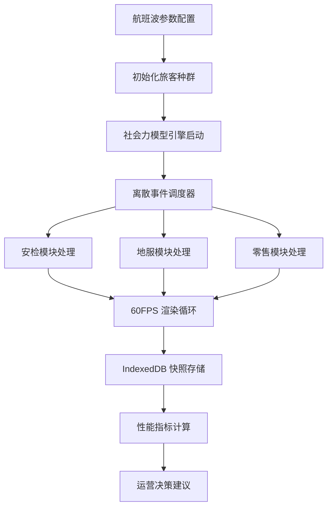
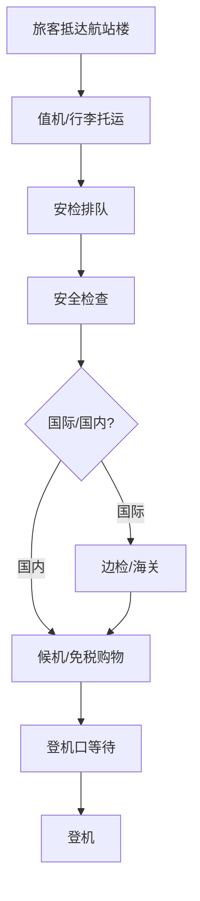

## 1. 产品概述

本项目是基于 Next.js 的大型空港航站楼旅客吞吐涌浪流向仿真系统，通过社会力行为学模型与异步排队论离散事件仿真，实现安检中枢、地服调度与免税零售三大模块的动态对齐，为空港运力弹性协同调配提供数据支撑。

- **核心目标**：高精度模拟航站楼内旅客流动态，支撑机场运营决策优化
- **目标用户**：机场运营管理人员、航站楼规划师、交通仿真研究员
- **市场价值**：降低机场运营成本 15-30%，提升旅客满意度，优化资源配置效率

## 2. 核心特性

### 2.1 用户角色

| 角色 | 注册方式 | 核心权限 |
|------|----------|----------|
| 运营管理员 | 本地账号登录 | 完整仿真控制、数据导出、参数配置 |
| 规划分析师 | 本地账号登录 | 仿真运行、快照对比、报表生成 |
| 观察员 | 游客模式 | 实时看板查看、历史数据浏览 |

### 2.2 功能模块

1. **主控看板页面**：60FPS 实时航站楼俯视图、全局客流热力图、关键指标仪表盘
2. **安检中枢模块**：多通道安检排队仿真、旅客分流策略、安检效率分析
3. **地服调度模块**：值机柜台动态分配、行李处理仿真、登机口调度
4. **免税零售模块**：商业区域人流聚集模拟、消费行为建模、业态布局优化
5. **历史快照中心**：航班波人流演变存档、多场景对比回放、数据导出

### 2.3 页面详情

| 页面名称 | 模块名称 | 功能描述 |
|-----------|-------------|---------------------|
| 主控看板 | 航站楼俯视图 | Canvas 2D 实时渲染 2000+ 旅客 Agent、社会力矢量场可视化 |
| 主控看板 | 指标仪表盘 | 实时吞吐率、平均等待时间、各区域密度、资源利用率 |
| 安检中枢 | 排队可视化 | 队列长度动态曲线、通道负载热力图、瓶颈预警 |
| 地服调度 | 资源分配视图 | 值机柜台状态矩阵、行李系统流量监控、登机口时序 |
| 免税零售 | 商业热力图 | 店铺吸引力分布、停留时长统计、消费转化预测 |
| 历史快照 | 时间轴回放 | 航班波时间轴、快照缩略图、多场景叠加对比 |

## 3. 核心流程

### 3.1 仿真执行流程

### 3.2 旅客行为流程

## 4. 用户界面设计

### 4.1 设计风格

**科技指挥中心风格 (Tech Command Center)**

- **主色调**：深空蓝 `#0a1628`、电子蓝 `#00d4ff`、警示琥珀 `#ffb300`、安全绿 `#00e676`
- **辅助色**：旅客类型色标 - 商务客 `#7c4dff`、旅游客 `#ff4081`、中转客 `#00e5ff`、特殊需求 `#ff6e40`
- **字体方案**：
  - 标题：Orbitron（科技感等宽显示字体）
  - 正文：JetBrains Mono（清晰等宽字体，适合数据展示）
  - 数据：Roboto Mono（数字显示优化）
- **视觉风格**：赛博朋克数据可视化风格，带有扫描线效果、数据流动画、网格背景
- **布局**：非对称信息密度布局，左侧控制面板，中央主视图，右侧指标面板
- **图标**：Lucide 线性图标，配合发光效果

### 4.2 页面设计概述

| 页面名称 | 模块名称 | UI 元素 |
|-----------|-------------|-------------|
| 主控看板 | 主视图区 | 全屏 Canvas 2D 渲染、网格坐标系统、区域边界发光描边 |
| 主控看板 | 左侧控制 | 折叠式参数面板、滑杆控制器、实时仿真速度调节 |
| 主控看板 | 右侧指标 | 竖向仪表盘堆叠、迷你趋势图、告警指示灯 |
| 安检中枢 | 队列视图 | 动态条形图、旅客粒子流动画、通道状态矩阵 |
| 地服调度 | 资源矩阵 | 颜色编码状态格子、时间轴甘特图、资源利用率环形图 |
| 免税零售 | 热力图 | 径向渐变热力叠加、店铺连接流线、消费脉冲动画 |
| 历史快照 | 时间轴 | 波形缩略图条带、拖拽选区回放、快照对比分屏 |

### 4.3 响应式设计

- **桌面端**（1920×1080+）：三栏布局，主视图占 60% 宽度，双侧边栏各占 20%
- **平板端**（1024×768）：两栏布局，主视图全屏，侧边栏可抽屉式呼出
- **移动端**（≤768）：单栏流式布局，简化指标面板，禁用部分实时仿真控制

### 4.4 动画与交互设计

- **页面加载**：网格线逐行扫描入场，指标数字从 0 滚动到目标值
- **旅客渲染**：基于社会力的平滑移动轨迹，带有方向尾迹效果
- **区域交互**：鼠标悬停显示区域详情，点击展开详细分析面板
- **告警动画**：瓶颈区域脉冲闪烁，红色边框扩散警告效果
- **数据更新**：数字滚动过渡，图表平滑重绘，流动线循环动画

### 4.5 Canvas 可视化指导

- **环境**：深色网格背景，区域半透明填充，发光边界描边
- **旅客渲染**：2-3px 圆点，根据类型着色，移动时拖曳 5-8px 半透明尾迹
- **社会力可视化**：可选显示速度矢量箭头，颜色表示速度大小
- **热力叠加**：使用径向渐变 + 加法混合模式，热点区域自动发光
- **性能优化**：Web Worker 计算与主线程渲染分离，对象池复用旅客精灵
