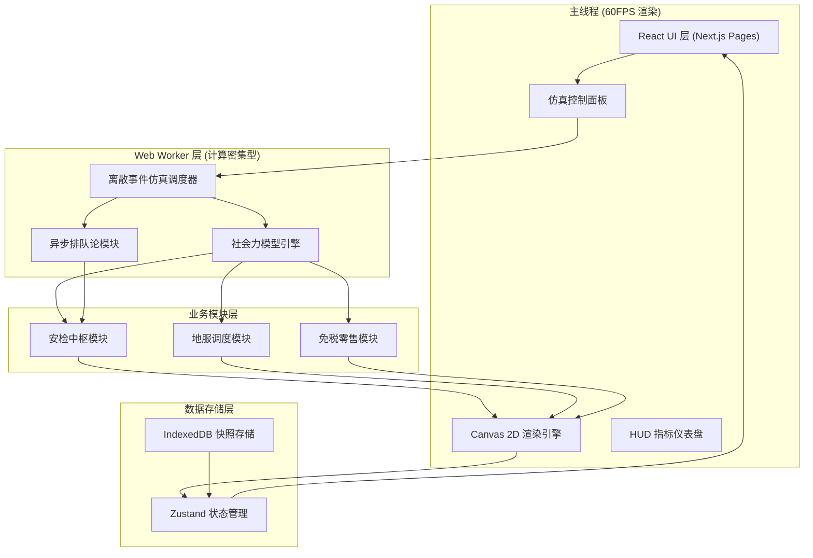
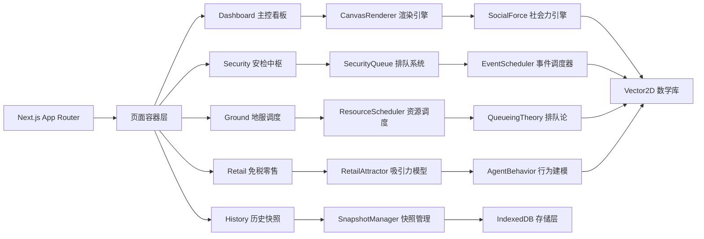
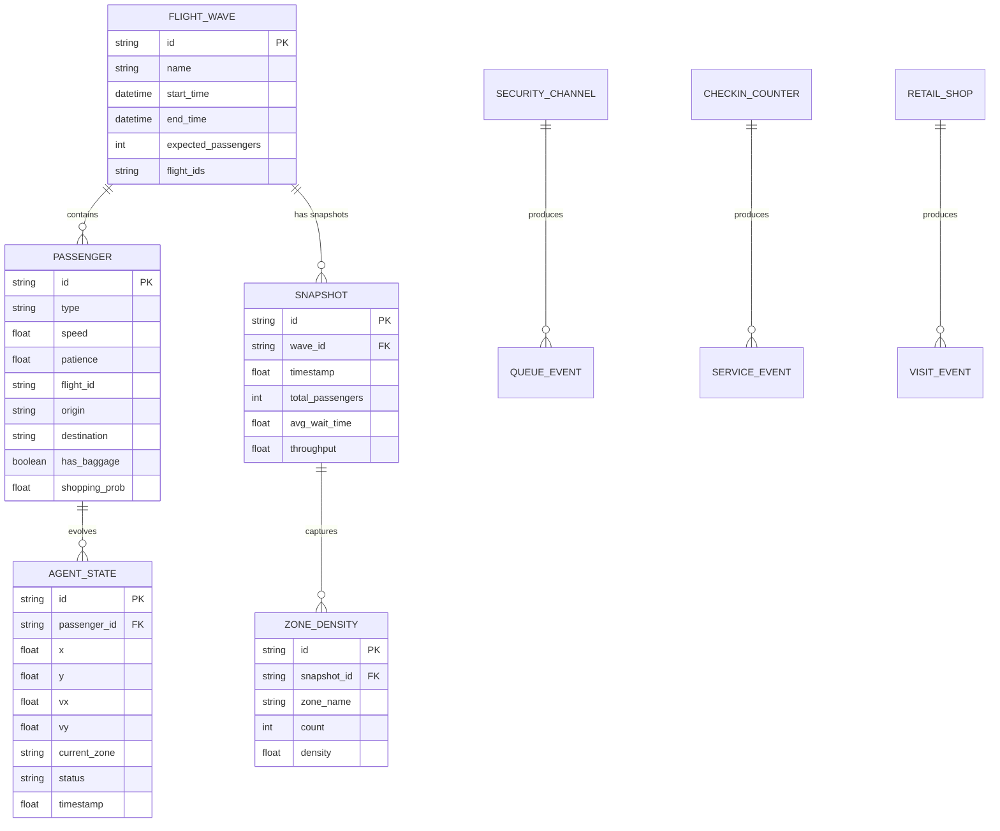

## 1. 架构设计

### 1.1 整体系统架构



### 1.2 模块分层架构



## 2. 技术描述

### 2.1 核心技术栈

| 层级 | 技术选型 | 版本 | 用途说明 |
|------|----------|------|----------|
| 前端框架 | Next.js | 14.x | App Router, SSR/SSG, 性能优化 |
| 语言 | TypeScript | 5.x | 类型安全，泛型编程 |
| 样式 | Tailwind CSS | 3.4 | 原子化 CSS，设计令牌系统 |
| 状态管理 | Zustand | 4.x | 轻量状态管理，中间件支持 |
| 渲染 | Canvas 2D API | - | 原生高性能 2D 渲染 |
| 并发 | Web Workers API | - | 多线程仿真计算 |
| 存储 | IndexedDB (idb) | 7.x | 本地大规模时序数据存储 |
| 图标 | lucide-react | 0.344 | 线性图标库 |
| 数学 | 自研 Vector2D | - | 2D 向量运算、几何计算 |

### 2.2 核心算法实现

#### 2.2.1 社会力模型 (Social Force Model)

**核心公式**：
```
f_i(t) = f_i^0(v_i, v_i^0, e_i^0) + Σ_j f_ij(r_ij) + Σ_W f_iW(r_iW)
```

- `f_i^0`：自驱动力（期望速度与当前速度差）
- `f_ij`：人际排斥力（指数衰减函数）
- `f_iW`：边界排斥力（墙体与障碍物）

**扩展项**：
- 吸引力项：零售店铺、登机口等目标点引力
- 群组力：家庭/团队旅客内聚行为
- 从众行为：视线范围内人流方向加权

#### 2.2.2 异步排队论 (Asynchronous Queueing Theory)

**M/M/c 排队模型**：
- 到达过程：泊松分布 (Poisson)
- 服务时间：指数分布
- 服务台数：c 个并行通道

**关键指标计算**：
```
ρ = λ/(cμ)          # 服务强度
Lq = (P0 * (λ/μ)^c * ρ) / (c! * (1-ρ)^2)  # 平均队列长度
Wq = Lq / λ         # 平均等待时间
```

#### 2.2.3 离散事件仿真 (Discrete Event Simulation)

**事件类型**：
- `ARRIVAL`：旅客抵达航站楼
- `CHECKIN_START`：开始值机
- `CHECKIN_END`：值机完成
- `SECURITY_ENTER`：进入安检队列
- `SECURITY_EXIT`：安检完成
- `SHOP_ENTER`：进入商店
- `SHOP_EXIT`：离开商店
- `BOARDING_CALL`：登机广播
- `BOARDING_COMPLETE`：登机完成

**事件调度器**：优先队列按时间戳排序，异步处理事件回调。

## 3. 路由定义

| 路由 | 页面名称 | 核心功能 |
|-------|---------|----------|
| `/` | 主控看板 | 航站楼全局实时仿真视图、指标仪表盘 |
| `/security` | 安检中枢 | 多通道排队可视化、瓶颈分析、效率报表 |
| `/ground` | 地服调度 | 值机/行李/登机口资源分配视图 |
| `/retail` | 免税零售 | 商业热力图、消费行为分析、业态优化 |
| `/history` | 历史快照 | 航班波回放、多场景对比、数据导出 |

## 4. 数据模型

### 4.1 核心实体关系图



### 4.2 核心 TypeScript 类型定义

```typescript
// 旅客 Agent 类型
type PassengerType = 'business' | 'tourist' | 'transfer' | 'special';

interface PassengerAgent {
  id: string;
  type: PassengerType;
  position: Vector2D;
  velocity: Vector2D;
  desiredVelocity: Vector2D;
  target: Vector2D | null;
  currentZone: string;
  status: AgentStatus;
  patience: number;
  hasBaggage: boolean;
  shoppingInterest: number;
  flightId: string;
  boardingTime: number;
}

type AgentStatus = 
  | 'arriving'
  | 'in_checkin_queue'
  | 'at_checkin'
  | 'in_security_queue'
  | 'at_security'
  | 'walking'
  | 'shopping'
  | 'waiting_gate'
  | 'boarding'
  | 'exited';

// 社会力模型参数
interface SocialForceParams {
  selfDrivingCoeff: number;      // 自驱动力系数
  socialRepulsionCoeff: number;  // 人际排斥系数
  socialRepulsionRange: number;  // 排斥作用范围
  boundaryRepulsionCoeff: number; // 边界排斥系数
  attractionCoeff: number;       // 目标吸引力系数
  maxSpeed: number;              // 最大速度
  relaxationTime: number;        // 松弛时间
}

// 离散事件
interface SimulationEvent {
  id: string;
  type: EventType;
  timestamp: number;
  passengerId: string;
  data?: Record<string, unknown>;
  priority: number;
}

// 排队系统
interface Queue {
  id: string;
  name: string;
  servers: QueueServer[];
  waitingLine: PassengerAgent[];
  maxLength: number;
  serviceRate: number;       // μ 服务率
  arrivalRate: number;       // λ 到达率
}

// IndexedDB 快照
interface FlowSnapshot {
  id: string;
  waveId: string;
  timestamp: number;
  simulationTime: number;
  passengerCount: number;
  zoneDensities: Record<string, number>;
  queueLengths: Record<string, number>;
  averageWaitTimes: Record<string, number>;
  throughput: number;
  bottlenecks: string[];
}
```

## 5. 核心模块设计

### 5.1 社会力模型引擎

**文件位置**：`src/lib/simulation/social-force-engine.ts`

**核心方法**：
- `computeForces(agent: PassengerAgent, neighbors: PassengerAgent[], obstacles: Obstacle[]): Vector2D`
- `updateAgent(agent: PassengerAgent, dt: number, forces: Vector2D): void`
- `findNeighbors(agent: PassengerAgent, allAgents: PassengerAgent[], radius: number): PassengerAgent[]`

**空间分区优化**：使用网格哈希 (Spatial Grid Hash) 将 2D 空间划分为网格，每个 Agent 只需检查相邻 9 个网格内的其他 Agent，复杂度从 O(n²) 降至 O(n)。

### 5.2 离散事件调度器

**文件位置**：`src/lib/simulation/event-scheduler.ts`

**数据结构**：最小堆优先队列
- 按事件时间戳排序
- 支持事件取消与重新调度
- 异步事件处理回调链

**核心方法**：
- `scheduleEvent(event: SimulationEvent): void`
- `processNextEvents(currentTime: number, maxCount: number): SimulationEvent[]`
- `cancelEvent(eventId: string): boolean`

### 5.3 Canvas 2D 渲染引擎

**文件位置**：`src/components/canvas/TerminalCanvas.tsx`

**渲染管线**：
1. 背景层：网格线、区域填充
2. 设施层：值机柜台、安检通道、商店、登机口
3. 热力层：密度场径向渐变叠加
4. Agent 层：旅客圆点 + 方向尾迹
5. HUD 层：坐标标注、区域标签、告警提示

**性能优化**：
- 离屏 Canvas (OffscreenCanvas) 预渲染静态元素
- 对象池复用旅客精灵
- 视口裁剪只渲染可见区域
- 每帧 deltaTime 插值平滑动画

### 5.4 IndexedDB 存储管理器

**文件位置**：`src/lib/storage/snapshot-storage.ts`

**数据库 Schema**：
- Object Store: `flight_waves` (key: `id`)
- Object Store: `snapshots` (key: `id`, index: `waveId`, `timestamp`)
- Object Store: `agent_trajectories` (key: `[snapshotId, passengerId]`)

**核心方法**：
- `saveSnapshot(snapshot: FlowSnapshot): Promise<void>`
- `getSnapshotsByWave(waveId: string): Promise<FlowSnapshot[]>`
- `deleteWave(waveId: string): Promise<void>`
- `exportWaveData(waveId: string): Promise<Blob>`

## 6. 性能优化策略

### 6.1 60FPS 渲染保障

1. **计算/渲染分离**：所有仿真计算在 Web Worker 中执行，主线程仅处理渲染
2. **固定时间步长**：物理更新使用固定 dt (16ms)，渲染使用插值
3. **帧率自适应**：Agent 数量动态调整，低于 45FPS 时自动降低细节
4. **内存管理**：Agent 对象池复用，避免 GC 卡顿

### 6.2 Web Worker 通信协议

```typescript
// Worker -> Main
interface WorkerUpdateMessage {
  type: 'agent_states';
  agents: CompactAgentState[];
  metrics: SimulationMetrics;
  timestamp: number;
}

// Main -> Worker
interface WorkerControlMessage {
  type: 'start' | 'pause' | 'reset' | 'speed_change';
  data?: Record<string, unknown>;
}

// 紧凑传输格式 (TypedArray)
type CompactAgentState = Float32Array; 
// [id_idx, x, y, vx, vy, type_code, status_code]
```

### 6.3 IndexedDB 写入优化

- 批量写入：每 5 秒聚合 100+ 条记录一次写入
- 增量压缩：快照间 delta 编码存储
- 内存缓存：最近 1000 条快照内存缓存
- 索引优化：复合索引 `[waveId, timestamp]`

## 7. 航站楼布局数据结构

```typescript
interface TerminalLayout {
  width: number;
  height: number;
  zones: Zone[];
  obstacles: Obstacle[];
  paths: Path[];
  facilities: Facility[];
}

interface Zone {
  id: string;
  name: string;
  type: 'checkin' | 'security' | 'retail' | 'gate' | 'lounge' | 'corridor';
  polygon: Vector2D[];
  color: string;
}

interface Facility {
  id: string;
  zoneId: string;
  type: 'checkin_counter' | 'security_channel' | 'shop' | 'gate';
  position: Vector2D;
  capacity: number;
  serviceRate: number;
}
```

## 8. 项目目录结构

```
src/
├── app/                    # Next.js App Router
│   ├── layout.tsx
│   ├── page.tsx           # Dashboard
│   ├── security/page.tsx
│   ├── ground/page.tsx
│   ├── retail/page.tsx
│   └── history/page.tsx
├── components/
│   ├── canvas/            # Canvas 渲染组件
│   ├── dashboard/         # 看板组件
│   ├── security/          # 安检模块组件
│   ├── ground/            # 地服模块组件
│   ├── retail/            # 零售模块组件
│   ├── history/           # 历史快照组件
│   └── ui/                # 通用 UI 组件
├── lib/
│   ├── simulation/        # 仿真核心引擎
│   │   ├── social-force-engine.ts
│   │   ├── event-scheduler.ts
│   │   ├── queueing-theory.ts
│   │   ├── agent-behavior.ts
│   │   └── terminal-layout.ts
│   ├── storage/           # IndexedDB 存储
│   ├── math/              # Vector2D 数学库
│   └── state/             # Zustand stores
├── workers/               # Web Workers
│   └── simulation.worker.ts
├── types/                 # TypeScript 类型定义
└── styles/                # 全局样式与主题
```
