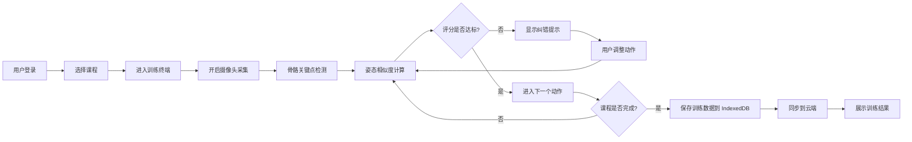

# PoseNexus 产品需求文档 (PRD)

## 1. 产品概述
PoseNexus 是一款基于 Vue 3 的家庭智能健身训练系统，通过计算机视觉技术实现骨骼关键点识别与姿态纠错，为用户提供专业级的居家健身体验。
- 核心价值：解决家庭健身动作不标准导致的训练效果差、运动损伤风险高的问题
- 目标用户：居家健身爱好者、瑜伽练习者、康复训练人群

## 2. 核心功能

### 2.1 用户角色
| 角色 | 注册方式 | 核心权限 |
|------|----------|----------|
| 普通用户 | 手机号/邮箱注册 | 课程浏览、训练记录、实时纠错、数据同步 |
| 课程管理员 | 后台邀请 | 课程管理、动作库维护、数据分析 |

### 2.2 功能模块
1. **首页**：课程推荐、训练统计、快速开始、今日目标
2. **课程中心**：课程列表、分类筛选、课程详情、动作预览
3. **训练终端**：实时姿态捕捉、骨骼可视化、纠错反馈、训练计时
4. **数据中心**：训练记录、进度快照、成就系统、数据同步

### 2.3 页面详情
| 页面名称 | 模块名称 | 功能描述 |
|-----------|-------------|---------------------|
| 首页 | 数据看板 | 展示本周训练时长、完成动作数、正确率统计 |
| 首页 | 快捷入口 | 快速开始训练、继续上次课程、自定义训练 |
| 课程中心 | 课程列表 | 按类型/难度/时长筛选，卡片式展示 |
| 课程中心 | 课程详情 | 课程介绍、动作列表、注意事项、开始训练 |
| 训练终端 | 视频采集 | 摄像头实时画面，骨骼关键点叠加显示 |
| 训练终端 | 纠错面板 | 实时姿态评分、错误提示、纠正建议 |
| 训练终端 | 动作指引 | 标准动作示范、当前动作名称、倒计时 |
| 数据中心 | 历史记录 | 按日期查看训练详情、动作完成情况 |
| 数据中心 | 同步管理 | IndexedDB 本地快照、云端同步状态 |

## 3. 核心流程

## 4. 用户界面设计

### 4.1 设计风格
- **主色调**：科技蓝 (#165DFF) - 传达专业、可靠的品牌形象
- **辅助色**：活力橙 (#FF7D00) - 用于强调交互元素
- **成功色**：健康绿 (#00B42A) - 正确动作反馈
- **警示色**：警示红 (#F53F3F) - 错误动作提示
- **按钮风格**：圆角 8px，微阴影，悬浮放大效果
- **字体**：使用 Inter 作为主字体，搭配 JetBrains Mono 展示数据
- **布局风格**：卡片式布局，玻璃拟态效果，深色主题优先
- **图标风格**：线性图标，统一 24px 尺寸

### 4.2 页面设计概述
| 页面名称 | 模块名称 | UI 元素 |
|-----------|-------------|-------------|
| 首页 | 数据看板 | 渐变背景统计卡片、数据动效、趋势图表 |
| 课程中心 | 课程列表 | 悬停放大效果、进度条、难度标签 |
| 训练终端 | 视频区域 | 全屏视频流、骨骼线覆盖、实时 HUD 显示 |
| 训练终端 | 纠错面板 | 侧边滑入、评分圆环动画、文字高亮提示 |
| 数据中心 | 历史记录 | 时间轴布局、日历选择器、详情展开动效 |

### 4.3 响应式
- 桌面端优先设计，适配 1920px、1440px、1024px
- 平板端优化双列布局，训练终端全屏模式
- 移动端单列布局，简化交互元素
- 训练终端支持全屏显示，触控操作优化

### 4.4 视觉特效
- **背景**：深色渐变 + 网格纹理 + 微妙动态光效
- **骨骼可视化**：发光线条，正确动作绿色，错误红色
- **纠错反馈**：脉冲动画 + 粒子效果 + 语音提示
- **页面切换**：淡入淡出 + 滑动过渡
