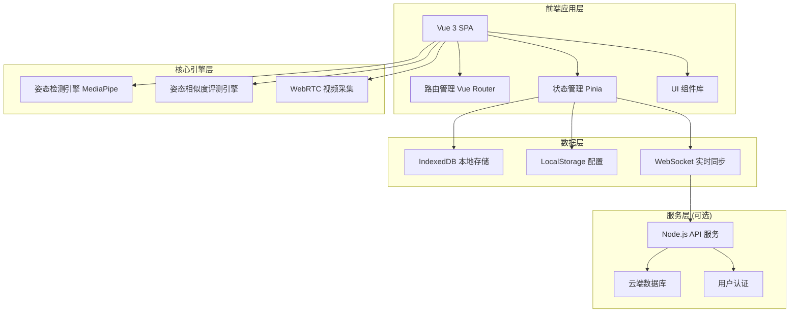

# PoseNexus 技术架构文档

## 1. 架构设计



## 2. 技术栈说明

### 2.1 前端技术
- **框架**: Vue 3.4+ (Composition API) + TypeScript 5.0+
- **构建工具**: Vite 5.0+
- **路由**: Vue Router 4.x
- **状态管理**: Pinia 2.x
- **UI 框架**: Tailwind CSS 3.4 + Headless UI
- **图标**: Phosphor Icons
- **图表**: ECharts 5.x
- **动画**: GSAP / Vue Transition

### 2.2 核心引擎
- **姿态检测**: MediaPipe Pose / TensorFlow.js MoveNet
- **视频处理**: WebRTC API + Canvas 2D
- **相似度计算**: DTW (动态时间规整) + 余弦相似度
- **音频反馈**: Web Speech API / Web Audio API

### 2.3 数据存储
- **本地数据库**: IndexedDB (Dexie.js 封装)
- **配置存储**: LocalStorage
- **实时同步**: WebSocket + Service Worker

### 2.4 开发工具
- **代码规范**: ESLint + Prettier
- **类型检查**: TypeScript Strict Mode
- **测试**: Vitest + Vue Test Utils
- **Git Hooks**: Husky + lint-staged

## 3. 目录结构

```
src/
├── assets/              # 静态资源
│   ├── styles/          # 全局样式
│   ├── icons/           # 图标
│   └── images/          # 图片
├── components/          # 通用组件
│   ├── ui/              # 基础 UI 组件
│   ├── pose/            # 姿态相关组件
│   └── layout/          # 布局组件
├── composables/         # 组合式函数
│   ├── usePoseEngine.ts # 姿态检测引擎
│   ├── useSimilarity.ts # 相似度计算
│   ├── useIndexedDB.ts  # IndexedDB 操作
│   └── useWebSocket.ts  # WebSocket 连接
├── stores/              # Pinia 状态管理
│   ├── user.ts          # 用户状态
│   ├── training.ts      # 训练状态
│   └── course.ts        # 课程状态
├── views/               # 页面视图
│   ├── Home.vue         # 首页
│   ├── Courses.vue      # 课程中心
│   ├── Training.vue     # 训练终端
│   └── Profile.vue      # 数据中心
├── router/              # 路由配置
├── types/               # TypeScript 类型定义
├── utils/               # 工具函数
│   ├── poseMath.ts      # 姿态计算
│   ├── db.ts            # 数据库操作
│   └── validator.ts     # 数据验证
└── App.vue              # 根组件
```

## 4. 路由定义

| 路由路径 | 页面名称 | 功能说明 |
|---------|---------|---------|
| `/` | 首页 | 数据看板、快捷入口、课程推荐 |
| `/courses` | 课程列表 | 课程分类、筛选、搜索 |
| `/courses/:id` | 课程详情 | 课程信息、动作预览、开始训练 |
| `/training/:courseId` | 训练终端 | 实时姿态捕捉、纠错反馈 |
| `/profile` | 个人中心 | 训练记录、数据同步、设置 |
| `/login` | 登录页 | 用户登录、注册 |

## 5. 核心数据模型

### 5.1 骨骼关键点数据结构

```typescript
interface Keypoint {
  x: number;           // 归一化 X 坐标 (0-1)
  y: number;           // 归一化 Y 坐标 (0-1)
  z?: number;          // 深度坐标
  visibility: number;  // 可见性置信度 (0-1)
  score?: number;      // 关键点评分
}

interface PoseData {
  timestamp: number;   // 时间戳
  keypoints: Keypoint[];  // 33 个关键点
  score: number;       // 整体姿态置信度
}
```

### 5.2 训练记录数据结构

```typescript
interface TrainingSession {
  id: string;
  userId: string;
  courseId: string;
  startTime: number;
  endTime: number;
  totalDuration: number;
  averageScore: number;
  actions: TrainingAction[];
  synced: boolean;     // 是否已同步到云端
  createdAt: number;
}

interface TrainingAction {
  actionId: string;
  actionName: string;
  startTime: number;
  endTime: number;
  scores: number[];    // 每帧评分
  averageScore: number;
  corrections: Correction[];
}

interface Correction {
  timestamp: number;
  type: 'warning' | 'error';
  message: string;
  keypointIndex: number;
  suggestion: string;
}
```

### 5.3 IndexedDB 存储结构

```
Database: pose_nexus_db
├── ObjectStore: users
├── ObjectStore: courses
├── ObjectStore: training_sessions
│   └── Indexes: userId, createdAt, synced
├── ObjectStore: action_templates
└── ObjectStore: snapshots
    └── Indexes: userId, timestamp
```

## 6. 姿态相似度评测引擎

### 6.1 算法流程
1. **关键点归一化**: 将关键点坐标转换为相对骨骼中心的坐标
2. **特征提取**: 计算关键关节角度、肢体长度比例
3. **相似度计算**: 
   - 静态姿态：余弦相似度 + 欧氏距离
   - 动态动作：DTW (动态时间规整) 匹配
4. **评分映射**: 将相似度值映射到 0-100 分

### 6.2 核心接口

```typescript
interface PoseSimilarityEngine {
  compare(staticPose: PoseData, referencePose: PoseData): number;
  compareSequence(
    userSequence: PoseData[],
    referenceSequence: PoseData[],
    windowSize?: number
  ): Promise<SequenceResult>;
  calculateAngles(pose: PoseData): JointAngles;
  detectErrors(pose: PoseData, reference: PoseData): Correction[];
}
```

## 7. 实时同步机制

### 7.1 IndexedDB 本地快照
- 训练数据每 5 秒自动保存快照
- 支持离线训练，联网后自动同步
- 冲突解决：以最新修改时间为准

### 7.2 WebSocket 实时同步
- 训练终端与课程系统间实时数据传输
- 骨骼关键点数据流式传输 (60fps 采样，10fps 传输)
- 支持多端同步训练进度

## 8. 性能优化策略

1. **姿态检测优化**: WebAssembly 加速，Web Worker 后台计算
2. **渲染优化**: Canvas 分层渲染，requestAnimationFrame 帧率控制
3. **存储优化**: IndexedDB 批量写入，数据压缩存储
4. **网络优化**: 数据差分传输，断线重连机制
