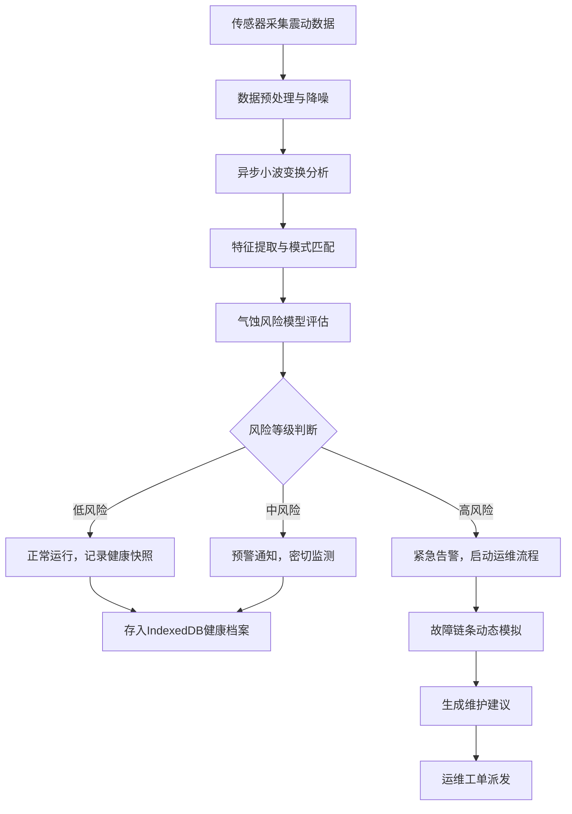

## 1. 产品概述

大型离心泵组智能预测性维护系统，基于高频震动频谱分析与异步小波变换算法，实现工业级设备的气蚀风险预测、故障先兆识别与健康状态管理。

- 面向工业运维工程师、设备管理部门与跨区域工业资产管理者
- 解决传统计划停机维护成本高、故障突发性强的痛点，实现从被动运维到主动预测的转变

## 2. 核心功能

### 2.1 用户角色

| 角色 | 注册方式 | 核心权限 |
|------|----------|----------|
| 运维工程师 | 企业账号登录 | 查看设备状态、分析频谱数据、确认预警 |
| 设备管理员 | 企业账号登录 | 设备管理、阈值配置、数据导出 |
| 系统管理员 | 超级账号 | 用户管理、系统配置、区域管理 |

### 2.2 功能模块

1. **设备总览仪表盘**：区域设备分布、健康状态统计、关键指标KPI
2. **震动频谱分析**：实时波形展示、FFT频谱图、小波时频分析
3. **气蚀风险预测**：风险等级评估、先兆特征识别、趋势预测曲线
4. **故障链条模拟**：故障传播路径可视化、因果关系分析、演化时间轴
5. **健康快照管理**：历史快照查询、健康对比分析、异常溯源
6. **预警中心**：分级告警通知、处理流程跟踪、预警统计分析

### 2.3 页面详情

| 页面名称 | 模块名称 | 功能描述 |
|---------|----------|----------|
| 仪表盘 | 总览概览 | 设备健康热力图、风险等级分布、关键性能指标卡片、实时告警列表 |
| 设备详情 | 状态监测 | 设备基础信息、实时震动波形、3D设备模型展示、运行参数面板 |
| 频谱分析 | 信号处理 | 时域波形图、FFT频域分析、异步小波时频热力图、特征频率标注 |
| 风险预测 | 气蚀评估 | 气蚀风险雷达图、预测趋势曲线、风险因子权重分析、建议措施 |
| 故障模拟 | 链条分析 | 故障传播有向图、因果关系矩阵、演化时间轴模拟、影响范围评估 |
| 快照管理 | 健康存档 | 快照列表查询、快照详情查看、多快照对比、异常溯源定位 |
| 预警中心 | 告警管理 | 告警列表、分级过滤、告警确认与处理、历史告警统计 |
| 系统配置 | 参数设置 | 阈值配置、用户管理、区域管理、数据同步设置 |

## 3. 核心流程

## 4. 用户界面设计

### 4.1 设计风格
- **工业科技风**：深色主题为主，配合高对比度的状态指示色
- **主色调**：深蓝科技蓝 (#0A192F) 作为背景，辅以亮青色 (#64FFDA) 作为强调色
- **状态色系**：绿色 (#00C853) 正常、黄色 (#FFD600) 警告、橙色 (#FF9100) 严重、红色 (#FF1744) 危险
- **字体**：JetBrains Mono 作为数据展示字体，思源黑体作为界面字体
- **视觉元素**：科技感网格背景、渐变发光效果、数据可视化图表

### 4.2 页面设计概述

| 页面名称 | 模块名称 | UI元素 |
|---------|----------|--------|
| 仪表盘 | 总览概览 | 网格布局、数据卡片、ECharts热力图、实时数据流动画、告警滚动列表 |
| 频谱分析 | 信号处理 | 三栏布局、时域波形Canvas、频域FFT图、小波时频热力图、参数控制面板 |
| 风险预测 | 气蚀评估 | 雷达图、趋势曲线图、风险因子进度条、智能建议卡片 |
| 故障模拟 | 链条分析 | 力导向图、节点动画、时间轴滑块、因果关系矩阵热力图 |
| 快照管理 | 健康存档 | 时间线布局、快照卡片、对比视图、异常高亮 |

### 4.3 响应式设计
- 桌面端优先（1920px），适配 1440px、1024px
- 侧边栏可折叠，主内容区域自适应
- 图表组件支持响应式重绘
- 关键数据大屏展示模式

### 4.4 动效设计
- 数据加载采用骨架屏与渐变动画
- 告警状态变化时脉冲闪烁提示
- 图表切换时平滑过渡动画
- 故障模拟时节点发光传播效果
- 滚动时的视差与渐入效果
