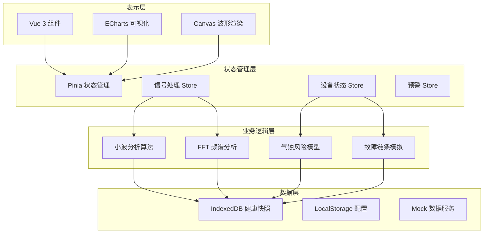

## 1. 架构设计



## 2. 技术描述

- **前端框架**：Vue 3.4 + TypeScript 5.4 + Vite 5.2
- **状态管理**：Pinia 2.1
- **路由**：Vue Router 4.3
- **UI 组件库**：Element Plus 2.7 + 自定义组件
- **图表可视化**：ECharts 5.5
- **数据存储**：IndexedDB (idb 库封装)
- **信号处理**：Web Workers + 自研小波变换算法
- **样式方案**：Tailwind CSS 3.4 + SCSS 变量
- **代码规范**：ESLint + Prettier + Husky
- **性能优化**：虚拟滚动、请求分片、Web Workers 计算、懒加载

## 3. 路由定义

| 路由路径 | 页面名称 | 懒加载组件 |
|---------|----------|------------|
| /dashboard | 仪表盘 | DashboardView |
| /devices | 设备列表 | DeviceListView |
| /devices/:id | 设备详情 | DeviceDetailView |
| /spectrum | 频谱分析 | SpectrumAnalysisView |
| /prediction | 风险预测 | CavitationPredictionView |
| /fault-simulation | 故障模拟 | FaultChainSimulationView |
| /snapshots | 快照管理 | HealthSnapshotView |
| /alerts | 预警中心 | AlertCenterView |
| /settings | 系统配置 | SystemSettingsView |

## 4. 核心数据模型

### 4.1 设备信息模型

```typescript
interface PumpDevice {
  id: string
  name: string
  model: string
  location: string
  region: string
  installDate: string
  ratedPower: number
  ratedFlow: number
  ratedHead: number
  currentStatus: 'running' | 'standby' | 'maintenance' | 'fault'
  healthScore: number
  lastSnapshotTime: string
  sensorIds: string[]
}
```

### 4.2 震动信号模型

```typescript
interface VibrationSignal {
  id: string
  deviceId: string
  sensorId: string
  timestamp: number
  samplingRate: number
  duration: number
  rawData: Float32Array
  frequencyDomain: {
    frequencies: number[]
    amplitudes: number[]
  }
  waveletResult: WaveletCoefficient[]
}

interface WaveletCoefficient {
  scale: number
  time: number
  value: number
}
```

### 4.3 健康快照模型

```typescript
interface HealthSnapshot {
  id: string
  deviceId: string
  timestamp: number
  healthScore: number
  vibrationFeatures: {
    rms: number
    peak: number
    crestFactor: number
    kurtosis: number
    skewness: number
  }
  cavitationRisk: {
    level: 'low' | 'medium' | 'high' | 'critical'
    probability: number
    factors: RiskFactor[]
  }
  recommendations: string[]
}

interface RiskFactor {
  name: string
  weight: number
  value: number
  threshold: number
}
```

### 4.4 故障链条模型

```typescript
interface FaultChain {
  id: string
  deviceId: string
  rootCause: FaultNode
  propagationPath: FaultEdge[]
  affectedComponents: string[]
  estimatedTimeToFailure: number
  severity: 'minor' | 'moderate' | 'severe' | 'catastrophic'
}

interface FaultNode {
  id: string
  type: 'cause' | 'effect' | 'symptom'
  component: string
  description: string
  probability: number
  timePoint: number
}

interface FaultEdge {
  from: string
  to: string
  relationship: string
  delay: number
  confidence: number
}
```

## 5. 关键算法模块

### 5.1 异步小波变换

使用 Morlet 小波进行连续小波变换，Web Worker 中异步执行，避免阻塞主线程：

```typescript
// 核心算法封装在 src/algorithms/wavelet.ts
// 支持多尺度分析，自动提取故障特征频率
```

### 5.2 气蚀风险评估模型

基于多特征融合的模糊综合评价：

```typescript
// 特征包括：
// - 主频带能量占比
// - 次谐波成分强度
// - 随机噪声水平
// - 冲击脉冲计数
// - 趋势变化速率
```

### 5.3 IndexedDB 存储设计

- 数据库名：PumpLinkDB
- 对象仓库：
  - devices (设备信息)
  - vibration_signals (震动信号，支持大体积二进制存储)
  - health_snapshots (健康快照，万级数据)
  - alerts (告警记录)
  - fault_chains (故障链条)
- 索引设计：按设备ID、时间戳、健康分数建立多列索引

## 6. 性能优化策略

1. **大数据渲染**：Canvas 直接绘制波形，虚拟滚动处理列表
2. **计算优化**：Web Workers 执行 FFT 和小波变换，分片计算
3. **存储优化**：IndexedDB 分页查询，LRU 缓存热点数据
4. **内存管理**：及时释放大型 Float32Array，避免内存泄漏
5. **首屏优化**：路由懒加载，关键资源预加载
