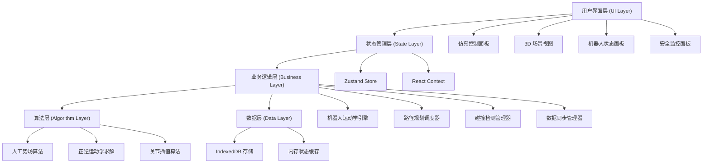
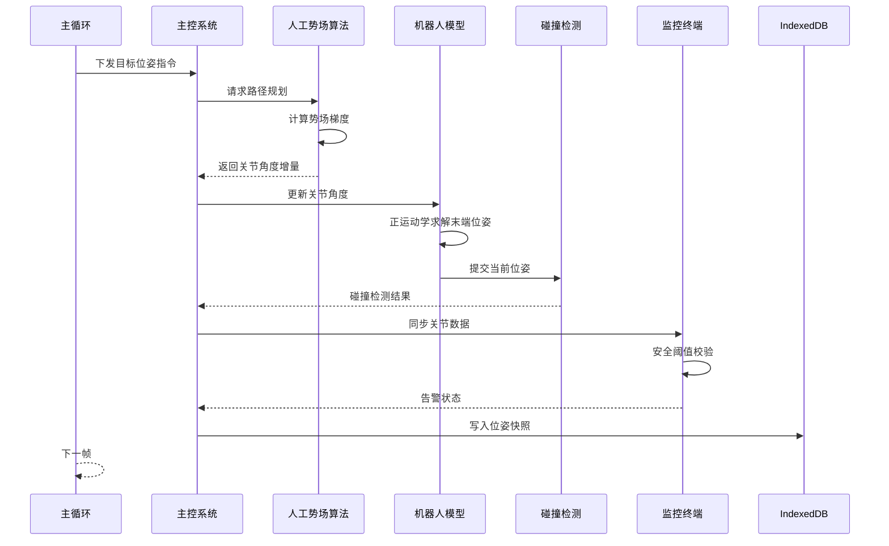

# 多协作机器人空间运动避障仿真平台 - 技术架构文档

## 1. 技术选型

### 1.1 前端框架
| 技术 | 选型 | 说明 |
|-----|------|------|
| 框架 | Next.js 14 | React 服务端渲染框架，支持 App Router |
| 语言 | TypeScript 5 | 类型安全，提升代码可维护性 |
| 样式 | Tailwind CSS 3 | 原子化 CSS，快速构建 UI |
| 状态管理 | Zustand | 轻量级状态管理，支持跨组件状态共享 |

### 1.2 核心依赖
| 依赖 | 版本 | 用途 |
|-----|------|------|
| three | ^0.160.0 | 3D 场景渲染引擎 |
| @react-three/fiber | ^8.15.0 | React 绑定的 Three.js |
| @react-three/drei | ^9.92.0 | Three.js 辅助组件库 |
| idb | ^7.1.1 | IndexedDB 封装库 |
| lucide-react | ^0.294.0 | 图标库 |

### 1.3 开发工具
| 工具 | 用途 |
|-----|------|
| ESLint | 代码质量检查 |
| Prettier | 代码格式化 |
| Husky + lint-staged | Git 钩子，提交前代码检查 |

## 2. 系统架构设计

### 2.1 整体架构图


### 2.2 模块划分

#### 2.2.1 机器人运动学模块 (`src/lib/robotics/`)
- `kinematics.ts` - 正逆运动学求解
- `robotModel.ts` - 机器人 DH 参数与模型定义
- `trajectory.ts` - 轨迹规划与插值

#### 2.2.2 路径规划模块 (`src/lib/planning/`)
- `potentialField.ts` - 人工势场算法实现
- `collision.ts` - 碰撞检测
- `obstacle.ts` - 障碍物管理

#### 2.2.3 数据存储模块 (`src/lib/storage/`)
- `indexedDB.ts` - IndexedDB 封装
- `snapshot.ts` - 位姿快照管理

#### 2.2.4 数据同步模块 (`src/lib/sync/`)
- `masterController.ts` - 主控系统模拟
- `monitorTerminal.ts` - 监控终端模拟
- `dataAlignment.ts` - 数据对齐逻辑

#### 2.2.5 3D 渲染模块 (`src/components/three/`)
- `Scene.tsx` - 3D 场景主组件
- `Robot.tsx` - 机器人模型组件
- `Obstacle.tsx` - 障碍物渲染组件
- `Workspace.tsx` - 工作空间渲染

### 2.3 数据流设计

#### 2.3.1 仿真主循环数据流


#### 2.3.2 数据对齐机制
- 采用**主从同步**模式：主控系统为数据源，监控终端为数据接收方
- 每帧数据携带**时间戳**和**帧序号**
- 监控终端维护**数据缓冲区**，按时间戳排序后消费
- 偏差超过阈值时触发**重同步**机制

## 3. 核心算法设计

### 3.1 异步人工势场法 (APF)

#### 3.1.1 算法原理
```
合力 = 引力 + 斥力
引力 U_att = 0.5 * k_att * (q - q_goal)²
斥力 U_rep = 0.5 * k_rep * (1/d - 1/d0)²  (d ≤ d0)
       U_rep = 0                         (d > d0)
```

#### 3.1.2 异步优化策略
- 使用 Web Worker 在后台线程计算势场
- 采用**时间分片**策略，避免阻塞主线程
- 支持**增量更新**，仅重新计算变化区域的势场

### 3.2 碰撞检测算法

#### 3.2.1 层次包围盒 (BVH)
- 每根连杆使用 OBB (有向包围盒)
- 先进行粗检 (AABB 相交测试)
- 再进行精检 (OBB 分离轴定理)

#### 3.2.2 碰撞检测类型
- **自碰撞**：机器人自身连杆碰撞
- **互碰撞**：多机器人之间碰撞
- **环境碰撞**：机器人与障碍物碰撞

### 3.3 数据对齐算法

#### 3.3.1 时间戳同步
```typescript
// 主控时间戳 -> 监控时间戳映射
interface TimeSync {
  masterTimestamp: number;
  monitorTimestamp: number;
  offset: number;
}

// 线性插值补偿网络延迟
function alignData(masterData: DataFrame[], monitorData: DataFrame[]): AlignedPair[]
```

## 4. 数据模型设计

### 4.1 机器人位姿数据模型
```typescript
interface RobotPose {
  robotId: string;
  timestamp: number;
  frameNumber: number;
  joints: number[];  // 6个关节角度 (弧度)
  endEffector: {
    position: [number, number, number];
    orientation: [number, number, number, number];  // 四元数
  };
  velocity: number[];  // 关节速度
  effort: number[];    // 关节力矩
}
```

### 4.2 IndexedDB 存储模型
```typescript
// 数据库: robot_snapshots
// 存储对象: snapshots (主键: id, 索引: robotId, timestamp)
interface SnapshotRecord {
  id?: string;
  robotId: string;
  timestamp: number;
  pose: RobotPose;
  simulationTime: number;
  collisionWarning: boolean;
}
```

## 5. 性能优化策略

### 5.1 渲染优化
- Three.js 启用 **instancedMesh** 渲染重复对象
- 机器人模型使用 **LOD** (层次细节) 技术
- 离屏渲染使用 **WebWorker** 处理复杂计算

### 5.2 计算优化
- 路径规划采用 **空间哈希** 加速邻近查询
- 碰撞检测使用 **BVH 树** 减少相交测试次数
- 关节角度计算使用 **查表法** 加速三角函数

### 5.3 存储优化
- IndexedDB 采用 **批量写入** 减少 I/O
- 历史数据使用 **增量压缩** 存储
- 自动清理 **过期数据** 控制存储容量

## 6. 安全设计

### 6.1 软限位保护
- 每个关节配置角度限制
- 超出限制时触发紧急停止
- 限位边界设缓冲区域

### 6.2 速度限制
- 关节最大角速度限制
- 笛卡尔空间最大速度限制
- 加速度平滑限制

### 6.3 碰撞预警
- 距离阈值分级预警 (警告/危险/紧急)
- 预测性碰撞检测 (预判 N 帧后的位姿)
- 紧急情况下自动执行安全停机轨迹
