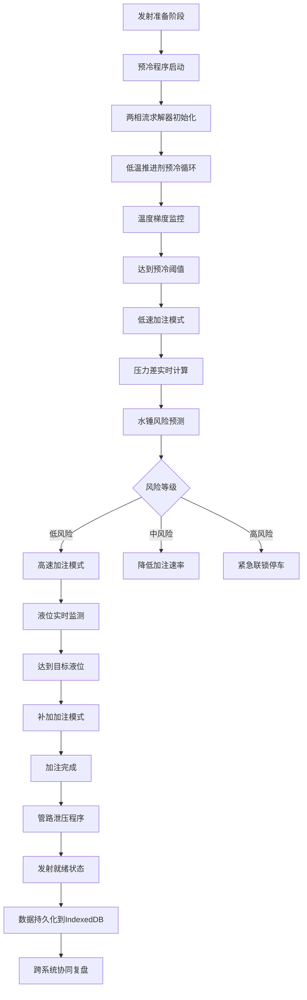

## 1. 产品概述

本项目构建基于 SolidJS 的运载火箭发射工位推进剂加注动态演化模拟系统，实现液氢/液氧低温推进剂加注过程的全流程数字孪生。系统通过异步非稳态两相流控制方程求解器实时预测瞬态水锤风险，将压力差与温度梯度在指挥大屏、加注控制与安全防爆三大模块间进行标准化映射，并利用 IndexedDB 存储全流程历史状态波形，支撑发射前夕跨系统的协同快速复盘。

## 2. 核心功能

### 2.1 用户角色

| 角色 | 注册方式 | 核心权限 |
|------|----------|----------|
| 指挥人员 | 系统内置 | 全局状态监控、发射流程控制、复盘分析 |
| 加注工程师 | 系统内置 | 加注参数调节、阀门控制、异常处理 |
| 安全监察员 | 系统内置 | 防爆监控、风险预警、紧急停车权限 |

### 2.2 功能模块

1. **指挥大屏模块**：全局态势感知、推进剂状态总览、发射倒计时、风险预警看板
2. **加注控制模块**：加氧/加氢管路控制、参数设定、阀门时序、加注速率调节
3. **安全防爆模块**：温度梯度监测、压力差监控、水锤风险预测、紧急联锁保护
4. **数据复盘模块**：历史波形回放、多系统数据对齐、异常事件溯源、报告生成

### 2.3 页面详情

| 页面名称 | 模块名称 | 功能描述 |
|----------|----------|----------|
| 指挥大屏 | 态势总览 | 2D 发射工位示意图、加注管路动态着色、推进剂液位高度实时动画 |
| 指挥大屏 | 参数面板 | 温度/压力/流量三维参数卡片、实时波形曲线图、系统健康度指标 |
| 指挥大屏 | 倒计时 | 发射倒计时器、关键节点时间轴、任务进度百分比 |
| 加注控制 | 管路控制 | 加氧/加氢独立管路控制、阀门开关状态、加注速率滑块 |
| 加注控制 | 参数设定 | 目标加注量、加注压力、温度阈值、流量上限配置 |
| 安全防爆 | 监测面板 | 温度梯度热力图、压力差等高线、泄漏检测传感器状态 |
| 安全防爆 | 水锤预测 | 两相流求解器输出、水锤风险等级、预测波形超前展示 |
| 数据复盘 | 波形回放 | IndexedDB 历史数据加载、多通道波形同步回放、时间轴缩放 |
| 数据复盘 | 事件分析 | 异常事件标记、跨系统数据关联、根因分析辅助工具 |

## 3. 核心流程

系统模拟运载火箭低温推进剂加注的完整生命周期：从预冷准备→低速加注→高速加注→液位补加→管路泄压→发射准备六个阶段。每个阶段通过异步计算求解两相流控制方程，实时计算压力波传播与温度场分布，当检测到水锤风险时触发三级预警机制。所有传感器数据以 100Hz 采样频率写入 IndexedDB，支持发射前 1 小时内任意时间窗口的多系统协同复盘。

## 4. 用户界面设计

### 4.1 设计风格

**设计方向**：航天工业级硬核风格，深蓝科技底色配合高对比度警示色，突出数据密集型监控系统的专业感与可靠性。

- **主色调**：深空蓝 `#0a1628` 作为背景主色，航天蓝 `#1e3a5f` 作为面板底色
- **强调色**：液氧蓝 `#00d4ff`（加氧管路）、液氢青 `#00ffc8`（加氢管路）
- **警示色**：预警黄 `#ffd700`、告警橙 `#ff6b35`、危险红 `#ff2d55`、正常绿 `#00ff88`
- **字体**：主标题使用 Orbitron 航天字体，正文使用 JetBrains Mono 等宽字体，数据显示使用数字专用字体
- **布局风格**：模块化栅格布局，面板采用深空灰金属质感边框，数据卡片使用悬浮阴影效果
- **图标风格**：线性简约图标配合发光效果，状态指示灯使用脉冲动画

### 4.2 页面设计概述

| 页面名称 | 模块名称 | UI 元素 |
|----------|----------|----------|
| 指挥大屏 | 态势总览 | 全屏 SVG 发射工位示意图、CSS 渐变动画模拟流体流动、实时数据标签 |
| 指挥大屏 | 参数面板 | 三维立体数据卡片、环形进度指示器、实时波形 Canvas 图表 |
| 指挥大屏 | 倒计时 | 七段数码管风格倒计时器、关键节点时间轴、百分比进度条 |
| 加注控制 | 管路控制 | 交互式管道示意图、阀门开关按钮、加注速率滑块、状态切换动画 |
| 加注控制 | 参数设定 | 表单卡片、数字输入框、滑块控件、配置保存/加载按钮 |
| 安全防爆 | 监测面板 | 温度热力图、压力等高线图、传感器矩阵、状态指示灯 |
| 安全防爆 | 水锤预测 | 求解器输出波形图、风险等级仪表盘、预测时间轴、预警闪烁效果 |
| 数据复盘 | 波形回放 | 多通道波形叠加显示、时间轴缩放控件、播放控制按钮 |
| 数据复盘 | 事件分析 | 事件标记时间线、关联数据面板、分析结果卡片 |

### 4.3 响应式设计

采用桌面优先设计，针对 27 寸以上指挥大屏进行优化，支持 4K 分辨率显示。次要页面适配 1080p 桌面显示。移动端仅提供数据查看功能，不支持控制操作。

### 4.4 数据可视化专项设计

- **环境氛围**：深空背景配合微弱星空粒子动画，营造航天发射氛围
- **灯光设置**：面板采用边缘发光效果，关键数据卡片使用呼吸灯动画
- **动效设计**：流体流动使用 CSS 渐变位移动画，阀门开关使用旋转过渡，预警使用脉冲闪烁
- **交互反馈**：按钮悬停发光效果，滑块拖动实时数据反馈，点击波纹动画
- **后处理效果**：全局微妙噪点纹理，扫描线效果，数据辉光效果

