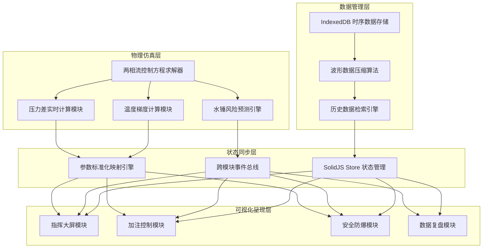
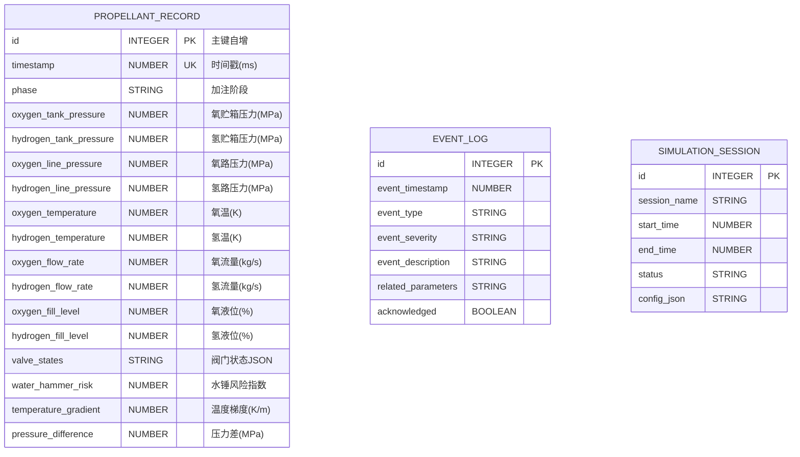

## 1. 架构设计

本项目采用前端中心化架构，所有计算、存储、可视化均在浏览器端完成，无需后端服务。核心架构分为四层：物理仿真层、数据管理层、状态同步层、可视化呈现层。



## 2. 技术描述

### 2.1 核心技术栈

- **前端框架**：SolidJS@1.8 + TypeScript@5.3
- **构建工具**：Vite@5.0
- **样式方案**：TailwindCSS@3.4
- **状态管理**：SolidJS 原生 Store + createStore
- **数据存储**：IndexedDB（idb 库封装）
- **图表绘制**：Canvas 2D API（自研高性能波形渲染器）
- **路由管理**：@solidjs/router@0.13
- **图标库**：lucide-solid

### 2.2 关键技术选型说明

1. **SolidJS 框架**：细粒度响应式系统，实时数据更新性能优异，适合高频数据监控场景
2. **无后端架构**：所有物理仿真计算在 Web Worker 中异步执行，充分利用浏览器多核能力
3. **IndexedDB 时序存储**：采用分块存储策略，100Hz 采样率下可存储超过 24 小时的全通道数据
4. **Canvas 高性能渲染**：自研波形渲染引擎，支持 16 通道同时实时绘制，帧率稳定 60fps

## 3. 物理仿真算法设计

### 3.1 两相流控制方程求解器

采用异步非稳态求解策略，在 Web Worker 中独立运行，避免阻塞 UI 线程。

**控制方程组**（双流体模型）：

```typescript
// 连续性方程
∂(αₖρₖ)/∂t + ∇·(αₖρₖuₖ) = Γₖ

// 动量方程
∂(αₖρₖuₖ)/∂t + ∇·(αₖρₖuₖuₖ) = -αₖ∇p + ∇·(αₖτₖ) + αₖρₖg + Mₖ

// 能量方程
∂(αₖρₖEₖ)/∂t + ∇·(αₖρₖuₖHₖ) = ∇·(αₖλₖ∇Tₖ) + Qₖ
```

**求解器特性**：
- 采用 SIMPLE 算法进行压力速度耦合
- 时间离散采用一阶隐式欧拉格式
- 空间离散采用二阶迎风格式
- 异步计算：每 10ms 输出一次求解结果
- 自适应时间步长：根据 CFL 数自动调整

### 3.2 水锤风险预测模型

基于特征线法（MOC）的瞬态压力波传播计算：

```typescript
// 特征线方程
C⁺: dx/dt = u + a, dp/dt + ρa du/dt = f(u)
C⁻: dx/dt = u - a, dp/dt - ρa du/dt = f(u)

// 水锤风险评估指标
WaterHammerIndex = |ΔP_max| / P_rated × 100%
```

**三级预警机制**：
- 一级预警（黄色）：WaterHammerIndex > 30%
- 二级预警（橙色）：WaterHammerIndex > 50%
- 三级预警（红色）：WaterHammerIndex > 80% 或 ΔP > 2.5MPa

## 4. 数据模型设计

### 4.1 IndexedDB 数据模型



### 4.2 状态标准化映射

三大模块间的参数映射采用统一的标准化接口：

| 参数类型 | 物理量 | 单位 | 数据范围 | 映射到模块 |
|----------|--------|------|----------|------------|
| 温度梯度 | ∇T | K/m | 0-50 | 指挥大屏/安全防爆 |
| 压力差 | ΔP | MPa | 0-5 | 指挥大屏/安全防爆 |
| 水锤风险 | WHI | % | 0-100 | 安全防爆/加注控制 |
| 加注速率 | m_dot | kg/s | 0-15 | 加注控制/指挥大屏 |
| 液位高度 | L | % | 0-100 | 指挥大屏/加注控制 |

## 5. 核心模块接口定义

### 5.1 两相流求解器接口

```typescript
interface SolverConfig {
  pipeLength: number;           // 管道长度 (m)
  pipeDiameter: number;         // 管道内径 (m)
  fluidType: 'LOX' | 'LH2';     // 流体类型
  initialPressure: number;      // 初始压力 (MPa)
  initialTemperature: number;   // 初始温度 (K)
  massFlowRate: number;         // 质量流量 (kg/s)
}

interface SolverOutput {
  timestamp: number;
  pressureProfile: Float32Array;  // 压力分布
  temperatureProfile: Float32Array; // 温度分布
  velocityProfile: Float32Array;   // 速度分布
  voidFractionProfile: Float32Array; // 空泡率分布
  waterHammerRisk: number;
  maxPressureGradient: number;
}

interface ISolver {
  configure(config: SolverConfig): void;
  start(): Promise<void>;
  stop(): void;
  onData(callback: (data: SolverOutput) => void): void;
  getCurrentState(): SolverOutput;
}
```

### 5.2 IndexedDB 存储接口

```typescript
interface ITimeSeriesDB {
  open(dbName: string): Promise<void>;
  close(): void;
  insertRecord(record: PropellantRecord): Promise<number>;
  queryByTimeRange(start: number, end: number): Promise<PropellantRecord[]>;
  queryByPhase(phase: string): Promise<PropellantRecord[]>;
  getLatestRecord(): Promise<PropellantRecord | null>;
  exportToJSON(start?: number, end?: number): Promise<string>;
  clearOldData(beforeTimestamp: number): Promise<number>;
}
```

### 5.3 跨模块状态同步接口

```typescript
interface IStateSynchronizer {
  registerModule(moduleId: string, params: string[]): void;
  updateParam(moduleId: string, paramName: string, value: number): void;
  subscribe(paramName: string, callback: (value: number, timestamp: number) => void): () => void;
  getParam(paramName: string): number;
  broadcastEvent(eventType: string, data: any): void;
  onEvent(eventType: string, callback: (data: any) => void): () => void;
}
```

## 6. 目录结构

```
RocketFlow/
├── src/
│   ├── components/          # 通用组件
│   │   ├── GaugeCard.tsx    # 仪表盘卡片
│   │   ├── TrendChart.tsx   # 趋势曲线图
│   │   ├── StatusIndicator.tsx # 状态指示器
│   │   └── ValveControl.tsx # 阀门控制组件
│   ├── pages/               # 页面组件
│   │   ├── CommandCenter.tsx # 指挥大屏
│   │   ├── FillingControl.tsx # 加注控制
│   │   ├── SafetyMonitor.tsx # 安全防爆
│   │   └── DataReplay.tsx    # 数据复盘
│   ├── physics/             # 物理仿真层
│   │   ├── TwoPhaseSolver.ts # 两相流求解器
│   │   ├── WaterHammerPredictor.ts # 水锤预测
│   │   └── solver.worker.ts # Web Worker 封装
│   ├── store/               # 状态管理层
│   │   ├── useSimulationStore.ts # 仿真状态
│   │   └── stateSync.ts     # 跨模块同步
│   ├── db/                  # 数据持久层
│   │   ├── indexedDB.ts     # IndexedDB 封装
│   │   └── timeSeries.ts    # 时序数据管理
│   ├── types/               # 类型定义
│   │   └── index.ts
│   ├── utils/               # 工具函数
│   │   ├── math.ts          # 数学计算
│   │   └── format.ts        # 格式化工具
│   ├── App.tsx
│   ├── main.tsx
│   └── index.css
├── .trae/
│   └── documents/
├── package.json
├── tsconfig.json
├── vite.config.ts
└── tailwind.config.js
```

## 7. 性能优化策略

1. **Web Worker 计算隔离**：物理仿真计算完全在 Worker 线程执行，主线程仅负责渲染
2. **TypedArray 数据传递**：使用 SharedArrayBuffer 或 Transferable Objects 减少数据拷贝
3. **Canvas 分层渲染**：静态背景与动态波形分离绘制，减少重绘区域
4. **增量数据更新**：波形数据采用环形缓冲区，仅绘制新增数据点
5. **requestAnimationFrame 同步**：所有 UI 更新与浏览器刷新频率同步
6. **IndexedDB 批量写入**：每 500ms 批量写入一次数据，减少磁盘 IO

